# Restricted Arsenal Creation Assistant (RACA)

Restricted Arsenal Creation Assistant is an Arma 3 add-on for mission makers, unit leaders, and server administrators who use ACE Arsenal and need deliberate control over the equipment available in a mission.

RACA turns restricted-arsenal creation into an authoring workflow. Instead of manually collecting class names, maintaining large SQF arrays, and repeating the same setup on multiple objects, an author works from the equipment actually loaded in Arma, saves reusable presets, turns those presets into mission-wide Arsenal Configurations in Eden, and can optionally apply server-authoritative access and quantity rules at runtime.

RACA does **not** replace the ACE Arsenal interface. Players continue to use ACE Arsenal; RACA determines which items, interactions, access rules, and limits apply around it.

> **Current status:** The repository contains the `0.11.0-dev` development build. It has broad automated and hands-on test coverage, but it is not yet a public release. Read [Development maturity and known limitations](#development-maturity-and-known-limitations) before adopting it for a live operation.

## What this README is for

This README is RACA's **pre-install decision guide**. It explains the problem the mod solves, the design choices behind it, the people and workflows it suits, the features and dependencies an installation brings with it, the available deployment models, and the present maturity of the project.

It deliberately does not document every button, field, schema, or troubleshooting path. The [Implementation Wiki](docs/IMPLEMENTATION_WIKI.md) assumes that you have decided to evaluate or use RACA and serves as the detailed operating, administration, testing, and contributor reference. The [Quick Start Guide](#quick-start-guide) at the very end of this README is only enough to reach a first working arsenal before continuing in the wiki.

## The problem RACA is designed to solve

A conventional restricted ACE Arsenal often requires a mission maker to:

- discover equipment class names manually;
- keep several item-category arrays organized in SQF;
- update the same list in several missions or object Init fields;
- diagnose content that disappears when the active mod set changes;
- create separate scripts for different roles or access groups;
- implement quantity limits, administrative changes, or audit records separately; and
- repeat multiplayer and join-in-progress checks without built-in evidence.

That process is workable, but it becomes difficult to review and maintain as a unit's mod set, doctrine, and mission library grow. RACA centralizes that work in a visible catalogue and carries the result into Eden as mission data.

## RACA's methodology

RACA is built around four principles.

### 1. Author from the live game catalogue

The Creator scans the ACE-compatible equipment available in the current Arma session. Base-game, DLC, ACE, and loaded content-mod classes can therefore be searched and selected from one interface. RACA records class names and their relevant source metadata; it does not maintain a separate hard-coded master catalogue.

This means the active mod set matters. An item can be selected only when its class is available during authoring, and the same content mod must be present when the mission runs if that item is expected to appear.

### 2. Separate personal authoring data from deployed mission data

Presets, favorites, tags, role packs, Saved Filters, draft recovery, and other authoring conveniences live in the active Arma profile. Eden does not merely store a reference to that profile. A named Arsenal Configuration stores a complete, flattened preset snapshot in the mission, and every linked object receives a self-contained copy of that configuration.

As a result:

- deleting or changing a profile preset does not silently rewrite an existing mission configuration;
- inherited presets are resolved before deployment;
- dedicated servers do not need the original author's profile to use Eden-authored configurations;
- editing and saving a mission configuration refreshes every object linked to it; and
- adopting later changes from a profile preset is an explicit author action.

### 3. Treat imported files as data, never executable code

Versioned JSON is RACA's authoritative round-trip interchange format. Existing SQF arsenals and simple class lists can also be imported through a conservative migration parser.

Imported SQF is scanned for safe, quoted class-name values. RACA does not compile, execute, spawn, or `execVM` imported clipboard text. Dynamically computed SQF content may therefore be impossible to recover automatically, which is an intentional security boundary.

### 4. Keep runtime policy on the server

When a mission uses RACA's controlled runtime configuration, the server owns the complete object configuration, access decisions, sessions, quotas, saved-loadout validation, and audit state. Clients receive the sanitized metadata needed to display and request ACE interactions.

This prevents a client interface from becoming the authority for permissions or limits. It also lets the same configuration support initial clients, listen hosts, dedicated servers, and persistent action registration for joining clients.

```mermaid
flowchart LR
    A[Load Arma, CBA, ACE, and content mods] --> B[Author from the live catalogue]
    B --> C[Save profile presets and authoring aids]
    C --> D[Eden creates named mission configurations]
    D --> E[Linked objects receive standalone snapshots]
    E --> F[Server validates and registers object interactions]
    F --> G[Clients receive sanitized ACE actions]
    G --> H[Players use the restricted ACE Arsenal]
```



## Who RACA is for

RACA is a good fit when you:

- create missions with ACE Arsenal and want a visual alternative to maintaining class arrays;
- reuse similar arsenals across roles, missions, or unit events;
- want one named configuration to stay consistent across many mission objects;
- want access restrictions based on unit, faction, group, rank, UID, vehicle role, required items, or mission permissions;
- need per-item or per-category allowances enforced by the server;
- want profile-portable JSON presets or migration from an existing SQF arsenal;
- want mission makers and server administrators to share a consistent arsenal workflow; or
- need audit and multiplayer-rehearsal evidence for a controlled arsenal system.

RACA is probably unnecessary when you:

- do not use ACE Arsenal;
- need only one small, rarely changed SQF list and are comfortable maintaining it manually;
- want a restriction to apply automatically to every ACE Arsenal in a mission without configuring objects;
- expect the mod to supply equipment from content mods that are not loaded; or
- require a finished public-release package with every separate-client acceptance gate already complete.

## Feature overview

### Catalogue and preset authoring

The single-player Creator is available under **Tutorials > Restricted Arsenal Creator**. It provides:

- a live ACE-compatible catalogue covering weapons, attachments, magazines, equipment, uniforms, vests, backpacks, headgear, NVGs, facewear, and other supported classes;
- search across display names, class names, categories, mods, owning add-ons, and authors;
- Category, Mod, Add-on, Author, and Tag filters with deterministic sortable columns;
- Included, Inherited, and Favorites views;
- persistent favorites, catalogue tags, and reusable Saved Filters;
- item pictures, hover context, detailed class/config/source inspection, and weapon-specific compatible-magazine navigation;
- checkbox and keyboard inclusion controls, filtered bulk operations, Ctrl/Shift multi-selection, and undo/redo;
- per-item and per-category quantity-policy authoring;
- profile-persistent unsaved-draft recovery; and
- compatibility analysis with copyable diagnostic reports.

### Quick Start, roles, and reusable authoring aids

Quick Start can produce a blank draft or an unsaved role-oriented starting point. Built-in role starters include rifleman, medic, grenadier, marksman, machine gunner, engineer, EOD, pilot, crew, and recon.

These starters are catalogue-driven suggestions, not fixed faction loadouts. Optional settings can constrain a starter to one loaded source mod and apply optic, suppressor, night-vision, and medical policies. Every generated result remains an unsaved draft that the author must review.

Units can also capture their own explicit class selections as profile-wide custom role packs. A role pack can merge into a draft, replace draft inclusion, or serve as a Quick Start source. Role packs are separate from saved arsenal presets.

### Preset library, inheritance, and history

Named presets are saved in the active Arma profile. RACA supports:

- case-insensitive overwrite protection and confirmed deletion;
- up to 20 archived revisions before destructive library changes;
- restoration of an archived version as a new revision;
- comparison between a saved Preset Analysis target and the current draft;
- child presets derived from a source preset with explicit additions and removals;
- circular-inheritance rejection and stale/missing-source warnings; and
- conversion of an inherited preset into a standalone result.

Inheritance is an authoring convenience. Eden and standalone outputs use the complete effective selection rather than requiring the source chain at runtime.

### Import, export, and diagnostics

RACA can export:

| Format | Intended use |
| --- | --- |
| Versioned JSON preset | Guaranteed RACA-to-RACA round trip between compatible versions. |
| Reusable SQF | Standalone mission script that initializes the exported classes as an ACE Arsenal. |
| Class list | Simple de-duplicated comma-separated class names for documentation or other tooling. |
| Required-mod manifest | Machine-readable class grouping by source mod and owning add-on. |
| Support bundle | Environment, catalogue, compatibility, manifest, and preset evidence for diagnosis. |

JSON, compatible existing SQF arsenals, and class lists can be imported from the clipboard in the single-player Creator. JSON is authoritative and preserves unavailable cargo and safe extension metadata so a preset can survive mod-set changes without silently losing intent. SQF and class-list support are conservative migration paths. Name collisions present four explicit outcomes—Import, Overwrite, Import Copy, or Cancel—and the selected transaction either commits once or leaves the profile library unchanged. Manifest and support-bundle exports are diagnostics and are intentionally not importable as presets.

Clipboard import is unavailable in multiplayer because Arma disables `copyFromClipboard` there.

### Eden mission authoring

RACA adds **Tools > RACA Mission Arsenal Tool** to Eden. Its two tabs deliberately separate mission inspection from configuration authoring:

- **Mission Dashboard** inventories mission objects and shows each object's Arsenal Configuration, readable item name, class name, and variable name. Variable-name, object-type, and free-text filters make large missions manageable. A highlighted object can be selected in Eden or assigned a configuration in one undoable step.
- **Configure** creates named, mission-local Arsenal Configurations. Each configuration chooses a flattened preset snapshot and can define an optional interaction icon, AND/OR access rules, and a denied message. Saving it refreshes all linked objects.

The **Restricted Arsenals** object attribute is intentionally compact: it only selects one of the configurations already defined in the mission and points authors back to the Tools menu when they need another. Each configuration has a human-readable display name and a separate stable internal ID, so renaming does not break object links. Each assigned object stores a complete runtime snapshot, including quantity policies carried by the chosen preset, so deployment never depends on the author's profile. Older embedded object configurations remain untouched until an author deliberately replaces them with a named configuration.

Unknown future configuration envelopes and malformed/duplicate records are preserved byte-for-byte during inspection. Eden displays recovery states instead of silently rewriting them; an author must explicitly repair, replace, or remove affected data, and successful repairs are one undoable transaction.

The Eden integration also provides access-rule testing against placed units, object preflight, copyable Dashboard reports, profile-accented controls, and Eden Undo integration. The detailed editor workflow and data behavior belong in the [Implementation Wiki](docs/IMPLEMENTATION_WIKI.md#eden-mission-arsenal-tool).

### Controlled runtime arsenals

For Eden-configured RACA objects, the runtime can provide:

- server-authorized ACE interaction opening;
- missing-class validation and safe degradation;
- distance, object, slot, access, and active-session checks;
- exact-class and category quantity accounting;
- interaction, player, life, mission, or shared-arsenal scopes;
- interaction, respawn, round, phase, or manual reset boundaries;
- loadout rollback when unauthorized or over-limit content is detected;
- remaining-allowance actions;
- per-player saved loadouts validated against the active slot;
- cancellation and prior-loadout restoration when an object is reconfigured; and
- server audit records.

The generated reusable SQF export is intentionally simpler. It creates a standalone restricted ACE Arsenal but does not include RACA runtime access, quotas, administration, or audit behavior.

### Administration and Zeus

Authorized server administrators can use an ACE self-interaction dashboard to inspect configured objects, sessions, quota records, and recent audit events. Server-side authorization is checked for snapshots and commands rather than relying on a hidden client button.

The dashboard also includes a guided multiplayer rehearsal that distinguishes server, listen-host, initial-client, and distinct JIP evidence.

Zeus receives four server-executed modules under **Restricted Arsenals**:

- assign or replace a restricted arsenal;
- clear a restricted arsenal;
- enable or disable a restricted arsenal; and
- reset arsenal quotas.

Servers and missions can disable these modules through the authoritative **Enable Zeus modules** CBA Addon Option. Server-profile preset fallback is separately disabled by default and never precedes embedded mission configuration lookup.

A curator places a module on one or more target objects, supplies any requested configuration or display-name input, and confirms it. The client sends only that bounded request; the server revalidates authorization, mission policy, targets, and embedded configuration data, performs the change, returns a visible accepted/rejected result, and writes a structured `[RACA][ZEUS:<request-id>]` event for administrators.

### CBA Addon Options

RACA registers one **Restricted Arsenal Creation Assistant** category before Eden or mission interfaces open. Seven preferences are profile-local: catalogue page size (50/100/200/400; default 200), new-session Search Mode (Basic), new Compatibility severity (Errors), selection-driven Item Details (off), persistent draft recovery (on), optional onboarding guidance (on), and status verbosity (Standard). These affect only the local authoring interface. Saved views, restored navigation, and active report state keep their own semantics.

Two options are server/mission controls: **Enable Zeus modules** (on) and **Allow Zeus profile-preset fallback** (off). CBA forcing applies to the authoritative server value; a client-local edit cannot grant server behavior. The server re-reads enablement immediately before mutation. Setting changes do not rewrite presets, tags, role packs, Saved Filters, Eden configurations, or mission objects.

The former `RACA_catalogSearchMode_v1` value remains a historical Creator-view preference and is not migrated into the new-session default. The former mission variables `RACA_allowZeusModules` and `RACA_allowZeusProfileFallback` are no longer authorization inputs. This deliberate non-migration prevents a local profile or legacy mission variable from silently changing server authority.

## Installation requirements and deployment choices

RACA requires:

- Arma 3 **2.22 or newer**;
- **CBA_A3**;
- **ACE3**, with ACE Arsenal enabled; and
- the same equipment/content mods needed by the presets and mission.

The package contains two PBOs:

| PBO | Responsibility |
| --- | --- |
| `core.pbo` | Creator, catalogue, presets, interchange, runtime, administration, networking, and Zeus. |
| `eden.pbo` | Eden Tools-menu integration, mission configuration library, object assignment attribute, access-rule test, Dashboard, and transactional mission editing. |

Both PBOs are required for the complete authoring-to-runtime workflow. The Core add-on declares `A3_Modules_F`, `cba_main`, `ace_arsenal`, and `ace_interact_menu`; the Eden add-on depends on `3DEN` and RACA Core.

RACA supports two practical deployment models:

| Deployment model | Where RACA is used | What the mission receives |
| --- | --- | --- |
| **Author with RACA, deploy reusable SQF** | Load RACA, CBA_A3, ACE3, and the content mods while creating the list. The exported mission script itself calls ACE Arsenal and does not provide RACA's managed runtime. | A standalone restricted ACE Arsenal containing the exported classes. Access rules, quantity enforcement, administration, audit, saved loadouts, and Zeus control are not included. |
| **Use the complete RACA workflow** | Load the complete RACA package and matching dependencies while authoring, on the server, and on participating clients. | Mission-embedded named configurations, object assignments, server-authoritative access and limits, administration, audit, saved loadouts, and Zeus modules. |

The first model is useful when a unit wants RACA as a safer visual list builder but intends to keep its existing SQF mission workflow. The second model is for missions that want RACA to remain responsible after authoring. JSON export is the recommended backup and sharing format in either case.

## Installation and adoption considerations

RACA is loaded as a normal local Arma 3 mod folder, alongside CBA_A3, ACE3, and the relevant content mods. Any server or client participating in RACA's controlled runtime workflow should load the same required dependencies and mission content.

Before adopting it, understand these operational boundaries:

- **Presets are profile-local until embedded or exported.** Back up/share important authoring work as JSON.
- **Missions contain snapshots.** A profile edit does not silently update an Arsenal Configuration. Selecting the newer preset state and saving the configuration is deliberate; that save then refreshes every linked object.
- **Content mods remain external dependencies.** RACA records and validates their classes but does not redistribute them.
- **Missing runtime classes are omitted.** The RPT receives `[RACA]` warnings, and the resulting arsenal may be smaller than intended.
- **RACA configuration is object-specific.** It does not globally seize control of unrelated ACE arsenals.
- **Quantity and access enforcement require the RACA runtime path.** A reusable SQF export provides a standalone restricted ACE Arsenal only.
- **Authoring imports are clipboard-based and single-player only.** This is an Arma engine security limitation.
- **Multiplayer acceptance still requires real multiplayer testing.** Built-in rehearsal evidence supports but does not replace opening and using the arsenal on actual clients.

## Security and data behavior

RACA uses versioned, normalized data structures and fails closed on unsupported future versions or malformed policy structures. Import work is checkpointed and cancellable without a fixed item-count ceiling; invalid input, cancellation, or engine resource failure does not partially rewrite the profile library.

At runtime, clients do not own the embedded presets, permission decisions, quota state, or session truth. Remote-execution targets are explicitly declared, protected client handlers reject direct non-server invocation, and joining clients receive only the action metadata required for their interface.

Configuration changes and object removal cancel affected sessions and restore the player's prior loadout instead of leaving a stale unrestricted session open.

For the schemas, persistence locations, normalization rules, and complete security model, read the [Implementation Wiki](docs/IMPLEMENTATION_WIKI.md#data-formats-and-persistence-boundaries).

## Development maturity and known limitations

RACA is currently version `0.11.0-dev`. The **September 4, 2026** consolidated build is source-complete for the current diagnostic docket. It passed static validation, a clean Core/Eden PBO build, and 97/97 deterministic packaged-engine assertions. A dedicated server and one initial remote client also passed the rehearsal probes. That is meaningful evaluation evidence, but it is not the same as completing every release gate.

| Gate | Latest evidence |
| --- | --- |
| Static validation and clean PBO build | **Pass — September 4** |
| Consolidated Creator/Eden/Zeus source docket | **Implemented — September 4** |
| Automated packaged-engine acceptance | **Pass — 97/97 assertions on September 4** |
| Large import boundaries | **Pass:** 19,999; 20,000; 20,001; 40,280; 50,001; and 100,000-record fixtures |
| Exact Unicode clipboard/RPT reconstruction | **Pass:** 4,166 characters, including a 4,096-character line |
| Synthetic 100,000-record catalogue | **Functional pass with measured constraint:** settled p95 1.473 s; initial full render 3.549 s, above the proposed 250 ms visible-result target |
| Dedicated server and initial remote client | **Pass — September 4** |
| Genuine second-identity JIP | **Blocked by the single local Steam identity; not tested** |
| Resolution-specific visual, native Eden, Curator-placement, and final ACE-content matrix | **Not yet completed** |

The final isolated September 4 session loaded 1,534 ACE-compatible classes with CBA_A3 `3.19.0` and ACE3 `3.21.2.113`. Its RPT contained no RACA assertion failure, expression error, missing script, or undefined variable. The new indexed catalogue retains the complete result set while rendering a bounded 200-row page; it does not replace the old import ceiling with another hidden class limit.

Release evidence still required before a public release includes:

- timed no-blink and layout captures at 16:9, ultrawide, and 4:3 safe zones;
- the native Eden recovery, Undo, large placed-object Dashboard, and fallback race/cancel matrix;
- actual Curator placement for every Zeus module across listen-host, dedicated-server, and distinct-JIP roles;
- a genuine second-identity JIP rehearsal; and
- final interactive Creator → Eden → player-facing ACE Arsenal inspection.

See the [September 4 test log](docs/TEST_LOG_2026-09-04.md) for the current PBO hashes, exact assertion scope, performance measurements, Zeus excerpts, and redacted multiplayer evidence. See the [consolidated implementation record](docs/CONSOLIDATED_IMPLEMENTATION_2026-09-04.md) for requirement-by-requirement evidence boundaries and the [in-game release checklist](docs/IN_GAME_TEST_CHECKLIST.md) for the complete release protocol.

## Documentation map

The README and wiki are intentionally different documents:

| Document | Primary question | Scope |
| --- | --- | --- |
| **README** | **Should I install or evaluate RACA?** | Purpose, methodology, suitability, feature overview, dependencies, deployment choices, tradeoffs, maturity, and a minimal first-use path. |
| **Implementation Wiki** | **How do I use, administer, test, troubleshoot, or modify RACA?** | Exact workflows, controls, terminology, schemas, persistence, runtime behavior, edge cases, diagnostics, security, architecture, and source maps. |

Use the focused documents below when you need a formal format specification, test protocol, or release procedure.

- [Implementation Wiki](docs/IMPLEMENTATION_WIKI.md) — detailed user workflows, terminology, Creator/Eden/runtime behavior, administration, Zeus, architecture, schemas, security, persistence, testing, and complete function maps.
- [Portable preset format](docs/PORTABLE_PRESET_FORMAT.md) — JSON envelope, SQF/class-list compatibility, and interchange examples.
- [In-game release checklist](docs/IN_GAME_TEST_CHECKLIST.md) — complete Creator, Eden, runtime, multiplayer, and JIP acceptance protocol.
- [September 4 test log](docs/TEST_LOG_2026-09-04.md) — current hashes, 97/97 engine result, performance measurements, Zeus excerpts, and redacted multiplayer evidence.
- [Consolidated implementation record](docs/CONSOLIDATED_IMPLEMENTATION_2026-09-04.md) — requirement packages, evidence boundaries, and remaining manual gates.
- [September 2 targeted test log](docs/TEST_LOG_2026-09-02.md) and [September 1 test log](docs/TEST_LOG_2026-09-01.md) — historical evidence for earlier builds.
- [Development acceptance evidence](docs/DEVELOPMENT_ACCEPTANCE.md) — latest clean-tree development-package evidence.
- [Release process](docs/RELEASE_PROCESS.md) — versioning, packaging, validation, checksums, and release gates.
- [Changelog](CHANGELOG.md) — current unreleased work and published baselines.

## Building and contributing

Building requires Arma 3 Tools, including AddonBuilder and BankRev. From the repository root:

```powershell
.\tools\validate.ps1
.\tools\build.ps1 -Clean
```

The default output is `build\@RestrictedArsenalCreationAssistant`. Static validation checks configuration structure, SQF syntax, registrations, PBO prefixes, and known integration regressions; it does not replace in-game acceptance.

The repository also includes isolated automated and multiplayer smoke missions. `prepare-autotest.ps1` supports the Windows PowerShell 5.1 environment used for the September 4 pass and recursively stages mission functions. The multiplayer harness still requires a genuinely separate Steam identity to prove distinct JIP behavior.

After a clean, fully tested release candidate is committed, `tools\release.ps1` validates version consistency, rebuilds the PBOs, verifies hashes, and generates the release archive and report. Development versions require `-AllowDevelopmentVersion`.

## License and project

RACA calls public ACE3 and CBA interfaces but does not redistribute those projects or content mods. RACA source and documentation are licensed under the repository's MIT License.

Project page: [github.com/Black-Ops-2-543/Arma3_ACE_Arsenal_Creation_Tool](https://github.com/Black-Ops-2-543/Arma3_ACE_Arsenal_Creation_Tool)

## Quick Start Guide

This is the shortest path to a basic restricted arsenal. For complete explanations and advanced features, follow the [Implementation Wiki](docs/IMPLEMENTATION_WIKI.md).

1. **Install the dependencies.** Enable CBA_A3, ACE3, RACA, and every content mod whose equipment you intend to use. Restart Arma after changing the mod set.
2. **Open the Creator.** From the main menu, choose **Tutorials > Restricted Arsenal Creator**.
3. **Create a draft.** Open **Quick Start** for a blank or role-oriented draft, or switch to **Arsenal Contents** and select items manually. A row click selects; the Included checkbox or Space changes inclusion.
4. **Review and save.** Give the draft a name, use **Check Compatibility**, then choose **Save / Overwrite**. JSON export is recommended for backup and sharing.
5. **Create an Eden configuration.** Open **Tools > RACA Mission Arsenal Tool**, switch to **Configure**, choose **Add Configuration**, give it a clear name, select the preset, and choose **Save Configuration**.
6. **Assign it to an object.** Return to **Mission Dashboard**, select the object's row, choose the configuration below the table, and use **Apply to Object**. The same choice is also available in **Attributes > Restricted Arsenals**.
7. **Preview before release.** Use the named ACE interaction on the object and confirm that only the intended classes appear. Review the RPT for `[RACA]` warnings.
8. **Test the actual deployment model.** Multiplayer missions should be tested with an initial remote client and a genuinely distinct joining client. Continue with the wiki's [complete authoring-to-player workflow](docs/IMPLEMENTATION_WIKI.md#the-complete-authoring-to-player-workflow) and the [full in-game checklist](docs/IN_GAME_TEST_CHECKLIST.md).
