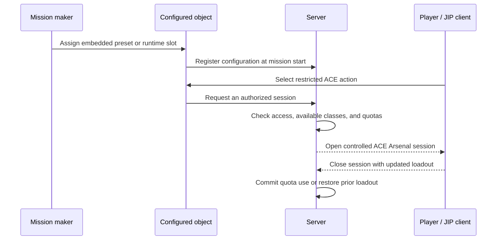

# Restricted Arsenal Creation Assistant (RACA)

Restricted Arsenal Creation Assistant (RACA) is an Arma 3 add-on for mission makers who use ACE Arsenal and need to create controlled, reusable equipment lists without hand-writing SQF.

RACA is intended to make arsenal authoring feel like an editor workflow rather than a scripting task. It discovers ACE-compatible content available in the current Arma session, lets the author search and select individual classes, saves that selection as a named preset, and exposes the preset as a normal Eden object attribute. The player still uses the familiar ACE Arsenal interaction; RACA simply determines exactly what that interaction may provide.

## Why RACA exists

Creating a mission-specific restricted arsenal often means finding class names manually, writing SQF arrays, repeating equipment lists across missions, wiring lists to objects, and diagnosing missing classes when the active mod set changes. RACA removes that friction.

The project is meant to make carefully restricted ACE Arsenal configurations easier to build, understand, reuse, and maintain. It does not replace ACE Arsenal or create a separate player-facing arsenal interface. It is an authoring assistant for mission makers.

## What RACA does

RACA has two parts:

1. **The creator** — a searchable catalogue and preset library at **Tutorials > Restricted Arsenal Creator**.
2. **The Eden integration** — a **Restricted Arsenals** attribute added to Eden objects.

```mermaid
flowchart LR
    A[Load Arma 3, CBA, ACE, and content mods] --> B[Open Restricted Arsenal Creator]
    B --> C[Choose a role starter or select permitted classes]
    C --> D[Set optional item limits and run preflight]
    D --> E[Save or adopt a preset]
    E --> F[Assign in Eden or through a Zeus module]
    F --> G[Server validates access and quota rules]
    G --> H[Players use controlled ACE Arsenal slots]
```



The important boundary is between authoring and runtime: the profile is used to create and manage presets, while the saved mission carries the selected preset it needs to run.

The current release:

- scans the ACE-compatible catalogue from the base game, DLC, and currently loaded mods;
- searches display names, class names, categories, mods, owning add-ons, and authors;
- provides parameterized first-run Quick Start, counted source-mod/owning-add-on/author/tag filters, reusable saved catalogue views, persistent favorites and catalogue tags, clickable persistent sorting, detailed item inspection, Ctrl/Shift multi-selection, and undo/redo;
- separates weapons, attachments, magazines, uniforms, vests, backpacks, headgear, NVGs, facewear, and general equipment;
- keeps every ammunition magazine—including rockets, 40 mm rounds, grenades, mines, and explosives—in Magazines while keeping magazine-backed inventory/medical items in Equipment;
- supports row clicks, Space-bar toggling, Include Visible, Exclude Visible, and Clear All;
- saves named presets in the active Arma profile and supports loading, case-insensitive overwriting, and guarded deletion;
- archives up to 20 prior revisions per preset before destructive library changes, with comparison and rollback as a new revision;
- adopts a source preset with explicit additions/removals, detects circular links, warns about stale or missing sources, and can make an adopted preset standalone;
- exports selections as round-trip JSON, reusable mission SQF, or a simple class list, and imports JSON, existing SQF arsenals, and class lists through the clipboard;
- exports a machine-readable required-mod manifest and a self-contained diagnostic support bundle;
- includes role starters for rifleman, medic, grenadier, marksman, machine gunner, engineer, EOD, pilot, crew, and recon, plus profile-wide custom unit role packs captured from any draft;
- provides color-coded, severity-filterable creator preflight reports for ACE/CBA/Eden availability, active catalogue scope, invalid data, missing classes, duplicate entries, bucket corrections, and likely content-mod sources, with navigation to available affected items; object preflight also blocks wrong field types, duplicate slot IDs, malformed access conditions, and malformed quantity policies before runtime;
- saves per-item and per-category quantity policies with interaction, player, life, mission, or shared-arsenal scopes and explicit reset timing;
- adds a transactional multi-slot configuration editor and mission-wide dashboard to every Eden object's attributes;
- embeds the selected preset in the mission, so runtime use does not depend on the creator's profile;
- provides server-authoritative access checks, controlled ACE interactions, quota enforcement, audit logging, and saved player loadouts for runtime-configured arsenals;
- gives authenticated server administrators an ACE self-interaction dashboard for configured objects, live sessions, quota records, recent audit events, and guided host/client/JIP rehearsal;
- provides Zeus modules to assign or replace, clear, enable or disable, and reset quotas on restricted arsenals; and
- validates preset data, skips unavailable classes, and logs diagnostics with the `[RACA]` prefix.

The player-facing result remains ACE Arsenal. RACA adds the authoring, access, and accounting layer around it.

## Requirements

- Arma 3 **2.22 or newer**
- **CBA_A3**
- **ACE3**, with ACE Arsenal enabled

Load the same content mods while creating a preset, editing the mission, and playing the mission. If a preset contains a class from a mod that is not loaded at runtime, RACA omits that class and reports a warning in the Arma RPT.

## Tutorial: create and use a restricted arsenal

### 1. Install and load RACA

Build RACA or obtain the `@RestrictedArsenalCreationAssistant` folder, then place it somewhere Arma 3 can load as a mod. In the Arma 3 Launcher, enable CBA_A3, ACE3, RACA, and every content mod containing equipment you want to use.

Start Arma 3 after confirming the dependencies load without errors.

### 2. Open the creator

Open **Tutorials > Restricted Arsenal Creator**. RACA loads a catalogue from the current session.

The creator is divided into two tabs. **Preset Management** contains naming, saving, loading, import/export, and adoption maintenance. **Assignment** contains the complete item table, search, category filters, current inclusion state, and bulk include/exclude tools.

**Quick Start** is also a concrete preset generator. Choose a built-in role or custom unit pack, optionally limit it to one loaded source mod, then set optic, suppressor, night-vision, and medical policies. RACA remembers those parameter choices and generates an unsaved draft for review; it never saves or assigns generated content automatically.

The controls include:

- **Search** — searches names, class names, categories, mods, owning add-ons, and authors;
- **Category** — filters by item type;
- **Mod** — filters to one loaded source mod and shows the number of available classes per source;
- **Add-on** — filters to one owning `CfgPatches` add-on and shows its available-class count;
- **Author** — filters to one config author and shows its available-class count;
- **Tag** — filters to a reusable profile-wide item tag; **Edit** creates tags and adds or removes them from the current multi-row selection without touching any preset;
- **Saved Views** — captures and restores a named combination of search, Category, Mod, Add-on, Author, Tag, and sort order without changing the draft selection;
- **Favorite** — stores the selected class in a profile-wide Favorites view;
- **Included / Item / Class Name / Mod / Author headers** — sort the filtered catalogue in either direction and remember the chosen order across sessions;
- **Included** — shows whether a row belongs to the current selection;
- **Details** (or **Enter**) — opens the selected class's config family, base class, source add-ons, item type, mass/capacity/compatibility metadata, draft state, favorite state, and effective quantity policy;
- **Saved presets** — chooses a previously saved list;
- **Save / Overwrite** — stores the current selection under the entered name;
- **Load** — loads the selected saved preset;
- **Delete** — removes the selected preset from the active profile after confirmation while keeping the current items as an unsaved recovery copy;
- **Draft recovery** — continuously checkpoints unsaved names, items, source adoption, and limits to the active profile, then offers to restore or discard that draft after an unexpected close or restart;
- **Quick Start** — creates an unsaved blank or role-based draft, optionally constrained to one loaded source mod, and leads directly to review;
- **Revision History** — compares automatically archived versions and restores one as a new revision;
- **Compare Draft** — copies the exact added/removed class and quantity-policy difference against the selected saved preset;
- **Undo / Redo** — reverses creator item and policy changes, also available with `Ctrl+Z` / `Ctrl+Y`;
- **Adopted source preset** — selects an optional saved source for the current preset;
- **Adopt / Refresh** — adopts that source or deliberately reapplies a changed source while preserving additions and removals;
- **Make Standalone** — saves the complete current result with no source link;
- **Export format** — chooses round-trip JSON, reusable mission SQF, a simple class list, a required-mod manifest, or a support bundle;
- **Export** — copies the selected preset in that format;
- **Import Auto** — detects and safely imports RACA JSON, an existing SQF arsenal, or a class list from the clipboard; and
- **Include Visible**, **Exclude Visible**, and **Clear All** — manages selections in bulk; and
- **Ctrl-click / Shift-click** — selects separate rows or a continuous range; press **Space**, **Favorite**, or **Limit Item** to change the complete set in one operation. Inclusion and limits remain undoable.

The Preset Management tab also provides **Role starter**, **Apply Starter**, **Packs**, **Run Preflight**, **View Details**, and **Copy Report**. The detailed preflight view filters colored Error, Warning, and Information rows; double-clicking an available affected class opens it in Assignment. Assignment includes quantity-limit controls for either the selected class or the active equipment category. **Icons** toggles catalogue item pictures, while **Included**, **Inherited**, and **Favorites** provide focused views. Hovering a row shows a compact summary; **Details** opens the full class/source/config/compatibility report and can include, exclude, favorite, or copy that item without leaving the inspector. The footer always labels the current contents **SAVED** or **UNSAVED DRAFT**.

### 3. Build the selection

Use Category, Mod, Add-on, Author, and Search to narrow the catalogue. Click a row to toggle it, or select a row and press **Space**. Ctrl-click selects separate rows and Shift-click selects a range; then press **Space**, **Favorite**, or **Limit Item** to apply the operation consistently to the selected set. A selection remains intact when an item is temporarily hidden by another filter.

Use **Tags > Edit** to group classes under unit-defined labels such as “medical”, “logistics”, “faction”, or “event kit”. Tags accept the same Ctrl/Shift multi-row selection used by Favorite and Limit Item, persist in the profile even when a content mod is temporarily unloaded, participate in normal text search, and appear in item details. Removing or deleting a tag never removes a class from a preset.

Use **Saved Views** to keep reusable workspaces such as “ACE medical”, “RHS uniforms”, or “Current mod audit”. Enter a view name and capture the current search, Category, Mod, Add-on, Author, Tag, and sorting. Existing saved views are migrated with an empty tag filter. Applying or deleting a view never includes, excludes, saves, overwrites, or deletes an arsenal preset.

For a basic rifleman arsenal:

1. Use **Weapons** to include the permitted rifles and launchers.
2. Use **Magazines** for ammunition, rockets, 40 mm rounds, grenades, mines, and explosives.
3. Use **Equipment** for maps, watches, binoculars, medical supplies, inventory items, and anything not covered by a dedicated category.
4. Add permitted uniforms, vests, headgear, NVGs, facewear, backpacks, and attachments.
5. Confirm the summary shows a non-zero item count.

Bulk actions affect only rows currently visible through the active filters. Use **Exclude Visible** to remove a filtered group, or **Clear All** to start over.

To begin from a practical role baseline, choose a **Role starter** in Preset Management and select **Apply Starter**. Starters are search-based suggestions drawn from the current catalogue; an active Source filter constrains them to that content pack. Parameterized Quick Start exposes the same source boundary plus optic, suppressor, night-vision, and medical add/exclude policies. Review the resulting list rather than treating it as a fixed faction loadout.

To preserve your unit's own faction, medical, logistics, or doctrine convention, build the desired included set and open **Packs**. Capture the current draft under a descriptive name. A custom pack can later merge its available classes into another draft, replace draft inclusion, or serve as a Quick Start choice. Role packs are profile-wide authoring aids: deleting one never deletes a preset, and unavailable mod classes are reported and skipped.

To set an exact limit, select an item row, choose its scope, enter a quantity, and select **Limit Item**. To share one allowance across a complete equipment category, choose that category and select **Limit Category**. Use `-1` for unlimited. Limits are stored with the preset; full server-side enforcement applies when the preset is used by RACA's controlled runtime-object configuration.

### 4. Save the preset

Enter a descriptive name such as `Rifleman - Training`, `Pilot - Rotary Wing`, or `Logistics - Restricted`, then select **Save / Overwrite**.

RACA rejects an empty name and an empty selection. Saving the same name again updates the existing preset instead of creating a case-variant duplicate. Presets are stored in the active Arma profile.

Before saving a preset intended for another mod set, select **Run Preflight**. It verifies ACE3, CBA_A3, and RACA Eden availability; explains exactly how many classes, source mods, owning add-ons, authors, and categories make up the active session; then identifies blocking invalid data, unavailable required classes, duplicates, bucket corrections, and likely source mods/add-ons. Select **Copy Report** to place the full report on the clipboard for testing notes or bug reports.

### 5. Adopt a source preset

To derive a role-specific preset from a common inventory:

1. Load an existing adopted preset to refresh it, or load/craft the selection that should become a new child.
2. Enter a unique child name.
3. Choose an **Adopted source preset** and press **Adopt / Refresh**.
4. Open **Assignment**. Every item from the adopted source is light blue, including source items that you exclude. Use **Inherited** to view only that complete source snapshot and **Included** to view the current result.
5. Include child-only items and exclude source items that this role must not receive.
6. Press **Save / Overwrite**.

RACA stores complete final item buckets alongside the adopted source name, a source fingerprint, additive overrides, and subtractive overrides. Loading never applies a changed source silently. If the source changed, RACA warns and continues showing the child's last saved complete contents; press **Adopt / Refresh** to apply the updated source deliberately, then save. A missing source produces a similar warning without breaking the stored child.

Circular adoption is rejected. **Make Standalone** immediately saves the current result without adoption metadata. Whether a preset remains adopted or becomes standalone, Eden embeds only a complete standalone copy in the mission, so a deployed mission never needs the author's profile or an unresolved source reference.

### 6. Export or import the selection

Select a saved preset, or leave **Saved presets** on **<Current selection>**, then choose an export format:

- **JSON preset** is RACA's authoritative round-trip format. Choose **Export**, paste the clipboard into a UTF-8 `.json` file, and archive or share it. To restore it, copy the complete document and choose **Import Auto**. A JSON export preserves the preset name and all cargo buckets; the importer validates that exact versioned structure.
- **Reusable SQF** creates a complete mission script. Save the clipboard text as `raca_arsenal.sqf` in the 3den mission folder. Put `[this] execVM "raca_arsenal.sqf";` in the Init field of every object that should use it. All of those objects share the same file and therefore stay linked to one maintained list. The script runs the ACE setup on the server and synchronizes the resulting arsenal.
- **Class list** creates a single comma-separated list such as `arifle_MX_F, FirstAidKit, 30Rnd_65x39_caseless_mag` for documentation or other tooling.
- **Required-mod manifest** creates versioned JSON grouped by source mod and owning add-on, with every required class listed explicitly.
- **Support bundle** creates versioned JSON containing RACA/Arma environment data, activated add-ons, compatibility results, the mod manifest, and the complete portable preset. Attach it to a bug report without hand-assembling diagnostics.

JSON preset is the only export intended for guaranteed re-import. The manifest and support bundle are diagnostic artifacts and are deliberately rejected by **Import Auto** as preset data.

To migrate an existing unit arsenal, copy the complete SQF file, enter the desired imported preset name in **Preset name**, and choose **Import Auto**. RACA extracts quoted, currently available config class names from common SQF arrays—including files that combine category arrays with `+`—without compiling or executing the file. It reports and excludes missing quoted classes. The same importer accepts the simple class-list export.

Duplicate preset names prompt for overwrite or a uniquely named imported copy. JSON is the guaranteed RACA-to-RACA interchange path; SQF import is intentionally a conservative migration parser because arbitrary SQF can compute its item list at runtime.

Clipboard import is available in the single-player creator only. Arma disables `copyFromClipboard` in multiplayer for security reasons. For format details, compatibility notes, and examples, see [Preset interchange formats](docs/PORTABLE_PRESET_FORMAT.md).

Imports are atomic and resource-bounded: RACA rejects clipboard text above 2,000,000 characters, presets above 20,000 referenced records, JSON envelopes above 64 preset-metadata or 256 transport-metadata records, and SQF/class-list scans above 50,000 quoted values or tokens. Rejection never changes the profile library.

### 7. Configure it in Eden

Close the creator and open Eden. Place or select the object that should provide the arsenal and open its attributes.

In **Restricted Arsenals**:

1. Choose **Configure slots**.
2. Add one or more slots. Each slot becomes a separately named ACE interaction on the object.
3. For each slot, choose its preset, enabled state, optional icon, and whether unauthorized players should be able to see it.
4. Add any access rules and choose whether all rules (**AND**) or any rule (**OR**) must match. Supported rules cover side, faction, group ID, minimum rank, unit class, player UID, vehicle role, required item, and mission-defined ACE permission key.
5. To rehearse access before preview, choose **Simulate access**, then pick any playable or AI soldier already placed in the mission. The report shows every rule as PASS, FAIL, or UNKNOWN and can be copied to the clipboard. Player UID and mission-defined ACE permissions remain explicitly unknown until runtime.
6. Choose **Save slot changes**, then **Apply configuration**. Closing with **Cancel** discards the transaction.
7. Confirm the object's normal Attributes window and save the scenario.

The configuration editor's mission-wide dashboard preflights every currently configured Eden object and labels it **READY**, **WARN**, or **BLOCKED** with enabled-slot and issue counts. Double-click an entry to select the object, choose **Copy Report** for a detailed mission-wide compatibility record, or use **Assign to selected** / **Clear selected** to update only the objects currently selected in Eden. A confirmation preview names the operation and object count, and the entire bulk update becomes one Eden Undo step. The dashboard reads applied Eden attributes; press **Apply configuration** before refreshing when the current editor transaction has changed.

Use **Refresh presets** in the object attribute to deliberately replace each slot's embedded preset with the matching current profile copy while preserving its interaction name, enabled state, access rules, icon, visibility, and slot order.

RACA stores a complete copy of the selected preset in the scenario attribute. Changing or deleting the profile copy later does not silently change a mission that has already been configured.

Deleting a profile preset also leaves any adopted children usable because they store complete item snapshots. Those children report their now-missing source until they are made standalone or assigned another source.

Choose **Clear** to remove all RACA slots from the object.

### 8. Test the mission

Preview the mission and interact with the configured object through ACE. It should open the normal ACE Arsenal interface, but only classes in the embedded preset should be available.

For a multiplayer release, test with a second client and a client joining in progress. From the authenticated **RACA Administration** panel, open **MP Rehearsal** with the initial remote client already connected, select **Start New**, then join another client and refresh probes. RACA records server, listen-host, initial-client, and JIP dependency/action-manifest evidence and produces a copyable Pass/Fail/Waiting report. This instrumentation supports—not replaces—actually opening the restricted arsenal on each machine.



## Controlled runtime arsenals

RACA's Eden attribute directly authors one or more named ACE interaction slots on an object. Each slot carries its own standalone embedded preset, enabled state, access rule, icon, visibility behavior, and quantity limits. The server authorizes every open request and checks the server-observed player loadout delta when the session closes; if a quota would be exceeded or an outside class was added, it restores the loadout from before that arsenal session. Legacy missions containing the earlier single-preset value are migrated automatically when opened and saved.

The full embedded preset, quota state, open-session records, and mission registry remain server-local. Clients receive only the minimum action metadata needed to draw ACE interactions. That sanitized action manifest is persisted against the configured object so joining clients receive it automatically, and its JIP entry disappears with the object. Requests are bound to the network owner of the player unit, limited by distance, and restricted to one active session per unit. Reconfiguring or clearing an object cancels its open sessions and restores each affected player's previous loadout.

### Access rules and quotas

An access rule may require side, faction, group, minimum rank, unit type, player UID, vehicle role, a required item, or a mission-defined ACE permission. Rules support AND/OR matching and a custom denial message. A restricted slot can remain visible when denied, or hide itself from unauthorized players.

Quantity limits can be assigned to an individual class or category. The creator's Assignment tab exposes the complete policy as **Scope**, **Reset**, and **Max**. Scope can be one interaction, one player, one life, the mission, or the shared arsenal. Reset timing can be never, every authorized interaction, player respawn, an administrator's new-round/new-phase command, or a manual administrator/Zeus reset. Interaction scope always starts fresh for each use and therefore locks its reset timing to **Every interaction**. RACA applies the same interaction boundary when a saved personal loadout is requested, reports remaining limited quantities when an authorized player opens the slot, and gives every slot a server-checked **Check remaining allowance** child action.

Reconfiguring an object preserves counters only for slot rules whose class/category, scope, and reset policy are unchanged. Counters for removed slots, removed or unlimited rules, and changed policies are discarded. Clearing, unregistering, or deleting a configured object also removes its quota records, including records discovered during the periodic stale-object cleanup.

### Player loadouts and administration

Every runtime slot adds ACE actions to save and reapply a personal loadout for that slot. Personal records stay in the player's profile and are bound to that player's UID and slot. Reapplication is requested through the server and passes through the same access, distance, allowed-class, and quota checks as an interactive arsenal session.

Server administrators can reset quotas and clear, enable, disable, assign, or replace configured objects. These actions require a logged-in server admin, `serverCommandAvailable "#kick"`, or a UID listed in `RACA_adminUIDs`. An authorized player's ACE self-interaction menu exposes **RACA Administration**, which shows sanitized object/slot summaries, active-session and quota counts, the newest 100 audit events, scoped controls, and a clipboard audit export. The server rechecks authorization for every snapshot and command; the client display is never authoritative.

The administration panel's **MP Rehearsal** starts a server-owned session, probes dependency and local sanitized-action registration on each connected interface, classifies later distinct player identities as JIP, and reports the server/listen-host/initial-client/JIP gates without exposing embedded presets. Initial identities are captured by Steam UID when the rehearsal starts, so disconnecting and reconnecting the same player remains initial-client evidence and cannot satisfy the JIP gate. A missing UID fails the identity proof instead of producing ambiguous release evidence. Starting and inspecting a rehearsal requires the same server-side authorization as every other administration action.

### Zeus modules

The **Restricted Arsenals** Zeus category includes modules to assign/replace a preset, clear an arsenal, enable/disable an arsenal, and reset quotas. Zeus modules run on the server and can be disabled for a mission by setting `RACA_allowZeusModules` to `false` in `missionNamespace`. The assignment module resolves its named preset first from the server profile and then from presets already embedded in registered mission objects. This fallback makes a dedicated-server Zeus workflow independent of the curator's local profile once at least one mission object carries that preset.

## Important behavior and limitations

### Presets and profiles

Presets are stored in the profile variable `RACA_presetLibrary_v1`. They are authoring data, not a runtime dependency of a saved mission. Eden embeds the selected preset in the scenario.

Before overwrite, rollback, standalone conversion, import replacement, or deletion, RACA archives the outgoing profile preset. Revision history retains the newest 20 snapshots for each preset and restores an old snapshot as a new monotonically increasing revision, so rollback never silently erases the version it replaced. Unsaved creator changes are separately checkpointed in `RACA_creatorDraftRecovery_v1`; a successful save or load clears that recovery record, while an unexpected close offers it on the next creator launch.

Portable presets use a documented JSON envelope. All imports are decoded or scanned as data and are never compiled or executed. Malformed data, unsafe class-name shapes, unsupported versions, and inputs above the documented resource limits are rejected atomically. See [the interchange formats](docs/PORTABLE_PRESET_FORMAT.md).

Adopted presets remain authoring conveniences. Their stored final buckets are always complete. JSON preserves safe adoption metadata for profile-to-profile editing, while class-list and SQF exports are intentionally standalone. Eden also strips adoption metadata before writing the object attribute.

### Missing content mods

RACA validates the embedded selection at mission start. Classes unavailable in the active mod set are skipped while valid classes are applied. Missing-content warnings are written to the RPT with the `[RACA]` prefix.

Keep the authoring and runtime mod sets aligned. A missing mod can make an intentionally restricted arsenal smaller than expected.

### Repeated previews

Before applying a preset, RACA removes the previously registered ACE virtual arsenal from the object. Repeated previews therefore do not accumulate old or unrestricted virtual cargo.

### Multiplayer

The server initializes the arsenal and the configured contents are synchronized for clients and JIP. The guided MP Rehearsal makes synchronization evidence visible and shareable, but multiplayer acceptance still requires real connected and JIP clients because the Arma engine is authoritative.

The generated **Reusable SQF** export is separate from RACA's Eden integration: it is a standalone ACE script with no RACA runtime dependency. It validates its object argument, runs on the server, removes an earlier ACE virtual arsenal, and initializes the exported classes globally.

## Troubleshooting

**The creator is not in Tutorials.** Confirm that RACA, CBA_A3, and ACE3 are loaded and that ACE Arsenal is enabled.

**The catalogue is empty or missing content.** Load the relevant content mod before opening the creator. RACA scans the current session only.

**A preset is not visible in Eden.** Press **Refresh**. If it is still missing, check that Eden is using the same Arma profile in which the preset was saved.

**The runtime arsenal is smaller than expected.** Inspect the newest Arma RPT for `[RACA]` warnings about unavailable classes and verify the runtime mod set.

**The object has no usable arsenal.** Confirm that a preset—not **<None>**—is selected, that it contains at least one item, and that its classes are available.

See the focused [in-game release checklist](docs/IN_GAME_TEST_CHECKLIST.md) for systematic verification.

## Build from source

Building requires Arma 3 Tools, including AddonBuilder and BankRev. From the repository root:

```powershell
.\tools\validate.ps1
.\tools\build.ps1 -Clean
```

The default output is `build\@RestrictedArsenalCreationAssistant`. The build packages the add-ons, verifies PBO prefixes, copies mod metadata, and creates `checksums.sha256`.

For the isolated dedicated-server synchronization rehearsal, build first and then stage the source-controlled smoke mission beneath a separate Arma profile:

```powershell
.\tools\prepare-multiplayer-smoke.ps1 -ArmaDirectory 'F:\SteamLibrary\steamapps\common\Arma 3'
```

The command validates the local server, CBA, ACE, and built RACA paths and prints reusable server/client launch arguments. See [the multiplayer smoke harness](tests/multiplayer/README.md) for the initial-client, reconnect, and distinct-JIP evidence sequence.

For the unattended single-process acceptance gate, build first and stage the
source-controlled VR autotest beneath an isolated Arma profile:

```powershell
.\tools\prepare-autotest.ps1 -ArmaDirectory 'F:\SteamLibrary\steamapps\common\Arma 3'
```

The command prints the exact client arguments for Arma's `-autotest` mode.
Every assertion appears in the RPT as `[RACA AUTOTEST]`; the mission returns
`END1` only when packaged Creator, interchange, Eden, runtime, Zeus, quota, and
live preset-deletion-control checks all pass. See [the automated acceptance
harness](tests/autotest/README.md).

After committing a clean, fully tested release candidate, `tools\release.ps1` reruns validation, rebuilds the PBOs, verifies every manifest hash, enforces version/changelog/license consistency, and creates a hashed ZIP plus `release-report.json`. See [the release process](docs/RELEASE_PROCESS.md). Development versions require the explicit `-AllowDevelopmentVersion` switch. The latest local development results and explicit multiplayer unknowns are recorded in [development acceptance evidence](docs/DEVELOPMENT_ACCEPTANCE.md).

If Arma 3 Tools is installed elsewhere, provide `-AddonBuilderPath`, `-ArmaToolsDirectory`, and `-BankRevPath`. Validation also supports custom CfgConvert, Java, and SQFLint paths; use `-SkipConfig` or `-SkipSqf` only when the corresponding tool is unavailable.

Static validation covers configuration structure, SQF syntax, PBO prefixes, mission registration, and known integration regressions. Final acceptance still requires in-game testing.

## Project layout

- `addons/core` — creator mission, catalogue scanning, preset storage, validation, and ACE application;
- `addons/core/functions/runtime` — server-authoritative sessions, access rules, quotas, player loadouts, and administration;
- `addons/core/functions/templates`, `diagnostics`, and `zeus` — role starters, preflight reporting, and Zeus modules;
- `addons/eden` — Eden object attribute and preset selection controls;
- `docs/IN_GAME_TEST_CHECKLIST.md` — in-game release checklist;
- `docs/PORTABLE_PRESET_FORMAT.md` — JSON, SQF, and class-list interchange formats and file workflows;
- `docs/RELEASE_PROCESS.md` and `CHANGELOG.md` — versioning, migration, evidence, and packaging gates;
- `tests/autotest` and `tools/prepare-autotest.ps1` — unattended packaged Creator, interchange, Eden, and runtime acceptance;
- `tests/multiplayer` and `tools/prepare-multiplayer-smoke.ps1` — isolated dedicated-server synchronization and identity evidence;
- `tools/validate.ps1` — source and configuration validation;
- `tools/build.ps1` — PBO packaging and checksum generation;
- `tools/release.ps1` — clean-tree release packaging and cryptographic release report generation.

## License and dependencies

RACA calls public ACE3 and CBA interfaces but does not redistribute either dependency. RACA source and documentation are licensed under the repository's MIT License.

Project page: [github.com/Black-Ops-2-543/Arma3_ACE_Arsenal_Creation_Tool](https://github.com/Black-Ops-2-543/Arma3_ACE_Arsenal_Creation_Tool)
