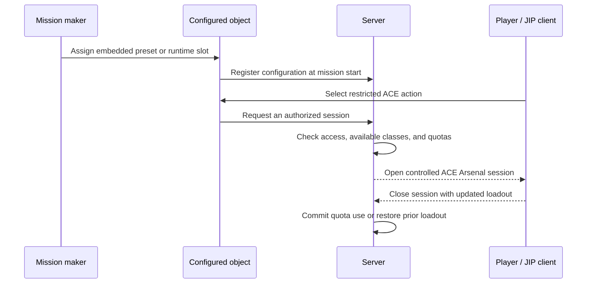

# Restricted Arsenal Creation Assistant (RACA)

Restricted Arsenal Creation Assistant (RACA) is an Arma 3 add-on for mission makers who use ACE Arsenal and need to create controlled, reusable equipment lists without hand-writing SQF.

RACA is intended to make arsenal authoring feel like an editor workflow rather than a scripting task. It discovers ACE-compatible content available in the current Arma session, lets the author search and select individual classes, saves that selection as a named preset, and exposes the preset as a normal Eden object attribute. The player still uses the familiar ACE Arsenal interaction; RACA simply determines exactly what that interaction may provide.

## Why RACA exists

Creating a mission-specific restricted arsenal often means finding class names manually, writing SQF arrays, repeating equipment lists across missions, wiring lists to objects, and diagnosing missing classes when the active mod set changes. RACA removes that friction.

The project is meant to make carefully restricted ACE Arsenal configurations easier to build, understand, reuse, and maintain. It does not replace ACE Arsenal or create a separate player-facing arsenal interface. It is an authoring assistant for mission makers.

## What RACA does

RACA has two parts:

1. **The creator** — a searchable catalogue and preset library at **Tutorials > Restricted Arsenal Creator**.
2. **The Eden integration** — a **Restricted Arsenals** attribute added to Eden objects.

```mermaid
flowchart LR
    A[Load Arma 3, CBA, ACE, and content mods] --> B[Open Restricted Arsenal Creator]
    B --> C[Choose a role starter or select permitted classes]
    C --> D[Set optional item limits and run preflight]
    D --> E[Save or adopt a preset]
    E --> F[Assign in Eden or through a Zeus module]
    F --> G[Server validates access and quota rules]
    G --> H[Players use controlled ACE Arsenal slots]
```



The important boundary is between authoring and runtime: the profile is used to create and manage presets, while the saved mission carries the selected preset it needs to run.

The current release:

- scans the ACE-compatible catalogue from the base game, DLC, and currently loaded mods;
- searches display names, class names, categories, mods, owning add-ons, and authors;
- separates weapons, attachments, magazines, uniforms, vests, backpacks, headgear, NVGs, facewear, and general equipment;
- keeps every ammunition magazine—including rockets, 40 mm rounds, grenades, mines, and explosives—in Magazines while keeping magazine-backed inventory/medical items in Equipment;
- supports row clicks, Space-bar toggling, Include Visible, Exclude Visible, and Clear All;
- saves named presets in the active Arma profile and supports loading, case-insensitive overwriting, and guarded deletion;
- adopts a source preset with explicit additions/removals, detects circular links, warns about stale or missing sources, and can make an adopted preset standalone;
- exports selections as round-trip JSON, reusable mission SQF, or a simple class list, and imports JSON, existing SQF arsenals, and class lists through the clipboard;
- includes role starters for rifleman, medic, grenadier, marksman, machine gunner, engineer, EOD, pilot, crew, and recon;
- provides creator preflight reports for invalid data, missing classes, duplicate entries, bucket corrections, and likely content-mod sources;
- saves per-item quantity policies with interaction, player, life, mission, or shared-arsenal scopes;
- adds a preset selector and Refresh button to every Eden object's attributes;
- embeds the selected preset in the mission, so runtime use does not depend on the creator's profile;
- provides server-authoritative access checks, controlled ACE interactions, quota enforcement, audit logging, and saved player loadouts for runtime-configured arsenals;
- provides Zeus modules to assign or replace, clear, enable or disable, and reset quotas on restricted arsenals; and
- validates preset data, skips unavailable classes, and logs diagnostics with the `[RACA]` prefix.

The player-facing result remains ACE Arsenal. RACA adds the authoring, access, and accounting layer around it.

## Requirements

- Arma 3 **2.22 or newer**
- **CBA_A3**
- **ACE3**, with ACE Arsenal enabled

Load the same content mods while creating a preset, editing the mission, and playing the mission. If a preset contains a class from a mod that is not loaded at runtime, RACA omits that class and reports a warning in the Arma RPT.

## Tutorial: create and use a restricted arsenal

### 1. Install and load RACA

Build RACA or obtain the `@RestrictedArsenalCreationAssistant` folder, then place it somewhere Arma 3 can load as a mod. In the Arma 3 Launcher, enable CBA_A3, ACE3, RACA, and every content mod containing equipment you want to use.

Start Arma 3 after confirming the dependencies load without errors.

### 2. Open the creator

Open **Tutorials > Restricted Arsenal Creator**. RACA loads a catalogue from the current session.

The creator is divided into two tabs. **Preset Management** contains naming, saving, loading, import/export, and adoption maintenance. **Assignment** contains the complete item table, search, category filters, current inclusion state, and bulk include/exclude tools.

The controls include:

- **Search** — searches names, class names, categories, mods, owning add-ons, and authors;
- **Category** — filters by item type;
- **Included** — shows whether a row belongs to the current selection;
- **Saved presets** — chooses a previously saved list;
- **Save / Overwrite** — stores the current selection under the entered name;
- **Load** — loads the selected saved preset;
- **Delete** — removes the selected preset from the active profile after confirmation while keeping the current items as an unsaved recovery copy;
- **Adopted source preset** — selects an optional saved source for the current preset;
- **Adopt / Refresh** — adopts that source or deliberately reapplies a changed source while preserving additions and removals;
- **Make Standalone** — saves the complete current result with no source link;
- **Export format** — chooses round-trip JSON, reusable mission SQF, or a simple class list;
- **Export** — copies the selected preset in that format;
- **Import Auto** — detects and safely imports RACA JSON, an existing SQF arsenal, or a class list from the clipboard; and
- **Include Visible**, **Exclude Visible**, and **Clear All** — manages selections in bulk.

The Preset Management tab also provides **Role starter**, **Apply Starter**, **Run Preflight**, and **Copy Report**. Assignment includes an optional quantity-limit control for the selected class; **View** switches between the current included items and the full adopted-source snapshot.

### 3. Build the selection

Use Category and Search to narrow the catalogue. Click a row to toggle it, or select a row and press **Space**. A selection remains intact when an item is temporarily hidden by another filter.

For a basic rifleman arsenal:

1. Use **Weapons** to include the permitted rifles and launchers.
2. Use **Magazines** for ammunition, rockets, 40 mm rounds, grenades, mines, and explosives.
3. Use **Equipment** for maps, watches, binoculars, medical supplies, inventory items, and anything not covered by a dedicated category.
4. Add permitted uniforms, vests, headgear, NVGs, facewear, backpacks, and attachments.
5. Confirm the summary shows a non-zero item count.

Bulk actions affect only rows currently visible through the active filters. Use **Exclude Visible** to remove a filtered group, or **Clear All** to start over.

To begin from a practical role baseline, choose a **Role starter** in Preset Management and select **Apply Starter**. Starters are search-based suggestions drawn from the current catalogue, so review the resulting list rather than treating it as a fixed faction loadout.

To set a limit, select an item row, choose its scope, enter a quantity, and select **Set Limit**. Use `-1` for unlimited. Limits are stored with the preset; full server-side enforcement applies when the preset is used by RACA's controlled runtime-object configuration.

### 4. Save the preset

Enter a descriptive name such as `Rifleman - Training`, `Pilot - Rotary Wing`, or `Logistics - Restricted`, then select **Save / Overwrite**.

RACA rejects an empty name and an empty selection. Saving the same name again updates the existing preset instead of creating a case-variant duplicate. Presets are stored in the active Arma profile.

Before saving a preset intended for another mod set, select **Run Preflight**. It identifies blocking invalid data, unavailable required classes, duplicates, bucket corrections, and likely source mods/add-ons. Select **Copy Report** to place the full report on the clipboard for testing notes or bug reports.

### 5. Adopt a source preset

To derive a role-specific preset from a common inventory:

1. Load an existing adopted preset to refresh it, or load/craft the selection that should become a new child.
2. Enter a unique child name.
3. Choose an **Adopted source preset** and press **Adopt / Refresh**.
4. Open **Assignment**. Every item from the adopted source is light blue, including source items that you exclude. Use **Inherited** to view only that complete source snapshot and **Included** to view the current result.
5. Include child-only items and exclude source items that this role must not receive.
6. Press **Save / Overwrite**.

RACA stores complete final item buckets alongside the adopted source name, a source fingerprint, additive overrides, and subtractive overrides. Loading never applies a changed source silently. If the source changed, RACA warns and continues showing the child's last saved complete contents; press **Adopt / Refresh** to apply the updated source deliberately, then save. A missing source produces a similar warning without breaking the stored child.

Circular adoption is rejected. **Make Standalone** immediately saves the current result without adoption metadata. Whether a preset remains adopted or becomes standalone, Eden embeds only a complete standalone copy in the mission, so a deployed mission never needs the author's profile or an unresolved source reference.

### 6. Export or import the selection

Select a saved preset, or leave **Saved presets** on **<Current selection>**, then choose an export format:

- **JSON preset** is RACA's authoritative round-trip format. Choose **Export**, paste the clipboard into a UTF-8 `.json` file, and archive or share it. To restore it, copy the complete document and choose **Import Auto**. A JSON export preserves the preset name and all cargo buckets; the importer validates that exact versioned structure.
- **Reusable SQF** creates a complete mission script. Save the clipboard text as `raca_arsenal.sqf` in the 3den mission folder. Put `[this] execVM "raca_arsenal.sqf";` in the Init field of every object that should use it. All of those objects share the same file and therefore stay linked to one maintained list. The script runs the ACE setup on the server and synchronizes the resulting arsenal.
- **Class list** creates a single comma-separated list such as `arifle_MX_F, FirstAidKit, 30Rnd_65x39_caseless_mag` for documentation or other tooling.

To migrate an existing unit arsenal, copy the complete SQF file, enter the desired imported preset name in **Preset name**, and choose **Import Auto**. RACA extracts quoted, currently available config class names from common SQF arrays—including files that combine category arrays with `+`—without compiling or executing the file. It reports and excludes missing quoted classes. The same importer accepts the simple class-list export.

Duplicate preset names prompt for overwrite or a uniquely named imported copy. JSON is the guaranteed RACA-to-RACA interchange path; SQF import is intentionally a conservative migration parser because arbitrary SQF can compute its item list at runtime.

Clipboard import is available in the single-player creator only. Arma disables `copyFromClipboard` in multiplayer for security reasons. For format details, compatibility notes, and examples, see [Preset interchange formats](docs/PORTABLE_PRESET_FORMAT.md).

### 7. Assign it to an Eden object

Close the creator and open Eden. Place or select the object that should provide the arsenal and open its attributes.

In **Restricted Arsenals**:

1. Choose the saved preset.
2. Press **Refresh** if the preset was saved after the attributes window or Eden session opened.
3. Confirm the attributes.
4. Save the scenario.

RACA stores a complete copy of the selected preset in the scenario attribute. Changing or deleting the profile copy later does not silently change a mission that has already been configured.

Deleting a profile preset also leaves any adopted children usable because they store complete item snapshots. Those children report their now-missing source until they are made standalone or assigned another source.

Choose **<None>** to remove RACA's assignment from the object.

### 8. Test the mission

Preview the mission and interact with the configured object through ACE. It should open the normal ACE Arsenal interface, but only classes in the embedded preset should be available.

For a multiplayer release, test with a second client and, when relevant, a client joining in progress. The host, connected client, and JIP client should see the same restricted contents.



## Controlled runtime arsenals

RACA's Eden attribute turns one embedded preset into a single restricted arsenal. The runtime object configuration expands that model into one or more named ACE interaction slots on an object. Each slot can carry its own preset, enabled state, access rule, icon, visibility behavior, and quantity limits. The server authorizes every open request and checks the player's loadout delta when the session closes; if a quota would be exceeded, it restores the loadout from before that arsenal session.

### Access rules and quotas

An access rule may require side, faction, group, minimum rank, unit type, player UID, vehicle role, a required item, or a mission-defined ACE permission. Rules support AND/OR matching and a custom denial message. A restricted slot can remain visible when denied, or hide itself from unauthorized players.

Quantity limits can be assigned to an individual class or category. Their scope is one interaction, one player, one life, the mission, or the shared arsenal; they can be reset on interaction, respawn, round, phase, or manually. RACA reports remaining limited quantities when an authorized player opens the slot.

### Player loadouts and administration

Every runtime slot adds ACE actions to save and reapply a personal loadout for that slot. RACA refuses to reapply a saved loadout if it contains classes outside the slot's allowed preset.

Server administrators can reset quotas and clear, enable, disable, assign, or replace configured objects. These actions require a logged-in server admin, `serverCommandAvailable "#kick"`, or a UID listed in `RACA_adminUIDs`. Runtime changes and access decisions are recorded in RACA's mission audit log.

### Zeus modules

The **Restricted Arsenals** Zeus category includes modules to assign/replace a preset, clear an arsenal, enable/disable an arsenal, and reset quotas. Zeus modules run on the server and can be disabled for a mission by setting `RACA_allowZeusModules` to `false` in `missionNamespace`. The assignment module resolves its named preset from the server's RACA preset library, so ensure the server profile has that preset before using it.

## Important behavior and limitations

### Presets and profiles

Presets are stored in the profile variable `RACA_presetLibrary_v1`. They are authoring data, not a runtime dependency of a saved mission. Eden embeds the selected preset in the scenario.

Portable presets use a documented JSON envelope. All imports are decoded or scanned as data and are never compiled or executed. Malformed data, unsafe class-name shapes, and unsupported versions are rejected. RACA imposes no fixed byte ceiling; the practical limit is the memory available to Arma and the operating-system clipboard. See [the interchange formats](docs/PORTABLE_PRESET_FORMAT.md).

Adopted presets remain authoring conveniences. Their stored final buckets are always complete. JSON preserves safe adoption metadata for profile-to-profile editing, while class-list and SQF exports are intentionally standalone. Eden also strips adoption metadata before writing the object attribute.

### Missing content mods

RACA validates the embedded selection at mission start. Classes unavailable in the active mod set are skipped while valid classes are applied. Missing-content warnings are written to the RPT with the `[RACA]` prefix.

Keep the authoring and runtime mod sets aligned. A missing mod can make an intentionally restricted arsenal smaller than expected.

### Repeated previews

Before applying a preset, RACA removes the previously registered ACE virtual arsenal from the object. Repeated previews therefore do not accumulate old or unrestricted virtual cargo.

### Multiplayer

The server initializes the arsenal and the configured contents are synchronized for clients and JIP. Multiplayer acceptance should still be verified in-game because the Arma engine is authoritative.

The generated **Reusable SQF** export is separate from RACA's Eden integration: it is a standalone ACE script with no RACA runtime dependency. It validates its object argument, runs on the server, removes an earlier ACE virtual arsenal, and initializes the exported classes globally.

## Troubleshooting

**The creator is not in Tutorials.** Confirm that RACA, CBA_A3, and ACE3 are loaded and that ACE Arsenal is enabled.

**The catalogue is empty or missing content.** Load the relevant content mod before opening the creator. RACA scans the current session only.

**A preset is not visible in Eden.** Press **Refresh**. If it is still missing, check that Eden is using the same Arma profile in which the preset was saved.

**The runtime arsenal is smaller than expected.** Inspect the newest Arma RPT for `[RACA]` warnings about unavailable classes and verify the runtime mod set.

**The object has no usable arsenal.** Confirm that a preset—not **<None>**—is selected, that it contains at least one item, and that its classes are available.

See the focused [in-game release checklist](docs/IN_GAME_TEST_CHECKLIST.md) for systematic verification.

## Build from source

Building requires Arma 3 Tools, including AddonBuilder and BankRev. From the repository root:

```powershell
.\tools\validate.ps1
.\tools\build.ps1 -Clean
```

The default output is `build\@RestrictedArsenalCreationAssistant`. The build packages the add-ons, verifies PBO prefixes, copies mod metadata, and creates `checksums.sha256`.

If Arma 3 Tools is installed elsewhere, provide `-AddonBuilderPath`, `-ArmaToolsDirectory`, and `-BankRevPath`. Validation also supports custom CfgConvert, Java, and SQFLint paths; use `-SkipConfig` or `-SkipSqf` only when the corresponding tool is unavailable.

Static validation covers configuration structure, SQF syntax, PBO prefixes, mission registration, and known integration regressions. Final acceptance still requires in-game testing.

## Project layout

- `addons/core` — creator mission, catalogue scanning, preset storage, validation, and ACE application;
- `addons/core/functions/runtime` — server-authoritative sessions, access rules, quotas, player loadouts, and administration;
- `addons/core/functions/templates`, `diagnostics`, and `zeus` — role starters, preflight reporting, and Zeus modules;
- `addons/eden` — Eden object attribute and preset selection controls;
- `docs/IN_GAME_TEST_CHECKLIST.md` — in-game release checklist;
- `docs/PORTABLE_PRESET_FORMAT.md` — JSON, SQF, and class-list interchange formats and file workflows;
- `tools/validate.ps1` — source and configuration validation; and
- `tools/build.ps1` — PBO packaging and checksum generation.

## License and dependencies

RACA calls public ACE3 and CBA interfaces but does not redistribute either dependency. Add an explicit project license before publishing or accepting outside contributions.

Project page: [github.com/Black-Ops-2-543/Arma3_ACE_Arsenal_Creation_Tool](https://github.com/Black-Ops-2-543/Arma3_ACE_Arsenal_Creation_Tool)
