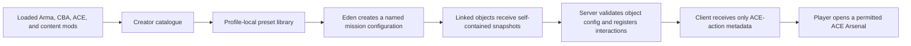

# Restricted Arsenal Creation Assistant — Implementation Wiki

> **Documentation status:** This wiki describes the `0.11.0-dev` implementation present in this repository on September 4, 2026. The consolidated package passed static validation, a clean Core/Eden build, and 97/97 deterministic Arma assertions; a dedicated server and one initial remote client also passed the rehearsal probes. Resolution-specific visual checks, actual Curator placement, native Eden interaction matrices, and a distinct-account JIP client remain open. This wiki is an implementation reference, not a public-release certificate. Use the [September 4 test log](TEST_LOG_2026-09-04.md), [consolidated implementation record](CONSOLIDATED_IMPLEMENTATION_2026-09-04.md), and [in-game release checklist](IN_GAME_TEST_CHECKLIST.md).

Restricted Arsenal Creation Assistant (RACA) is an Arma 3 add-on for mission makers using ACE Arsenal. It is an **authoring and control layer**, not a replacement arsenal. A mission maker builds a controlled list of equipment, turns it into a named mission-wide Arsenal Configuration, links that configuration to Eden objects, and players open it through a familiar ACE interaction. The same project can additionally enforce access rules, quantity limits, server authority, personal loadouts, audit records, administrator controls, and Zeus changes.

This wiki is the detailed operating and implementation reference for readers who have already decided to evaluate, use, test, administer, or contribute to RACA. It answers **how RACA behaves and how to work with it**: exact controls, workflows, terminology, schemas, persistence, edge cases, diagnostics, security boundaries, tests, and source architecture. For the pre-install question—**whether RACA fits your unit or mission workflow at all**—begin with the [README](../README.md). Its final Quick Start is intentionally brief; the complete behavior and edge cases live here.

## Contents

- [What RACA is and is not](#what-raca-is-and-is-not)
- [Current implementation and test status](#current-implementation-and-test-status)
- [Requirements, installation, and terminology](#requirements-installation-and-terminology)
- [The complete authoring-to-player workflow](#the-complete-authoring-to-player-workflow)
- [Creator: catalogue, selection, presets, and exports](#creator-catalogue-selection-presets-and-exports)
- [Eden Mission Arsenal Tool](#eden-mission-arsenal-tool)
- [Runtime: player interactions, access, quotas, and loadouts](#runtime-player-interactions-access-quotas-and-loadouts)
- [Administration and Zeus](#administration-and-zeus)
- [Data formats and persistence boundaries](#data-formats-and-persistence-boundaries)
- [Security and failure behavior](#security-and-failure-behavior)
- [Testing, diagnostics, building, and releases](#testing-diagnostics-building-and-releases)
- [Architecture and complete source map](#architecture-and-complete-source-map)
- [Known verification limits](#known-verification-limits)

## What RACA is and is not

RACA solves the mission-maker problem of turning the equipment available in the current mod set into a repeatable ACE Arsenal restriction, without manually maintaining class-name arrays. It scans the ACE virtual arsenal catalogue, records the exact classes an author permits, and carries a complete copy of that list into the mission.

It **is**:

- a single-player Creator mission available at **Tutorials > Restricted Arsenal Creator**;
- a profile-local preset library and authoring workspace;
- an Eden **Tools > RACA Mission Arsenal Tool** window plus a compact **Restricted Arsenals** object attribute;
- an optional server-authoritative runtime system for access control, quotas, audits, saved player loadouts, administrator tools, and Zeus changes; and
- a data-only import/export and diagnostic tool.

It **is not**:

- a replacement for ACE Arsenal's player interface;
- a global restriction on all ACE Arsenal boxes in a mission;
- a guarantee that equipment from a missing content mod will appear at runtime; or
- a way to execute imported scripts. Imported SQF is parsed only for safe, quoted class-name literals and is never compiled or run.

The core design boundary is intentional:



An inherited profile preset is useful while authoring, but is never a runtime dependency. Eden and runtime configurations contain a flattened, standalone preset snapshot.

## Current implementation and test status

The current development version is `0.11.0-dev`. The September 4 source and package are complete for the consolidated diagnostic docket and passed the deterministic packaged-engine suite. This evidence does not complete the full release checklist because several requirements are inherently visual, native-editor, Curator, or distinct-client scenarios.

| Gate | Latest result | Scope |
| --- | --- | --- |
| Static validation and clean build | **Pass — September 4** | Core/Eden configuration, SQF checks, packaging, PBO-prefix checks, and final hashes completed. |
| Consolidated Creator/Eden/Zeus implementation | **Source-complete — September 4** | All O1–O15 and F1–F15 solution packages are implemented; evidence classes remain separate below. |
| Automated Arma acceptance | **Pass — 97/97 on September 4** | Packaged Creator dialogs, catalogue, tags, magazine navigation, interchange, Eden data/preflight, runtime, and accepted/rejected Zeus server paths. |
| Large-import matrix | **Pass** | 19,999 through 100,000-record fixtures, including the exact 40,280 case, were processed without a hidden item ceiling. |
| Synthetic catalogue performance | **Functional pass with measured constraint** | 100,000-record settled filter p95 was 1.473 s; initial full render was 3.549 s and missed the proposed 250 ms visible-result target. |
| Dedicated multiplayer | **Pass for server + initial client** | Dedicated SERVER and initial remote CLIENT probes passed; the distinct JIP role remained WAITING. |
| Distinct-identity JIP | **Not tested** | Arma rejected a second simultaneous process using the same Steam ID; a second account/machine is required. |
| Visual/native-editor/Curator matrix | **Not tested in the final session** | The available computer-control surface exposed no native Arma image/app surface. |

The current hashes, exact timings, redacted multiplayer evidence, Zeus excerpts, and remaining evidence rows are in the [September 4 test log](TEST_LOG_2026-09-04.md). The final deterministic RPT contains no RACA assertion failure, expression error, missing script, or undefined variable.

### Resolved findings and open evidence gaps

| ID | Area | Recorded behavior or current status |
| --- | --- | --- |
| `RACA-TEST-001` | Creator catalogue | **Defined behavior.** Row-body click selects; Included checkbox or Space changes inclusion. Selection is class-based across paging/filtering. |
| `RACA-TEST-002` | Import decisions | **Resolved in source/engine tests.** The explicit choices are Import, Overwrite, Import Copy, and Cancel, with one atomic profile write at most. Resolution-specific visual inspection remains open. |
| `RACA-TEST-003` | Compatibility Check | **Resolved in source/engine tests.** Five real columns, Errors-first display, conditional navigation, and full-report copy are implemented. Resolution-specific layout inspection remains open. |
| `RACA-TEST-004` | Creator/Eden animation | **Resolved in source.** Changed actions use static profile-accent controls. Ten-second pixel captures remain open. |
| `RACA-TEST-005` | Autotest staging | **Resolved.** Recursive staging runs under the tested Windows PowerShell 5.1 environment. |
| `RACA-TEST-006` | Large catalogue | **Measured constraint.** No hidden record cap was found, but the 100,000-record initial render took 3.549 s. |
| `RACA-TEST-007` | Eden Dashboard assignment | **Resolved in source/engine tests.** Shared preflight, exact readback, request-owned native fallback, and cache invalidation are implemented. Manual cancel/race/Undo paths remain open. |
| `RACA-TEST-008` | Distinct JIP | **Environment blocker.** A second local profile cannot supply a second Steam identity. |

The open evidence gaps prevent the development build from being described as fully mission-ready even though the deterministic package is clean.

## Requirements, installation, and terminology

### Requirements

- Arma 3 2.22 or later.
- CBA_A3.
- ACE3 with ACE Arsenal enabled.
- RACA Core and RACA Eden PBOs.
- Every equipment/content mod used by the preset, loaded while creating the preset, editing the mission, and playing the mission.

The add-on declares `A3_Modules_F`, `cba_main`, `ace_arsenal`, and `ace_interact_menu` as Core dependencies. The Eden add-on depends on `3DEN` and `RACA_Core`.

### Installation

Use a release package or build `@RestrictedArsenalCreationAssistant`, then enable CBA_A3, ACE3, RACA, and the desired content mods in the Arma launcher. RACA contains two PBOs:

| PBO | Purpose |
| --- | --- |
| `addons/core.pbo` | Creator mission, catalogue, preset library, runtime logic, ACE actions, server networking, admin UI, and Zeus modules. |
| `addons/eden.pbo` | Eden Tools-menu integration, mission configuration library, compact object assignment attribute, access-rule test, Dashboard, and transactional Eden editing. |

### Key terms

| Term | Meaning |
| --- | --- |
| **Catalogue** | The ACE virtual-arsenal items discoverable from the active Arma session. |
| **Preset** | A named, profile-local selection of permitted classes, grouped into ACE/BIS virtual-cargo buckets. |
| **Arsenal Configuration** | A named mission-wide record containing one flattened preset snapshot, an optional icon, access rules, and a denied message. It can be linked to many objects. |
| **Configuration display name** | Human-readable mission-authoring text. It may contain spaces and punctuation and may be renamed without changing object identity. |
| **Stable configuration ID** | Opaque 1–64-character internal link stored separately from the display name. New IDs are generated by RACA; repair replaces missing/unsafe IDs and updates links atomically. |
| **Configuration recovery state** | `READY` for a valid v1 library, `RECOVERY` for malformed/duplicate/repairable v1 records, `FUTURE` for a newer version, or `BLOCKED` for an unrecognized/invalid envelope. Inspection never writes. |
| **Object assignment** | The selected Arsenal Configuration stored on an Eden object as a self-contained runtime snapshot. |
| **Runtime slot** | The normalized player-facing ACE interaction carried inside an object configuration. The current Eden tool produces one slot from each assigned Arsenal Configuration; the runtime schema remains compatible with older multi-slot object data. |
| **Object configuration** | The complete mission-embedded runtime envelope on one object, including its slot, access, limits, icon, and stable configuration-link metadata. |
| **Source/inherited preset** | A profile-level parent relationship used to derive a child preset with additions and removals. |
| **Flattened preset** | A complete result with no required source reference. This is what Eden and runtime use. |
| **Quantity policy** | A per-class or per-category allowance with a scope and reset rule. `-1` means unlimited. |
| **Preflight** | Structured validation that reports errors, warnings, and informational evidence before configuration reaches runtime. |

## The complete authoring-to-player workflow

1. Start Arma with the exact content mods whose items should be eligible.
2. Open **Tutorials > Restricted Arsenal Creator**.
3. Use Quick Start, a role starter, a role pack, or the catalogue to assemble a draft.
4. Optionally tag, favourite, inspect, sort, limit, compare, or preflight the draft.
5. Save it to the active Arma profile. Optionally export JSON for sharing or archival.
6. In Eden, open **Tools > RACA Mission Arsenal Tool**, switch to **Configure**, and create a named Arsenal Configuration from the saved preset.
7. Save the configuration, return to **Mission Dashboard**, select a mission-object row, choose the configuration below the table, and use **Apply to Object**. The compact **Attributes > Restricted Arsenals** dropdown is an equivalent per-object assignment path.
8. Preview the mission. The server validates and registers the object's self-contained snapshot, clients receive the relevant named ACE interaction, and the player uses it to open the restricted ACE Arsenal.
9. For a live mission, use authorized server administration or Zeus modules to change, clear, enable/disable, or reset configured arsenals.

### First successful mission: minimum path

For the smallest dependable setup, create a non-empty preset, save it, put an ammunition crate in Eden, create one Arsenal Configuration without access conditions, assign it to the crate from the Mission Dashboard, and preview. The object should expose the configuration's name as an ACE interaction and the resulting ACE Arsenal should contain only the preset's available classes. If it does not, capture the newest RPT lines containing `[RACA]`, `Error`, or `Warning` and follow the [release checklist](IN_GAME_TEST_CHECKLIST.md).

## Creator: catalogue, selection, presets, and exports

### How the catalogue is built

The Creator asks ACE Arsenal for the current virtual-item set, then creates one record per supported class:

```text
[display name, class name, category, virtual-cargo bucket, mod name,
 author, picture, searchable text, owning CfgPatches add-on]
```

The searchable text includes display name, class name, RACA category, source mod, author, loaded-mod directory, owning `CfgPatches` add-on, and BIS item type. RACA first identifies the declaring/owning add-on, then correlates its PBO prefix with Arma's loaded-mod table. That loaded PBO owner is authoritative when available, which prevents a community class with incomplete `configSourceMod` metadata from being mislabeled as Arma 3 and prevents later compatibility patches from claiming the original item.

Supported classes are classified into the ACE/BIS virtual-cargo buckets `items`, `weapons`, `magazines`, and `backpacks`, with these player-facing categories:

| Category | Rules |
| --- | --- |
| Weapons | `CfgWeapons` weapon classes other than binoculars. |
| Attachments | Muzzle, pointer, sight, and bipod accessory types. |
| Magazines | Ordinary `CfgMagazines` entries, including ammunition, rockets, 40 mm rounds, grenades, mines, and explosives. |
| Equipment | General equipment, binoculars, CBA miscellaneous items, ACE item cores, and magazine-backed items marked `ACE_asItem` or `ACE_isUnique` (for example, suitable ACE medical/inventory items). |
| Uniforms, Vests, Headgear, NVGs | Their corresponding `CfgWeapons` item types. |
| Backpacks | Backpack `CfgVehicles` classes. |
| Facewear | `CfgGlasses` classes. |

This categorisation is a browsing aid; runtime always receives the correct underlying virtual-cargo buckets.

The catalogue is indexed once by class, category, source, add-on, author, tag, and search text. Filtering computes the complete ordered match set, then renders a bounded page of at most 200 rows. Inclusion, multi-selection, favorites, limits, and diagnostic navigation are stored by class name rather than visible row index, so paging and filtering cannot silently retarget an edit. This removes hidden item ceilings without asking Arma controls to materialize every matching row at once.

### Creator interface and navigation

The Creator has two principal tabs:

- **Preset Management**: name, saved presets, save/load/delete, inheritance, Quick Start, role packs, Preset Analysis, history, comparison, import/export, compatibility checks, and diagnostics.
- **Arsenal Contents**: the full item table, search, filters, tags, sorting, details, included/inherited/favourite views, quantity policies, and bulk operations.

The footer distinguishes **SAVED** from **UNSAVED DRAFT**. Draft changes are checkpointed to the active profile and, after an unexpected close or restart, RACA offers to restore or discard the recovery draft. Successful save/load and deliberate discard remove that recovery copy.

### Find, filter, inspect, and organize classes

The following controls narrow presentation only; they do not silently alter the current draft selection.

| Tool | Behavior |
| --- | --- |
| Search | Matches the complete metadata record described above. |
| Category | Shows a category, Included, Inherited, Favorites, or all classes. |
| Mod / Add-on / Author | Counted filters for the loaded source mod, owning add-on, and config author. They compose with search and category filters. |
| Tags | Profile-wide custom labels. The tag editor has independent tag/member search and paging, edits exact class membership, retains unloaded classes, and has no 5,000-member or 100-tag truncation. Tags do not affect preset inclusion. |
| Saved Filters | Captures/restores search mode/text, category, mod, add-on, author, tag, and sort order. Missing values are shown explicitly and fail closed instead of broadening to All. **Clear Missing Filters** is the deliberate recovery action. It never mutates a draft. |
| Favorites | Persistent profile-wide class markers, shown through the Favorites view. |
| Sort headers | Included, Item, Class Name, Mod, and Author each toggle deterministic ascending/descending sorting and persist the last choice. |
| Details / Enter | Opens the item inspector: class/config lineage, base class, source add-ons, type/compatibility data, draft state, favourite state, effective quantity policy, and loaded compatible magazines. The inspector can copy details and include, exclude, favourite, or show those magazines. |

For RACA, a **compatible magazine** is a class returned by Arma's `compatibleMagazines <weapon class>` command—therefore including magazine-well and alternate-muzzle results—that is also present in the current RACA catalogue as magazine cargo. Results are de-duplicated and sorted by class. Unloaded magazine classes are not presented as selectable catalogue rows.

**Show Magazines** is a temporary navigation context, not a saved filter or draft change. RACA captures the exact search mode/text, category, source/add-on/author/tag filters, sort, page, and class-based selection; closes Item Details; and shows only the weapon's loaded compatible magazines. **Clear Magazine Filter** restores that exact prior workspace. Inclusion, favorites, limits, tag membership, undo/redo history, and Saved Filters are not changed.

### Build a selection

Clicking a row body selects that class without changing inclusion. Clicking its Included checkbox toggles it; Space toggles the current selection except while focus is in the Search field. Ctrl-click selects disjoint rows and Shift-click selects a contiguous range; then Space, Favorite, or Limit Selection performs a single batch operation. Selection state belongs to the underlying class, not only to a visible row, so filters do not accidentally change it.

- **Include Visible** and **Exclude Visible** affect only currently filtered rows.
- **Clear All** removes all selected classes, including hidden ones.
- **Undo/Redo** buttons and `Ctrl+Z` / `Ctrl+Y` reverse row, batch, starter, inheritance, and limit changes in creator history.
- Item pictures may be toggled, and hover text summarizes class, category, source, author, favourite status, and effective limit.

### Quick Start, role starters, and role packs

**Quick Start** creates an **unsaved review draft**. With Optional Settings closed it starts blank; opening Optional Settings exposes an optional built-in role or custom profile role pack, source-mod boundary, and item-type policies. The built-in roles are rifleman, medic, grenadier, marksman, machine gunner, engineer, EOD, pilot, crew, and recon.

Quick Start can restrict its result to one loaded source mod and apply optic, suppressor, night-vision, and medical add/exclude policies. It persists valid parameter choices but never automatically saves or assigns the generated result. Starters are search-based suggestions against the current catalogue rather than hard-coded faction loadouts.

Role packs are profile-wide authoring aids. Capture a current draft as a named pack, then merge it into another draft, replace that draft's inclusion, or use it through Quick Start. Re-capturing and deletion require confirmation. Classes not available in the current mod set are reported and skipped; deleting a role pack never deletes a preset.

### Save, load, compare, archive, and delete presets

Presets are stored in the active Arma profile under a versioned library. A save requires a non-empty name and non-empty selection. Names compare case-insensitively, so saving the same name is an overwrite rather than a case variant.

Before destructive library changes—overwrite, deletion, imported replacement, revision rollback, or conversion to standalone—RACA archives the outgoing preset. The history holds up to 20 prior revisions per preset. **See History** compares prior versions and restores one as a **new** revision; it does not mutate historical records. **Compare With Draft** copies exact added/removed class and quantity-policy differences against the independently selected **Preset Analysis** preset.

The two preset selectors have different responsibilities:

- **Saved presets** is the current library/load/delete/export selection. Its first entry, **`<Select a saved preset>`**, leaves no library preset selected; Export to Clipboard then uses the active draft.
- **Preset Analysis** supplies the target for **See History** and **Compare With Draft**. Selecting an analysis target does not load or change the current draft.

Delete requires confirmation and removes only the selected profile record. It leaves the selected classes as an unsaved recovery copy, protecting the work currently shown in the Creator. A saved mission or standalone preset already produced from that profile record remains intact.

### Inherit from a source preset

Inheritance is a profile-authoring feature for common base inventories. A child stores:

- the source preset name and source fingerprint;
- a complete last-known source snapshot;
- additions grouped by cargo bucket; and
- removals by class name.

When inheritance is applied or deliberately refreshed, the source snapshot becomes the base result, child additions are included, and child removals are excluded. Source items are shown light blue, even if the child currently excludes one. **Inherited** shows the complete source snapshot, while **Included** shows the effective child result.

RACA rejects circular source graphs. It never silently replaces a child with a modified parent: on load, a stale or missing source produces a warning while the child's stored complete selection remains usable. **Inherit / Refresh** is the explicit operation that reapplies a changed parent and saved overrides. **Make Standalone** preserves the current final selection while removing the source link. Eden, runtime, generated SQF, and class-list outputs always use the effective standalone result.

### Quantity policies

An item or category can carry a canonical policy:

```text
[class name or category:<Category>, maximum, scope, reset policy]
```

`-1` is unlimited; other maxima must be whole numbers at least zero. Supported scopes are `interaction`, `player`, `life`, `mission`, and `arsenal`. Supported reset policies are `never`, `respawn`, `round`, `phase`, and `interaction`; interaction scope always normalizes to interaction reset. A category policy has the form `category:Weapons`, `category:Magazines`, and so on and applies as an effective limit to rows in that category.

The Creator stores limits with the preset and displays the active effective limit per row. Actual charge, rollback, and counter ownership are enforced only by the controlled RACA runtime object configuration; a plain exported ACE SQF script is intentionally just an ACE restriction script.

### Preflight, diagnostic report, manifest, and support bundle

**Check Compatibility** produces colour-coded Error, Warning, and Information entries. The report covers ACE/CBA/RACA Eden availability, active catalogue scope, malformed preset data, missing classes, duplicate entries, category/bucket corrections, and likely source mods/add-ons. **View Details** opens the Compatibility Check window on **Errors** every time, while the summary retains full counts. The five real columns—Severity, Code, Class, Source, and Message—align with their cells. **Copy Report** always copies the full report, **Check Again** reruns analysis, and **Show Available Item** appears only when the selected record names a class present in the current catalogue. Navigation preserves unrelated draft state and marks an older report stale when the draft fingerprint changes.

Two diagnostic exports extend this evidence:

- **Required-mod manifest**: versioned JSON grouping every selected class by source mod and owning add-on.
- **Support bundle**: versioned JSON with RACA/Arma environment data, activated add-ons, compatibility analysis, the required-mod manifest, and the portable preset.

They are diagnostics, not preset data; **Import Automatically** deliberately rejects them.

### Import and export

| Format | Use | Re-import guarantee |
| --- | --- | --- |
| JSON preset | Versioned authoritative RACA interchange. Preserves name, cargo buckets, validated metadata, runtime limits, and safe inheritance details. | Yes, between compatible RACA versions. |
| Reusable SQF | Standalone ACE setup script for use in a mission folder. It validates `[this]`, runs server-side, removes an earlier virtual arsenal, and initializes ACE Arsenal globally. | No; it is a reusable deployment artifact. |
| Class list | Alphabetical, de-duplicated comma-separated class names for documentation or other tooling. | Yes, as a conservative class-list import while classes remain available. |
| Required-mod manifest / support bundle | Diagnostics and handoff artifacts. | No; intentionally rejected by Import Automatically. |

**Export to Clipboard** uses a saved preset when one is selected in **Saved presets**. Its first entry, **`<Select a saved preset>`**, means no library preset is selected; export then builds and exports the active draft instead. **Import Automatically** detects JSON first and otherwise uses the conservative SQF/class-list migration parser.

An import is one explicit operation with a unique identity, progress checkpoints, and cancellation. When no same-name record exists, **Import** commits the decoded preset. A name collision offers **Overwrite**, **Import Copy** with a generated unique name, or **Cancel**. The operation verifies that the library did not change underneath it and performs at most one profile write; parse failure, validation failure, cancellation, a superseding import, or failed compare-and-swap leaves the library untouched.

To use a reusable SQF output, save it as `raca_arsenal.sqf` in the mission folder and put this in each relevant object's Init field:

```sqf
[this] execVM "raca_arsenal.sqf";
```

The JSON schema and examples are documented in [Portable preset format](PORTABLE_PRESET_FORMAT.md). Clipboard import is intentionally single-player only because Arma disables `copyFromClipboard` in multiplayer. Import recognizes RACA JSON first; when no RACA signature is present, its lexer reads quoted strings and ignores line/block comments without compiling or executing the source. It handles common arrays combined with `+`, `append`, or `arrayIntersect`, but cannot recover class names computed at runtime. Generated SQF writes preset metadata only as safe line comments.

There is no fixed 20,000/50,000 record or 2,000,000-character authoring ceiling. Work is checkpointed so cancellation and engine resource failures remain atomic. The September 4 engine matrix processed 19,999, 20,000, 20,001, 40,280, 50,001, and 100,000-record class-list fixtures plus a 2.4 MB/100,000-record JSON fixture; see [the test log](TEST_LOG_2026-09-04.md) for timings and the duplicate-heavy-fixture caveat.

## Eden Mission Arsenal Tool

The modern Eden workflow is mission-centered rather than object-centered. Open **Tools > RACA Mission Arsenal Tool** in the 3den toolbar. The window uses the active Arma profile accent and contains two tabs: **Mission Dashboard** and **Configure**.

The tool keeps a versioned library inside the mission:

```text
["RACA_EDEN_CONFIGURATIONS", 1,
  [[configuration ID, name, flattened preset, icon path, access envelope], ...]]
```

This library is mission data, not profile data. The flattened preset inside each entry remains usable without the original author's profile or preset inheritance chain. The first field is an opaque stable ID used for links; the second is the author-facing display name. Display names may contain spaces/punctuation and can change without changing identity. New IDs are generated independently, use the supported 1–64-character identifier contract, and are never derived from display text. Each object also stores a complete snapshot for runtime and dedicated-server use.

Every Eden entry point first performs a read-only, lossless classification. A valid v1 envelope is `READY`; a v1 envelope containing malformed, duplicate, missing-ID, or legacy unsafe-ID records enters `RECOVERY`; a newer schema is `FUTURE`; and an unrecognized or malformed root is `BLOCKED`. Opening, refreshing, copying recovery evidence, and closing preserve the exact raw mission value. `FUTURE` and `BLOCKED` values cannot be rewritten by normal editing. In `RECOVERY`, the tool lists every valid, repairable, and blocked record with its exact cause. **Repair Configurations** generates replacement IDs only for repairable records, updates linked objects, reports changed records/object links, and commits the repaired envelope as one Eden history transaction. Records that cannot be repaired automatically remain blocked until the author explicitly replaces or removes them.

### Configure tab

The left side lists every named Arsenal Configuration in the mission. **Add Configuration** creates a draft from the first available saved RACA preset. The right side edits:

- a unique configuration name, limited to 128 characters;
- one saved preset, stored as a standalone snapshot;
- an optional interaction icon path, limited to 512 characters;
- AND/OR access conditions;
- a denied message, limited to 512 characters.

**Save Configuration** validates the current fields through the same assignment preflight used by Dashboard and the compact attribute, writes the library as one Eden history change, and refreshes every object linked to that configuration. Therefore a mission maker can maintain many arsenal objects from one location. Selecting a newer version of a profile preset is deliberate; profile changes never rewrite the mission by themselves.

**Delete Configuration** confirms the configuration name and linked-object count. Deletion removes the library entry and clears its linked object snapshots in the same undoable Eden history step. **Save and Close** preflights all remaining configurations before it writes and closes. The plain **Close** button discards only uncommitted field edits; changes already saved to the mission remain.

### Access rules

An access envelope is versioned and normalized as:

```text
["RACA_ACCESS", 1, "AND" or "OR", conditions, reserved flag,
 denial message, optional safe class-name metadata]
```

Supported conditions are:

| Condition | Match |
| --- | --- |
| Side | The unit's group side. |
| Faction | Unit faction class. |
| Group | Group ID. |
| Rank | At least the selected Arma rank. |
| Unit | Exact unit type/class. |
| UID | One of the listed player UIDs. |
| Vehicle role | Current assigned vehicle role. |
| Required item | Present in items, assigned items, weapons, or magazines. |
| ACE permission | Mission variable `RACA_permission_<key>` is true or contains the player's UID. |

No conditions means allow everyone. AND requires every listed condition; OR requires any one condition. Unknown condition kinds and malformed or oversized values are discarded during normalization and never executed. A denied interaction displays the configuration's denied message.

### Mission Dashboard

The Dashboard is an inventory of mission objects, not merely a list of objects already configured by RACA. Its table columns are:

| Column | Meaning |
| --- | --- |
| Arsenal Configuration | The linked configuration, `<No configuration>`, a legacy embedded value, or a missing-link warning. |
| Item Name | The readable `CfgVehicles` display name. |
| Class Name | The exact object class returned by `typeOf`. |
| Variable Name | The Eden variable name, intentionally blank when none is assigned. |

The **Variable name** filter offers **All** (default), **No variable name**, and **Only variable names**. The **Object type** filter offers **All**, **Unit**, **Module**, and **Object**, with **Object** selected by default. Search matches readable names, class names, and variable names.

Selecting a row synchronizes the assignment dropdown beneath the table. Choose an Arsenal Configuration and use **Apply to Object** to run shared preflight and write a complete snapshot as one undoable Eden history step. A blocked preflight leaves the object and tool open without mutation. Choosing `<No Arsenal Configuration>` removes an existing assignment only after confirmation. **Select in Eden** focuses the row's object in the scene, and double-clicking a row does the same. **Copy Report** copies the current filtered inventory plus preflight findings for configured rows.

The configuration column is colour-coded: neutral for unconfigured objects, green for a clean preflight, amber for warnings, and red for blocking errors. Missing content can remain visible as a warning instead of silently dropping the object. Malformed policy data remains a blocking error.

Dashboard refresh is debounced and separate from the Creator catalogue. It caches each object's identity, attribute fingerprint, display/class/variable metadata, and preflight result, then rebuilds only invalidated entries. Paging bounds the number of controls updated at once. Eden Undo/Redo and configuration/library edits invalidate the relevant cache so reports and summary counts remain current.

The normal assignment path succeeds only after exact attribute readback. If Arma rejects a direct scripted write for the custom attribute, RACA creates a request-owned native-attribute fallback containing the intended object, configuration ID, and starting fingerprints. Cancel, Escape, dialog close, selection change, a superseding Apply, or a concurrent configuration edit clears/rejects the pending request. A successful native save is accepted once, restores Dashboard filters/selection, and remains one Eden Undo step.

### Compact object attribute

Every placeable object still receives **Attributes > Restricted Arsenals**, but this is deliberately an assignment control rather than a second configuration editor. It contains only:

- `<No Arsenal Configuration>`;
- the named configurations currently stored in the mission; or
- a preservation entry when an older embedded object configuration does not match the modern library.

The attribute explains that additional configurations are created in the Eden RACA tool accessible from the toolbar. Choosing a named entry runs the same shared preflight and stores the same complete object snapshot used by Dashboard assignment. Legacy embedded data is preserved unless the author deliberately selects a modern configuration or removes it.

### Access-rule test

From **Configure**, **Test Access** opens the access-rule test against any soldier currently placed in the mission. **Run Test** reports each condition as PASS, FAIL, or UNKNOWN, applies the configuration's AND/OR logic, and can copy a readable result. UID and ACE-permission rules are runtime-only information and therefore remain UNKNOWN in this editor rehearsal rather than being treated as a pass.

### Object preflight and runtime application

Before a configuration is saved, assigned through Dashboard/attribute, or applied at runtime, RACA validates the same object candidate. It blocks wrong field types, malformed presets/access/limits, unsupported conditions, unsafe/duplicate identifiers, and invalid condition values; unavailable required classes are reported consistently. The object snapshot contains one normalized runtime slot:

```text
[configuration ID, configuration name, flattened preset, enabled,
 access envelope, limits, icon path, hide when denied]
```

The current Eden tool always enables that slot and shows the denied message. The wider runtime schema still accepts existing valid multi-slot object configurations, so an older mission is preserved until the author deliberately reassigns an object.

When applied on the server, RACA removes a previous ACE virtual arsenal, cancels active sessions with loadout restoration, prunes now-invalid quota state, stores the normalized configuration on the object, registers it in the mission registry, creates a sanitized action manifest, sends that manifest to clients (with persistent JIP registration), and writes an audit event.

## Runtime: player interactions, access, quotas, and loadouts

### Server authority and client information

RACA treats the server as authoritative for runtime state. It initializes the server registry at pre-init and the client action layer post-init. Its remote-execution whitelist allows only named RACA functions, with server-targeted requests and client-targeted responses separately declared. Client responses defensively reject direct calls that do not come from the server while preserving trusted listen-host delivery.

Clients receive only action metadata needed to render ACE interactions. Server-local state includes complete configuration, sessions, quotas, personal loadouts, and audit records. Named actions are bound to a sanitized object JIP target so late joiners receive their interactions and unregister cleanup can remove them.

### Opening an arsenal and access enforcement

A player activates a named ACE interaction. The client requests an open; the server identifies the object and slot, verifies it remains registered and enabled, applies the access envelope, checks distance/session state and quota status, then opens ACE Arsenal with only the slot's embedded available classes. Missing runtime classes are skipped and reported rather than causing arbitrary data to run.

The runtime can preview a preset for authoring/test use and coordinates the normal action opening with session creation. A live configuration change or object unregister cancels affected sessions, closes their stale state, and restores each player's pre-arsenal loadout with an explanatory message.

### Quantity accounting and rollback

RACA counts loadout contents across worn containers, weapons, assigned items, magazines, and stacked inventory. It normalizes item/category rules and charges them according to the configured scope. Before accepting a changed arsenal loadout, the server checks whether every selected class is permitted and whether exact/class/category policies would be exceeded.

If validation fails—because of an unauthorized class, over-quota request, expired session, unavailable object, or other failed condition—the server sends a corrected/restored loadout rather than accepting a partial unsafe result. Runtime code includes quota pruning and reset operations, UID-aware respawn boundaries, quota-status request/response, and category/exact-policy exhaustion handling.

### Personal loadouts

For runtime-configured arsenals, players can save, list, apply, and delete personal loadouts. The server validates an applied saved loadout against the active slot's permitted classes and policies; out-of-preset content is rejected. This prevents a profile/save path from bypassing restriction rules.

### Audit log and administrator dashboard

The runtime records events with severity and context. Authenticated server administrators can use an ACE self-interaction dashboard to inspect configured objects, live sessions, quota records, and recent audit events; issue requests; and copy audit evidence. Authorization is checked server-side, not merely by hiding a client button. The dashboard also provides guided listen-host/client/JIP rehearsal snapshots and probes for multiplayer evidence gathering.

## Administration and Zeus

### Runtime administration

The runtime administration flow comprises request/response access checks, snapshots, commands, refresh, and audit copying. It is designed to expose enough current state to an authorized administrator while retaining policy enforcement at the server. Relevant command paths include object refresh/bulk update, quota reset, session cancellation, audit inspection, and rehearsal execution.

### Zeus modules

RACA registers four global curator modules under **Restricted Arsenals**:

| Module | Effect |
| --- | --- |
| Assign / Replace Restricted Arsenal | Resolves a mission-embedded configuration by stable ID or display name and assigns it to target objects. Module attributes provide configuration choice and player-facing slot name. Server-profile fallback is off unless the mission explicitly enables `RACA_allowZeusProfileFallback`. |
| Clear Restricted Arsenal | Removes RACA configuration from targets. |
| Enable / Disable Restricted Arsenal | Toggles a configured restricted arsenal's enabled state. |
| Reset Arsenal Quotas | Clears quota records for the target configuration. |

The operator workflow is:

1. Place a module on one or more synchronized target objects. For Assign, enter the mission configuration ID/name and optional player-facing slot name; for Toggle, choose enable or disable.
2. The machine that owns the module submits one bounded request. Global duplicate executions do not submit again.
3. The server verifies the requester is the server or currently assigned curator, verifies module type and `RACA_allowZeusModules`, accepts only synchronized objects editable by that curator, and rejects a repeated placement.
4. Assign resolves the mission configuration library first and can fall back to an already registered embedded mission slot. Profile fallback is opt-in only. Clear/Toggle use the normal bulk runtime lifecycle; Reset clears only target-scoped quotas. There is no implicit no-target “reset all.”
5. The server writes registry/audit changes, returns `RACA Zeus <request-id>: <accepted/rejected message>` through system chat and a hint, and deletes the consumed module.

The wrapper functions are `moduleAssign`, `moduleClear`, `moduleToggle`, and `moduleResetQuotas`; the bridge is `requestZeusModule`, `handleZeusModuleRequest`, and `receiveZeusModuleResult`. All changes go through the same server runtime lifecycle rather than a separate unrestricted client path.

### Zeus troubleshooting

Copy the request ID from the visible `RACA Zeus ...` result, then search the **server** RPT for `[RACA][ZEUS:<request-id>]`. The event records operation, accepted target/change/rejection counts, `accepted=true|false`, and a reason. A visible “not current authorized curator” maps to an authorization rejection; “module identity” maps to a module/operation mismatch; “disabled by the mission” maps to `RACA_allowZeusModules=false`; “place the module on at least one valid target” means no synchronized editable target survived validation; and “mission configuration ... was not found” means no mission-library/registered match was available and profile fallback was disabled. Share the request ID, message, operation, and redacted event—never player UIDs or unrelated RPT identity lines.

## Data formats and persistence boundaries

### Preset schema

The canonical preset begins with:

```text
["RACA_PRESET", 1, preset name,
 [items bucket, weapons bucket, magazines bucket, backpacks bucket],
 optional metadata...]
```

Classes are sorted, de-duplicated, and reclassified into correct cargo buckets while validating. The validator rejects unsafe class names and non-text entries; unavailable but syntactically safe classes are retained in their original bucket with a warning so they can reappear when the content mod returns. It understands and validates one inheritance metadata record and one runtime metadata record, preserves safe unknown `RACA_*` metadata without interpreting it, and rejects unsafe unknown metadata.

Runtime metadata is versioned as `RACA_RUNTIME` and holds normalized limits plus reserved notes/revision/author/time fields. A portable JSON envelope is:

```text
["RACA_PORTABLE_PRESET", 2, preset, metadata]
```

Its metadata includes name, profile author, creation time, preset schema version, source mods, source add-ons, revision, modified-by/time, notes, optional inherited-source fingerprint, and preserved safe extension metadata. Unavailable syntactically valid cargo remains in its original bucket and is reported so a later profile with the content mod can restore it. Portable decoding is checkpointed, fails closed, and rejects unknown future versions without rewriting user data.

### Object schema

The current object configuration is:

```text
["RACA_OBJECT_CONFIG", 1, slots, options]
```

Options default to `auditLevel = standard` and `persistence = mission`. For backward compatibility, a raw `RACA_PRESET` can normalize into one enabled `default` slot with a default AND/no-condition access envelope and the preset's runtime limits.

### Where information is stored

| Location | Contents | Why it matters |
| --- | --- | --- |
| Active Arma profile | Preset library, revisions, draft recovery, tags, favorites, role packs, saved catalogue views, Quick Start choices. | Personal authoring conveniences never need to be distributed to players. |
| Mission/Eden attribute | Complete flattened slot configuration and embedded presets. | A deployed mission does not depend on the author's profile or source inheritance chain. |
| Server mission namespace/object variables | Normalized registry, sessions, quotas, audit history, runtime policy. | Prevents clients from owning policy decisions. |
| Client UI/action state | Sanitized action manifest and display state. | Enough to render/use interactions without exposing or trusting server state. |
| JSON/clipboard | Explicit import/export only. | Gives shareable archival interchange without hidden code execution. |

## Security and failure behavior

RACA is intentionally defensive at every data boundary.

- **Imports never execute code.** SQF is scanned as text only; RACA does not compile, call, spawn, or `execVM` imported text.
- **Import is checkpointed and atomic.** There is no fixed item/token/character ceiling substituting for the removed 20,000-item limit. Cancellation, invalid data, superseded operations, concurrent library changes, and engine resource failure leave the profile library unchanged.
- **Names and conditions are normalized.** Unsafe class names, unknown versions, unknown condition kinds, malformed values, duplicate/invalid policy data, and malformed access envelopes do not become executable behavior.
- **Future versions fail closed and remain recoverable.** Unknown newer preset schemas are rejected. Eden future/malformed configuration envelopes are classified read-only and kept byte-for-byte unchanged until an explicit supported recovery action.
- **Mission runtime is server-authoritative.** Client requests do not define the permissions, quotas, registry, or allowed loadout. Direct non-server invocations of protected client handlers are rejected.
- **Missing content degrades visibly.** Missing classes are excluded at use time or warned about in validation/preflight; they do not make unrelated classes permissive.
- **Active sessions are recoverable.** Configuration changes and unregistering cancel sessions and restore players rather than leaving a stale arsenal open.

## Testing, diagnostics, building, and releases

### Automated and manual evidence

The repository contains an isolated automated Creator/Eden/runtime mission and a separate multiplayer rehearsal mission. The September 4 packaged run passed `97/97` assertions with no RACA/script error and covered the consolidated catalogue, interchange, Creator-dialog, Eden-data, runtime, and Zeus-handler contracts. The dedicated rehearsal passed server and initial-client probes; the distinct-JIP role remained waiting because Arma rejected a second process using the same Steam identity. Visual/native-editor/Curator scenarios remain separate. See the [September 4 test log](TEST_LOG_2026-09-04.md), [consolidated implementation record](CONSOLIDATED_IMPLEMENTATION_2026-09-04.md), and [In-game release checklist](IN_GAME_TEST_CHECKLIST.md).

The checklist is deliberately broader than a code test: it covers start-up, Creator UI, catalogue semantics, selection regressions, persistence, inheritance, imports, Eden data integrity, object compatibility checks, ACE interaction behavior, access/quotas/loadouts, administrator paths, Zeus, host/client synchronization, dedicated server, and real JIP.

### RPT diagnostics

RACA emits diagnostic messages using the `[RACA]` prefix. When reporting a problem, preserve the on-screen message, relevant mission/object configuration, active mod set, and the newest RPT lines matching `[RACA]`, `Error`, or `Warning`. A support bundle and copied preflight/object/dashboard report should accompany this evidence when possible.

### Performance architecture and measured budgets

Creator catalogue search uses precomputed lower-case indexes and a bounded 200-row renderer; tag membership uses class-keyed maps and independent member paging; Dashboard uses debounced filters and per-object fingerprint/preflight caches. Operations invalidate only the data they affect. Import checkpoints separate parsing/validation/commit progress and make cancellation atomic.

On the September 4 target machine, the final `0.11.0-dev` package processed class-list inputs of 20,001, 40,280, 50,001, and 100,000 records in 0.988 s, 1.988 s, 2.468 s, and 4.925 s. A 2.4 MB/100,000-record JSON fixture completed in 1.982 s. A synthetic 100,000-record catalogue indexed in 1.351 s; settled 100-result filtering measured p50 0.996 s/p95 1.473 s, but initial 100,000-match render took 3.549 s. Thus the proposed two-second settled 100,000-record computation budget passed, while the proposed 250 ms first-visible-result target did not. The actual isolated 1,534-class catalogue refreshed in 0.062 s. The fixtures are duplicate-heavy stress inputs, not claims of 100,000 unique installed classes.

### Developer tools

| Tool | Purpose |
| --- | --- |
| `tools/validate.ps1` | Static/configuration/SQF validation. Run before calling a build/release valid. |
| `tools/build.ps1` | Builds Core and Eden PBOs, verifies `x\\raca\\addons\\<name>\\` PBO prefixes, copies metadata, and writes SHA-256 checksums. Its clean target is guarded to remain under the repository build directory. |
| `tools/prepare-autotest.ps1` | Recursively stages the isolated automatic mission, profile, and required CBA/ACE/RACA launch arguments. It supports the tested Windows PowerShell 5.1 environment. |
| `tools/reconstruct-rpt-copy.ps1` | Reconstructs one exact clipboard payload from chunked Unicode-safe RPT records and verifies length/checksum evidence. |
| `tools/prepare-multiplayer-smoke.ps1` | Stages server/client profiles, rehearsal mission, server configuration, and launch arguments for a local smoke test. |
| `tools/release.ps1` | Requires a clean tree, matching version metadata, validation, PBO checksums, and release archive/report generation. Development versions need the explicit `-AllowDevelopmentVersion` switch. |

### Release policy

RACA uses semantic versions. `mod.cpp` and `RACA_Core/versionStr` are the matching human-readable authorities; `version[]` and `versionAr[]` must match the same numeric release. Preset, portable preset, access, limit, and object configuration schemas are independently versioned. A public release requires a clean tree, updated changelog, static validation, complete applicable in-game checklist, RPT review, PBO/package inspection, checksums, and release evidence. Full details are in [Release process](RELEASE_PROCESS.md).

## Architecture and complete source map

### Repository structure

```text
addons/
  core/                  Creator, catalogue, presets, runtime, Zeus, tutorial mission, UI
  eden/                  Eden attribute, transactional editor, simulator, dashboard, UI
docs/                    Interchange schema, acceptance evidence, checklist, release process
tests/autotest/          Isolated 61-assertion Arma acceptance mission
tests/multiplayer/       Dedicated-server/listen-host/initial-client/JIP rehearsal mission
tools/                   Validation, build, test staging, and release scripts
```

### Function groups

All functions are registered under the `RACA` CfgFunctions tag. The following map is intentionally exhaustive at the implementation-group level, so contributors can find every behaviour without guessing where it lives.

| Group and directory | Implemented responsibilities |
| --- | --- |
| `functions/catalog` | Classification/cache helpers map Arma classes to category/bucket/config; `scanItems` queries ACE virtual items; catalogue indexes and compatible-magazine resolution support scalable navigation. |
| `functions/diagnostics` | Environment/preset analysis, human-readable diagnostic formatting, and object-configuration preflight. |
| `functions/presets` | Build, validate, migrate, flatten, fingerprint, archive, save/load/delete, inheritance/cycle management, library/composition/history access, runtime-policy extraction, JSON/SQF decoding/formatting, export/import, manifests, and support bundles. |
| `functions/templates` | Built-in role templates, profile role-pack retrieval, starter application, and parameterized Quick Start policy application. |
| `functions/ui` | Creator startup/shutdown, keyboard input, tab/view/filter/sort/table refresh, selection, status/summary, history, draft recovery, limits, favorites, tags, saved views, role packs, Quick Start, item details, preflight, and revision-history dialogs. |
| `functions/runtime` | Pre/post initialization, config/access/limit normalization, registry/object lifecycle, ACE action manifests, server open/session flows, access/quotas/loadout validation, saved loadouts, audit logs, admin dashboard, runtime rehearsal, request/response handlers, and cleanup/reset operations. |
| `functions/zeus` | Assign, clear, enable/disable, and quota-reset curator wrappers plus the server request/validation/result bridge. |
| `addons/eden/functions` | Lossless mission-envelope classification/repair; mission configuration read/write/snapshot conversion; compact attribute load/save; Configure editing; access-rule testing; shared assignment preflight; paged/cached Dashboard filtering, selection, assignment, and reporting. |

### Detailed runtime function map

| Area | Functions |
| --- | --- |
| Object and policy | `normalizeObjectConfig`, `normalizeAccess`, `normalizeLimits`, `preflightObjectConfig`, `applyObjectConfig`, `applyPreset`, `registerObject`, `unregisterObject`, `getMissionRegistry`, `getRuntimeObjectId`, `bulkUpdateObjects`. |
| ACE actions and sessions | `buildActionManifest`, `registerActions`, `requestOpen`, `openAuthorized`, `finishSession`, `cancelObjectSessions`, `previewPreset`, `pruneObjectQuotas`. |
| Access and quotas | `evaluateAccess`, `countLoadout`, `requestQuotaStatus`, `receiveQuotaStatus`, `resetQuotas`, `normalizeAccess`, `normalizeLimits`. |
| Player loadouts | `applyPlayerLoadout`, `requestLoadoutApply`, `applyAuthorizedLoadout`, `applyCorrectedLoadout`, `savePlayerLoadout`, `listPlayerLoadouts`, `deletePlayerLoadout`. |
| Administration and audit | `isAdminAuthorized`, `logEvent`, `adminOnLoad`, `adminRefresh`, `adminExecute`, `adminCommand`, `adminCopyAudit`, `requestAdminAccess`, `receiveAdminAccess`, `requestAdminSnapshot`, `receiveAdminSnapshot`. |
| Multiplayer rehearsal | `openRehearsal`, `rehearsalOnLoad`, `rehearsalRefresh`, `rehearsalExecute`, `rehearsalCopy`, `buildRehearsalSnapshot`, `requestRehearsal`, `rehearsalClientReady`, `rehearsalProbeClient`, `receiveRehearsalProbe`, `receiveRehearsalSnapshot`, `sendRehearsalSnapshot`. |
| Lifecycle | `initRuntime` (pre-init), `initClient` (post-init). |

### Detailed authoring function map

| Area | Functions |
| --- | --- |
| Preset construction and persistence | `buildPreset`, `validatePreset`, `migratePreset`, `saveCurrentPreset`, `loadSelectedPreset`, `deletePreset`, `getPresetLibrary`, `removePresetFromLibrary`, `refreshPresetCombo`, `setPresetRevision`, `archivePreset`, `getPresetHistory`. |
| Inheritance and flattening | `applyBasePreset`, `getComposition`, `wouldCreateCycle`, `fingerprintPreset`, `flattenPreset`, `flattenCurrentPreset`, `flattenPresetClasses`, `getRuntimePolicy`. |
| Interchange | `buildPortablePreset`, `decodePortablePreset`, `formatPortableJson`, `exportPreset`, `importPreset`, `importCheckpoint`, `decodeSqfPreset`, `formatSqfExport`, `isSafeClassName`, `buildModManifest`, `buildSupportBundle`. |
| Creator UX | `creatorOnLoad`, `creatorOnUnload`, `creatorKeyDown`, `refreshItemList`, `catalogPage`, `refreshCategoryCombo`, `refreshSourceCombo`, `toggleRow`, `resolveCreatorSelection`, `setVisibleSelection`, `clearSelection`, `setSortMode`, `setSearchMode`, `setCatalogView`, `captureCatalogView`, `restoreCatalogView`, `setStatus`, `updateSummary`, `switchCreatorTab`, `pushCreatorHistory`, `captureCreatorState`, `restoreCreatorHistory`, `refreshHistoryButtons`, `requestCreatorClose`. |
| Creator enhancements | `openQuickStart`, `quickStartOnLoad`, `quickStartApply`, `applySelectedRoleTemplate`, `refreshRoleTemplateCombo`, `openRolePacks`, role-pack CRUD/refresh/select functions, `toggleFavorite`, item-detail functions, tag functions, saved-view functions, draft recovery functions, limit functions, preflight/diagnostic functions, comparison/history restore functions. |

### Detailed Eden function map

| Area | Functions |
| --- | --- |
| Attribute lifecycle | `edenAttributeOnLoad`, `edenAttributeLoad`, `edenAttributeSave`, `edenPopulate`, `edenUpdateSummary`, `edenRefresh`, `edenClearAttribute`. |
| Mission configuration library | `edenGetConfigurations`, `edenGetConfigurationState`, `edenParseConfigurationEnvelope`, `edenIsSafeConfigurationId`, `edenGenerateConfigurationId`, `edenCopyLibraryRecovery`, `edenRepairConfigurations`, `edenStoreConfigurations`, `edenConfigurationToObjectConfig`, `validateConfigurationForAssignment`. |
| Mission tool and Configure tab | `edenOpenEditor`, `edenEditorOnLoad`, `edenEditorOnUnload`, `edenSwitchTab`, `edenEditorRefresh`, `edenEditorAddSlot`, `edenEditorRemoveSlot`, `edenEditorMoveSlot`, `edenEditorSelectSlot`, `edenEditorCommitSlot`, `edenEditorAddCondition`, `edenEditorRemoveCondition`, `edenEditorApply`. Historical `Slot` function names are retained for binary/script compatibility but now edit mission-wide Arsenal Configurations. |
| Access simulation | `edenOpenAccessSimulator`, `edenAccessSimulatorOnLoad`, `edenAccessSimulatorRefresh`, `edenAccessSimulatorCopy`. |
| Dashboard | `edenDashboardQueueRefresh`, `edenDashboardRefresh`, `edenDashboardRenderPage`, `edenDashboardPage`, `edenDashboardSelect`, `edenDashboardBulk`, `edenDashboardCopy`. |

### Complete registered-function index

The tables above explain the responsibilities. This index supplies the exact registered names for the small lifecycle/UI handlers that are easy to miss when tracing the implementation. Names correspond directly to `RACA_fnc_<name>` at runtime.

<details>
<summary>Catalogue, diagnostics, templates, and preset-library functions</summary>

| Group | Registered functions |
| --- | --- |
| Catalogue | `classifyClass`, `classifyCached`, `scanItems`, `indexCatalog`, `getCompatibleMagazines` |
| Diagnostics | `analyzeEnvironment`, `analyzePreset`, `formatDiagnosticReport`, `preflightObjectConfig` |
| Templates | `applyRoleTemplate`, `applyTemplateParameters`, `getRolePacks`, `getRoleTemplates` |
| Preset build/validation | `buildPreset`, `validatePreset`, `migratePreset`, `isSafeClassName`, `getRuntimePolicy` |
| Preset library/history | `getPresetLibrary`, `refreshPresetCombo`, `loadSelectedPreset`, `saveCurrentPreset`, `confirmPresetDeletion`, `presetDeletionOnLoad`, `deletePreset`, `removePresetFromLibrary`, `setPresetRevision`, `archivePreset`, `getPresetHistory` |
| Inheritance/flattening | `applyBasePreset`, `getComposition`, `wouldCreateCycle`, `fingerprintPreset`, `flattenPreset`, `flattenCurrentPreset`, `flattenPresetClasses`, `refreshBaseCombo` |
| Interchange and support | `buildPortablePreset`, `decodePortablePreset`, `formatPortableJson`, `formatSqfExport`, `decodeSqfPreset`, `exportPreset`, `importPreset`, `importCheckpoint`, `buildModManifest`, `buildSupportBundle` |

</details>

<details>
<summary>Complete Creator UI function index</summary>

| Area | Registered functions |
| --- | --- |
| Core display/input | `creatorOnLoad`, `creatorOnUnload`, `creatorKeyDown`, `switchCreatorTab`, `requestCreatorClose`, `queueRefresh`, `setStatus`, `updateSummary`, `copyTextAndLog` |
| Catalogue/table | `refreshItemList`, `catalogPage`, `refreshCategoryCombo`, `refreshSourceCombo`, `setCatalogView`, `setSearchMode`, `setSortMode`, `captureCatalogView`, `restoreCatalogView`, `clearMissingFilters`, `showMagazines`, `clearMagazineFilter`, `resolveCreatorSelection`, `itemListSelectionChanged`, `toggleRow`, `setVisibleSelection`, `clearSelection` |
| History and recovery | `pushCreatorHistory`, `captureCreatorState`, `restoreCreatorHistory`, `refreshHistoryButtons`, `saveDraftRecovery`, `queueDraftRecovery`, `offerDraftRecovery`, `clearDraftRecovery` |
| Quantity policies | `readQuantityPolicy`, `syncLimitPolicy`, `setItemLimit`, `setCategoryLimit` |
| Favorites and item details | `toggleFavorite`, `openItemDetails`, `itemDetailsOnLoad`, `itemDetailsRefresh`, `itemDetailsCopy`, `itemDetailsToggleFavorite`, `itemDetailsToggleIncluded` |
| Tags | `getCatalogTags`, `refreshCatalogTagIndex`, `openCatalogTags`, `catalogTagsOnLoad`, `catalogTagsRefresh`, `catalogTagsSelect`, `catalogTagsExecute`, `catalogTagMembersRefresh`, `catalogTagMembersSelect`, `catalogTagsPage` |
| Saved catalogue views | `getSavedCatalogViews`, `openSavedCatalogViews`, `savedCatalogViewOnLoad`, `savedCatalogViewRefresh`, `savedCatalogViewSelect`, `savedCatalogViewCapture`, `savedCatalogViewApply`, `savedCatalogViewDelete` |
| Role packs and Quick Start | `refreshRoleTemplateCombo`, `applySelectedRoleTemplate`, `openQuickStart`, `quickStartOnLoad`, `quickStartApply`, `openRolePacks`, `rolePackOnLoad`, `rolePackRefresh`, `rolePackSelect`, `rolePackCapture`, `rolePackApply`, `rolePackDelete` |
| Preflight and revision tools | `runCreatorDiagnostics`, `openCreatorDiagnostics`, `preflightOnLoad`, `preflightRefresh`, `preflightSelect`, `preflightSelectionChanged`, `preflightRemoveUnavailable`, `preflightRerun`, `preflightCopy`, `copyCreatorDiagnostics`, `compareSelectedPreset`, `openPresetHistory`, `historyOnLoad`, `historySelect`, `restorePresetRevision` |

</details>

<details>
<summary>Complete runtime, Zeus, and Eden function index</summary>

| Group | Registered functions |
| --- | --- |
| Runtime initialization/registry | `initRuntime`, `initClient`, `getMissionRegistry`, `getRuntimeObjectId`, `normalizeObjectConfig`, `normalizeAccess`, `normalizeLimits`, `registerObject`, `unregisterObject`, `applyObjectConfig`, `applyPreset`, `bulkUpdateObjects` |
| Runtime sessions/actions | `buildActionManifest`, `registerActions`, `requestOpen`, `openAuthorized`, `finishSession`, `cancelObjectSessions`, `previewPreset` |
| Runtime security/loadouts/quotas | `evaluateAccess`, `countLoadout`, `pruneObjectQuotas`, `resetQuotas`, `requestQuotaStatus`, `receiveQuotaStatus`, `requestLoadoutApply`, `applyAuthorizedLoadout`, `applyCorrectedLoadout`, `applyPlayerLoadout`, `savePlayerLoadout`, `listPlayerLoadouts`, `deletePlayerLoadout` |
| Runtime admin/audit | `isAdminAuthorized`, `logEvent`, `adminOnLoad`, `adminRefresh`, `adminExecute`, `adminCommand`, `adminCopyAudit`, `requestAdminAccess`, `receiveAdminAccess`, `requestAdminSnapshot`, `receiveAdminSnapshot` |
| Runtime rehearsal | `openRehearsal`, `rehearsalOnLoad`, `rehearsalRefresh`, `rehearsalExecute`, `rehearsalCopy`, `buildRehearsalSnapshot`, `requestRehearsal`, `rehearsalClientReady`, `rehearsalProbeClient`, `receiveRehearsalProbe`, `receiveRehearsalSnapshot`, `sendRehearsalSnapshot` |
| Zeus | `moduleAssign`, `moduleClear`, `moduleToggle`, `moduleResetQuotas`, `requestZeusModule`, `handleZeusModuleRequest`, `receiveZeusModuleResult` |
| Eden attribute/configuration/editor | `edenAttributeOnLoad`, `edenAttributeLoad`, `edenAttributeSave`, `edenPopulate`, `edenUpdateSummary`, `edenRefresh`, `edenClearAttribute`, `edenGetConfigurations`, `edenGetConfigurationState`, `edenParseConfigurationEnvelope`, `edenIsSafeConfigurationId`, `edenGenerateConfigurationId`, `edenCopyLibraryRecovery`, `edenRepairConfigurations`, `validateConfigurationForAssignment`, `edenStoreConfigurations`, `edenConfigurationToObjectConfig`, `edenOpenEditor`, `edenEditorOnLoad`, `edenEditorOnUnload`, `edenSwitchTab`, `edenEditorRefresh`, `edenEditorAddSlot`, `edenEditorRemoveSlot`, `edenEditorMoveSlot`, `edenEditorSelectSlot`, `edenEditorCommitSlot`, `edenEditorAddCondition`, `edenEditorRemoveCondition`, `edenEditorApply` |
| Eden access test/Dashboard | `edenOpenAccessSimulator`, `edenAccessSimulatorOnLoad`, `edenAccessSimulatorRefresh`, `edenAccessSimulatorCopy`, `edenDashboardQueueRefresh`, `edenDashboardRefresh`, `edenDashboardRenderPage`, `edenDashboardPage`, `edenDashboardSelect`, `edenDashboardBulk`, `edenDashboardCopy` |

</details>

## Known verification limits

The source and recorded acceptance evidence demonstrate substantial implementation coverage, but a player-facing documentation claim should distinguish code from field proof.

- The September 4 packaged mission passed 97/97 assertions and the dedicated SERVER/initial CLIENT probes passed.
- A distinct Steam identity/machine for JIP was unavailable. The attempted second local client was rejected as the same Steam identity, so that gate is **Unknown**, not passed.
- The final session could not observe native Arma pixels through its available computer-control surface. Resolution-specific no-blink/layout screenshots, full native Eden recovery/fallback/large-object flows, actual Curator placement, and final player-facing ACE content inspection remain open.
- The 100,000-record catalogue retains complete results, but the measured 3.549 s initial render misses the proposed 250 ms visible-result target; this is a documented performance constraint rather than a hidden cap.
- Content availability is inherently dependent on the active mod set. A valid preset can warn and omit content if its source mod is not loaded.
- This is a development version (`0.11.0-dev`), so use the release process and checklist before calling a packaged build a public release.

## Further reading

- [README](../README.md) — pre-install purpose, methodology, suitability, requirements, feature overview, maturity, and a deliberately brief Quick Start.
- [Portable preset format](PORTABLE_PRESET_FORMAT.md) — JSON/SQF/class-list interchange details and examples.
- [In-game release checklist](IN_GAME_TEST_CHECKLIST.md) — complete player/editor/runtime test protocol.
- [September 4 test log](TEST_LOG_2026-09-04.md) — current packaged-engine, performance, Zeus, clipboard, and multiplayer evidence.
- [Consolidated implementation record](CONSOLIDATED_IMPLEMENTATION_2026-09-04.md) — solution-package status and remaining evidence classes.
- [Development acceptance evidence](DEVELOPMENT_ACCEPTANCE.md) — current recorded acceptance results and their limits.
- [September 2 targeted test log](TEST_LOG_2026-09-02.md) and [September 1 test log](TEST_LOG_2026-09-01.md) — historical evidence for earlier builds.
- [Release process](RELEASE_PROCESS.md) — versioning, packaging, checksums, and release gate.
- [Changelog](../CHANGELOG.md) — release history and unreleased feature list.
