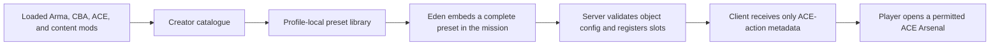

# Restricted Arsenal Creation Assistant — Implementation Wiki

> **Documentation status:** This wiki describes the `0.10.0-dev` implementation present in this repository. It is a source-grounded guide to what RACA is designed and coded to do. It is not, by itself, a release certificate: use the [in-game release checklist](IN_GAME_TEST_CHECKLIST.md) for real-game verification, particularly with separate multiplayer clients.

Restricted Arsenal Creation Assistant (RACA) is an Arma 3 add-on for mission makers using ACE Arsenal. It is an **authoring and control layer**, not a replacement arsenal. A mission maker builds a controlled list of equipment, assigns one or more named lists to an Eden object, and players open those lists through familiar ACE interactions. The same project can additionally enforce access rules, quantity limits, server authority, personal loadouts, audit records, administrator controls, and Zeus changes.

## Contents

- [What RACA is and is not](#what-raca-is-and-is-not)
- [Requirements, installation, and terminology](#requirements-installation-and-terminology)
- [The complete authoring-to-player workflow](#the-complete-authoring-to-player-workflow)
- [Creator: catalogue, selection, presets, and exports](#creator-catalogue-selection-presets-and-exports)
- [Eden: multi-slot mission configuration](#eden-multi-slot-mission-configuration)
- [Runtime: player interactions, access, quotas, and loadouts](#runtime-player-interactions-access-quotas-and-loadouts)
- [Administration and Zeus](#administration-and-zeus)
- [Data formats and persistence boundaries](#data-formats-and-persistence-boundaries)
- [Security and failure behavior](#security-and-failure-behavior)
- [Testing, diagnostics, building, and releases](#testing-diagnostics-building-and-releases)
- [Architecture and complete source map](#architecture-and-complete-source-map)
- [Known verification limits](#known-verification-limits)

## What RACA is and is not

RACA solves the mission-maker problem of turning the equipment available in the current mod set into a repeatable ACE Arsenal restriction, without manually maintaining class-name arrays. It scans the ACE virtual arsenal catalogue, records the exact classes an author permits, and carries a complete copy of that list into the mission.

It **is**:

- a single-player Creator mission available at **Tutorials > Restricted Arsenal Creator**;
- a profile-local preset library and authoring workspace;
- an Eden object attribute named **Restricted Arsenals**;
- an optional server-authoritative runtime system for access control, quotas, audits, saved player loadouts, administrator tools, and Zeus changes; and
- a data-only import/export and diagnostic tool.

It **is not**:

- a replacement for ACE Arsenal's player interface;
- a global restriction on all ACE Arsenal boxes in a mission;
- a guarantee that equipment from a missing content mod will appear at runtime; or
- a way to execute imported scripts. Imported SQF is parsed only for safe, quoted class-name literals and is never compiled or run.

The core design boundary is intentional:



An adopted profile preset is useful while authoring, but is never a runtime dependency. Eden and runtime configurations contain a flattened, standalone preset snapshot.

## Requirements, installation, and terminology

### Requirements

- Arma 3 2.22 or later.
- CBA_A3.
- ACE3 with ACE Arsenal enabled.
- RACA Core and RACA Eden PBOs.
- Every equipment/content mod used by the preset, loaded while creating the preset, editing the mission, and playing the mission.

The add-on declares `A3_Modules_F`, `cba_main`, `ace_arsenal`, and `ace_interact_menu` as Core dependencies. The Eden add-on depends on `3DEN` and `RACA_Core`.

### Installation

Use a release package or build `@RestrictedArsenalCreationAssistant`, then enable CBA_A3, ACE3, RACA, and the desired content mods in the Arma launcher. RACA contains two PBOs:

| PBO | Purpose |
| --- | --- |
| `addons/core.pbo` | Creator mission, catalogue, preset library, runtime logic, ACE actions, server networking, admin UI, and Zeus modules. |
| `addons/eden.pbo` | Eden attribute registration, configuration editor, access simulator, mission dashboard, and transactional Eden editing. |

### Key terms

| Term | Meaning |
| --- | --- |
| **Catalogue** | The ACE virtual-arsenal items discoverable from the active Arma session. |
| **Preset** | A named, profile-local selection of permitted classes, grouped into ACE/BIS virtual-cargo buckets. |
| **Slot** | One named player-facing ACE interaction on an object. A single object can have several slots. |
| **Object configuration** | The mission-embedded collection of slots and their individual access, limits, icon, and visibility settings. |
| **Source/adopted preset** | A profile-level parent relationship used to derive a child preset with additions and removals. |
| **Flattened preset** | A complete result with no required source reference. This is what Eden and runtime use. |
| **Quantity policy** | A per-class or per-category allowance with a scope and reset rule. `-1` means unlimited. |
| **Preflight** | Structured validation that reports errors, warnings, and informational evidence before configuration reaches runtime. |

## The complete authoring-to-player workflow

1. Start Arma with the exact content mods whose items should be eligible.
2. Open **Tutorials > Restricted Arsenal Creator**.
3. Use Quick Start, a role starter, a role pack, or the catalogue to assemble a draft.
4. Optionally tag, favourite, inspect, sort, limit, compare, or preflight the draft.
5. Save it to the active Arma profile. Optionally export JSON for sharing or archival.
6. In Eden, select an object, open **Attributes > Restricted Arsenals**, and choose **Configure slots**.
7. Add slots; choose a saved preset for each; configure access, limits, presentation, and enabled state; then apply the transaction.
8. Preview the mission. The server validates and registers the configuration, clients receive the relevant named ACE interactions, and the player uses a slot to open its restricted ACE Arsenal.
9. For a live mission, use authorized server administration or Zeus modules to change, clear, enable/disable, or reset configured arsenals.

### First successful mission: minimum path

For the smallest dependable setup, create a non-empty preset, save it, put an ammunition crate in Eden, configure one enabled slot without access conditions, apply it, and preview. The object should expose the slot's name as an ACE interaction and the resulting ACE Arsenal should contain only the preset's available classes. If it does not, capture the newest RPT lines containing `[RACA]`, `Error`, or `Warning` and follow the [release checklist](IN_GAME_TEST_CHECKLIST.md).

## Creator: catalogue, selection, presets, and exports

### How the catalogue is built

The Creator asks ACE Arsenal for the current virtual-item set, then creates one record per supported class:

```text
[display name, class name, category, virtual-cargo bucket, mod name,
 author, picture, searchable text, owning CfgPatches add-on]
```

The searchable text includes display name, class name, RACA category, source mod, author, Arma add-on, owning `CfgPatches` add-on, and BIS item type. It deliberately uses the **owning** add-on rather than every compatibility patch that touches a class, so a vanilla class patched by ACE does not falsely appear as ACE content.

Supported classes are classified into the ACE/BIS virtual-cargo buckets `items`, `weapons`, `magazines`, and `backpacks`, with these player-facing categories:

| Category | Rules |
| --- | --- |
| Weapons | `CfgWeapons` weapon classes other than binoculars. |
| Attachments | Muzzle, pointer, sight, and bipod accessory types. |
| Magazines | Ordinary `CfgMagazines` entries, including ammunition, rockets, 40 mm rounds, grenades, mines, and explosives. |
| Equipment | General equipment, binoculars, CBA miscellaneous items, ACE item cores, and magazine-backed items marked `ACE_asItem` or `ACE_isUnique` (for example, suitable ACE medical/inventory items). |
| Uniforms, Vests, Headgear, NVGs | Their corresponding `CfgWeapons` item types. |
| Backpacks | Backpack `CfgVehicles` classes. |
| Facewear | `CfgGlasses` classes. |

This categorisation is a browsing aid; runtime always receives the correct underlying virtual-cargo buckets.

### Creator interface and navigation

The Creator has two principal tabs:

- **Preset Management**: name, saved presets, save/load/delete, adoption, Quick Start, role packs, revision history, comparison, import/export, preflight, and diagnostics.
- **Assignment**: the full item table, search, filters, tags, sorting, details, included/inherited/favourite views, quantity policies, and bulk operations.

The footer distinguishes **SAVED** from **UNSAVED DRAFT**. Draft changes are checkpointed to the active profile and, after an unexpected close or restart, RACA offers to restore or discard the recovery draft. Successful save/load and deliberate discard remove that recovery copy.

### Find, filter, inspect, and organize classes

The following controls narrow presentation only; they do not silently alter the current draft selection.

| Tool | Behavior |
| --- | --- |
| Search | Matches the complete metadata record described above. |
| Category | Shows a category, Included, Inherited, Favorites, or all classes. |
| Mod / Add-on / Author | Counted filters for the loaded source mod, owning add-on, and config author. They compose with search and category filters. |
| Tags | Profile-wide custom labels. Tags are searchable, filterable, persistent even when a mod is temporarily unloaded, and have no effect on preset inclusion. |
| Saved Views | Captures/restores search, category, mod, add-on, author, tag, and sort order. It never mutates a draft. Older saved views migrate with an all-tags filter. |
| Favorites | Persistent profile-wide class markers, shown through the Favorites view. |
| Sort headers | Included, Item, Class Name, Mod, and Author each toggle deterministic ascending/descending sorting and persist the last choice. |
| Details / Enter | Opens the item inspector: class/config lineage, base class, source add-ons, type/compatibility data, draft state, favourite state, and effective quantity policy. The inspector can copy details and include, exclude, or favourite the class. |

### Build a selection

Clicking a row toggles that class immediately. Space toggles the selected row, except while focus is in the Search field. Ctrl-click selects disjoint rows and Shift-click selects a contiguous range without immediately changing inclusion; then Space, Favorite, or Limit Item performs a single batch operation. Selection state belongs to the underlying class, not only to a visible row, so filters do not accidentally change it.

- **Include Visible** and **Exclude Visible** affect only currently filtered rows.
- **Clear All** removes all selected classes, including hidden ones.
- **Undo/Redo** buttons and `Ctrl+Z` / `Ctrl+Y` reverse row, batch, starter, adoption, and limit changes in creator history.
- Item pictures may be toggled, and hover text summarizes class, category, source, author, favourite status, and effective limit.

### Quick Start, role starters, and role packs

Quick Start creates an **unsaved review draft**. It can start blank, use a built-in role, or use a custom profile role pack. The built-in roles are rifleman, medic, grenadier, marksman, machine gunner, engineer, EOD, pilot, crew, and recon.

Quick Start can restrict its result to one loaded source mod and apply optic, suppressor, night-vision, and medical add/exclude policies. It persists valid parameter choices but never automatically saves or assigns the generated result. Starters are search-based suggestions against the current catalogue rather than hard-coded faction loadouts.

Role packs are profile-wide authoring aids. Capture a current draft as a named pack, then merge it into another draft, replace that draft's inclusion, or use it through Quick Start. Re-capturing and deletion require confirmation. Classes not available in the current mod set are reported and skipped; deleting a role pack never deletes a preset.

### Save, load, compare, archive, and delete presets

Presets are stored in the active Arma profile under a versioned library. A save requires a non-empty name and non-empty selection. Names compare case-insensitively, so saving the same name is an overwrite rather than a case variant.

Before destructive library changes—overwrite, deletion, imported replacement, revision rollback, or conversion to standalone—RACA archives the outgoing preset. The history holds up to 20 prior revisions per preset. Revision History compares prior versions and restores one as a **new** revision; it does not mutate historical records. Compare Draft copies exact added/removed class and quantity-policy differences against the selected saved preset.

Delete requires confirmation and removes only the selected profile record. It leaves the selected classes as an unsaved recovery copy, protecting the work currently shown in the Creator. A saved mission or standalone preset already produced from that profile record remains intact.

### Adopt a source preset

Adoption is a profile-authoring feature for common base inventories. A child stores:

- the source preset name and source fingerprint;
- a complete last-known source snapshot;
- additions grouped by cargo bucket; and
- removals by class name.

When a source is adopted or deliberately refreshed, the source snapshot becomes the base result, child additions are included, and child removals are excluded. Source items are shown light blue, even if the child currently excludes one. **Inherited** shows the complete source snapshot, while **Included** shows the effective child result.

RACA rejects circular source graphs. It never silently replaces a child with a modified parent: on load, a stale or missing source produces a warning while the child's stored complete selection remains usable. **Adopt / Refresh** is the explicit operation that reapplies a changed parent and saved overrides. **Make Standalone** preserves the current final selection while removing the source link. Eden, runtime, generated SQF, and class-list outputs always use the effective standalone result.

### Quantity policies

An item or category can carry a canonical policy:

```text
[class name or category:<Category>, maximum, scope, reset policy]
```

`-1` is unlimited; other maxima must be whole numbers at least zero. Supported scopes are `interaction`, `player`, `life`, `mission`, and `arsenal`. Supported reset policies are `never`, `respawn`, `round`, `phase`, and `interaction`; interaction scope always normalizes to interaction reset. A category policy has the form `category:Weapons`, `category:Magazines`, and so on and applies as an effective limit to rows in that category.

The Creator stores limits with the preset and displays the active effective limit per row. Actual charge, rollback, and counter ownership are enforced only by the controlled RACA runtime object configuration; a plain exported ACE SQF script is intentionally just an ACE restriction script.

### Preflight, diagnostic report, manifest, and support bundle

**Run Preflight** produces colour-coded Error, Warning, and Information entries. The report covers ACE/CBA/RACA Eden availability, active catalogue scope, malformed preset data, missing classes, duplicate entries, category/bucket corrections, and likely source mods/add-ons. The detailed window filters severity, can copy the report, and can navigate from an available affected class to Assignment.

Two diagnostic exports extend this evidence:

- **Required-mod manifest**: versioned JSON grouping every selected class by source mod and owning add-on.
- **Support bundle**: versioned JSON with RACA/Arma environment data, activated add-ons, compatibility analysis, the required-mod manifest, and the portable preset.

They are diagnostics, not preset data; Import Auto deliberately rejects them.

### Import and export

| Format | Use | Re-import guarantee |
| --- | --- | --- |
| JSON preset | Versioned authoritative RACA interchange. Preserves name, cargo buckets, validated metadata, runtime limits, and safe adoption details. | Yes, between compatible RACA versions. |
| Reusable SQF | Standalone ACE setup script for use in a mission folder. It validates `[this]`, runs server-side, removes an earlier virtual arsenal, and initializes ACE Arsenal globally. | No; it is a reusable deployment artifact. |
| Class list | Alphabetical, de-duplicated comma-separated class names for documentation or other tooling. | Yes, as a conservative class-list import while classes remain available. |
| Required-mod manifest / support bundle | Diagnostics and handoff artifacts. | No; intentionally rejected by Import Auto. |

To use a reusable SQF output, save it as `raca_arsenal.sqf` in the mission folder and put this in each relevant object's Init field:

```sqf
[this] execVM "raca_arsenal.sqf";
```

The JSON schema and examples are documented in [Portable preset format](PORTABLE_PRESET_FORMAT.md). Clipboard import is intentionally single-player only because Arma disables `copyFromClipboard` in multiplayer. Import recognizes RACA JSON first; when no RACA signature is present, it conservatively scans SQF or a class list for quoted, currently available, safe config class names. It handles common arrays combined with `+`, `append`, or `arrayIntersect`, but cannot recover class names computed at runtime.

## Eden: multi-slot mission configuration

Every placeable object receives **Attributes > Restricted Arsenals**. The custom control shows a slot summary and provides **Configure slots**, **Refresh presets**, and **Clear**.

### Slots

The transactional editor can add, remove, rename, reorder, select, and commit several slots on one object. A slot contains:

```text
[slot ID, player-facing name, flattened preset, enabled,
 access envelope, limits, icon path, hide when denied]
```

Each slot may refer to the same or a different preset and independently keeps its enabled state, presentation, access mode, conditions, denial text, icon, visibility behavior, and limits. `Refresh presets` replaces matching embedded preset copies while retaining those slot-specific settings. Legacy single-preset values load as a compatible single default slot and save back as a modern object configuration.

The editor is transactional: **Cancel** discards the working changes; **Apply configuration** writes the complete valid configuration to the parent attribute. Overlong names, denial text, icon paths, or condition values show inline errors. The working state remains open for correction instead of being discarded.

### Access rules

An access envelope is versioned and normalized as:

```text
["RACA_ACCESS", 1, "AND" or "OR", conditions, reserved flag,
 denial message, optional safe class-name metadata]
```

Supported conditions are:

| Condition | Match |
| --- | --- |
| Side | The unit's group side. |
| Faction | Unit faction class. |
| Group | Group ID. |
| Rank | At least the selected Arma rank. |
| Unit | Exact unit type/class. |
| UID | One of the listed player UIDs. |
| Vehicle role | Current assigned vehicle role. |
| Required item | Present in items, assigned items, weapons, or magazines. |
| ACE permission | Mission variable `RACA_permission_<key>` is true or contains the player's UID. |

No conditions means allow. AND requires every condition; OR requires at least one. Unknown condition kinds and malformed/oversized values are discarded during normalization and never executed. The optional **hide when denied** setting controls whether a player sees a denied ACE action; a denied attempt otherwise displays the configured denial message.

### Eden access simulation and dashboard

**Simulate access** evaluates a chosen playable or AI soldier against a slot before preview. It reports each condition as PASS, FAIL, or UNKNOWN, uses the slot's AND/OR logic, does not treat UNKNOWN as a pass, and can copy the result. UID and permission conditions may be unknown in the editor because they are runtime information.

The mission dashboard inventories configured objects and reports READY, WARN, or BLOCKED, enabled-slot counts, issue totals, object type, entity ID, and detailed preflight results. Double-clicking a row selects only that object. Dashboard bulk assignment and clear operations apply only to selected Eden objects after confirmation; one Eden Undo reverses the entire bulk edit.

### Object preflight and application

Before runtime application, RACA validates the entire object configuration. It blocks wrong field types, duplicate slot IDs, malformed presets/access/limits, unsupported access conditions, invalid condition values, and other BLOCKED findings. Missing content can degrade to warning rather than making an object vanish from the dashboard, but malformed unsafe data never reaches runtime unless a controlled call explicitly opts into error-tolerant application.

When applied on the server, RACA removes a previous ACE virtual arsenal, cancels active sessions with loadout restoration, prunes now-invalid quota state, stores the normalized configuration on the object, registers it in the mission registry, creates a sanitized action manifest, sends that manifest to clients (with persistent JIP registration), and writes an audit event.

## Runtime: player interactions, access, quotas, and loadouts

### Server authority and client information

RACA treats the server as authoritative for runtime state. It initializes the server registry at pre-init and the client action layer post-init. Its remote-execution whitelist allows only named RACA functions, with server-targeted requests and client-targeted responses separately declared. Client responses defensively reject direct calls that do not come from the server while preserving trusted listen-host delivery.

Clients receive only action metadata needed to render ACE interactions. Server-local state includes complete configuration, sessions, quotas, personal loadouts, and audit records. Named actions are bound to a sanitized object JIP target so late joiners receive their interactions and unregister cleanup can remove them.

### Opening an arsenal and access enforcement

A player activates a named ACE interaction. The client requests an open; the server identifies the object and slot, verifies it remains registered and enabled, applies the access envelope, checks distance/session state and quota status, then opens ACE Arsenal with only the slot's embedded available classes. Missing runtime classes are skipped and reported rather than causing arbitrary data to run.

The runtime can preview a preset for authoring/test use and coordinates the normal action opening with session creation. A live configuration change or object unregister cancels affected sessions, closes their stale state, and restores each player's pre-arsenal loadout with an explanatory message.

### Quantity accounting and rollback

RACA counts loadout contents across worn containers, weapons, assigned items, magazines, and stacked inventory. It normalizes item/category rules and charges them according to the configured scope. Before accepting a changed arsenal loadout, the server checks whether every selected class is permitted and whether exact/class/category policies would be exceeded.

If validation fails—because of an unauthorized class, over-quota request, expired session, unavailable object, or other failed condition—the server sends a corrected/restored loadout rather than accepting a partial unsafe result. Runtime code includes quota pruning and reset operations, UID-aware respawn boundaries, quota-status request/response, and category/exact-policy exhaustion handling.

### Personal loadouts

For runtime-configured arsenals, players can save, list, apply, and delete personal loadouts. The server validates an applied saved loadout against the active slot's permitted classes and policies; out-of-preset content is rejected. This prevents a profile/save path from bypassing restriction rules.

### Audit log and administrator dashboard

The runtime records events with severity and context. Authenticated server administrators can use an ACE self-interaction dashboard to inspect configured objects, live sessions, quota records, and recent audit events; issue requests; and copy audit evidence. Authorization is checked server-side, not merely by hiding a client button. The dashboard also provides guided listen-host/client/JIP rehearsal snapshots and probes for multiplayer evidence gathering.

## Administration and Zeus

### Runtime administration

The runtime administration flow comprises request/response access checks, snapshots, commands, refresh, and audit copying. It is designed to expose enough current state to an authorized administrator while retaining policy enforcement at the server. Relevant command paths include object refresh/bulk update, quota reset, session cancellation, audit inspection, and rehearsal execution.

### Zeus modules

RACA registers four global curator modules under **Restricted Arsenals**:

| Module | Effect |
| --- | --- |
| Assign / Replace Restricted Arsenal | Assigns a saved profile preset to target objects as a restricted arsenal. Module attributes provide preset name and player-facing slot name. |
| Clear Restricted Arsenal | Removes RACA configuration from targets. |
| Enable / Disable Restricted Arsenal | Toggles a configured restricted arsenal's enabled state. |
| Reset Arsenal Quotas | Clears quota records for the target configuration. |

The module functions are `moduleAssign`, `moduleClear`, `moduleToggle`, and `moduleResetQuotas`. They use the same core runtime registration/application lifecycle rather than creating a separate unrestricted path.

## Data formats and persistence boundaries

### Preset schema

The canonical preset begins with:

```text
["RACA_PRESET", 1, preset name,
 [items bucket, weapons bucket, magazines bucket, backpacks bucket],
 optional metadata...]
```

Classes are sorted, de-duplicated, and reclassified into correct cargo buckets while validating. The validator rejects unsafe class names and non-text entries; unavailable but syntactically safe classes are retained in their original bucket with a warning so they can reappear when the content mod returns. It understands and validates one adoption/composition metadata record and one runtime metadata record, preserves safe unknown `RACA_*` metadata without interpreting it, and rejects unsafe unknown metadata.

Runtime metadata is versioned as `RACA_RUNTIME` and holds normalized limits plus reserved notes/revision/author/time fields. A portable JSON envelope is:

```text
["RACA_PORTABLE_PRESET", 2, preset, metadata]
```

Its metadata includes name, profile author, creation time, preset schema version, source mods, source add-ons, revision, modified-by/time, notes, and optional adopted-source fingerprint. Portable decoding is resource-bounded and rejects unknown future versions without rewriting user data.

### Object schema

The current object configuration is:

```text
["RACA_OBJECT_CONFIG", 1, slots, options]
```

Options default to `auditLevel = standard` and `persistence = mission`. For backward compatibility, a raw `RACA_PRESET` can normalize into one enabled `default` slot with a default AND/no-condition access envelope and the preset's runtime limits.

### Where information is stored

| Location | Contents | Why it matters |
| --- | --- | --- |
| Active Arma profile | Preset library, revisions, draft recovery, tags, favorites, role packs, saved catalogue views, Quick Start choices. | Personal authoring conveniences never need to be distributed to players. |
| Mission/Eden attribute | Complete flattened slot configuration and embedded presets. | A deployed mission does not depend on the author's profile or source adoption chain. |
| Server mission namespace/object variables | Normalized registry, sessions, quotas, audit history, runtime policy. | Prevents clients from owning policy decisions. |
| Client UI/action state | Sanitized action manifest and display state. | Enough to render/use interactions without exposing or trusting server state. |
| JSON/clipboard | Explicit import/export only. | Gives shareable archival interchange without hidden code execution. |

## Security and failure behavior

RACA is intentionally defensive at every data boundary.

- **Imports never execute code.** SQF is scanned as text only; RACA does not compile, call, spawn, or `execVM` imported text.
- **Input is bounded and atomic.** Clipboard input over 2,000,000 characters; presets over 20,000 references; JSON with over 64 preset-metadata or 256 transport-metadata records; and SQF/class-list scans over 50,000 quoted values/tokens are rejected without changing the library.
- **Names and conditions are normalized.** Unsafe class names, unknown versions, unknown condition kinds, malformed values, duplicate/invalid policy data, and malformed access envelopes do not become executable behavior.
- **Future versions fail closed.** Unknown newer schemas are rejected without rewriting the stored profile or mission value.
- **Mission runtime is server-authoritative.** Client requests do not define the permissions, quotas, registry, or allowed loadout. Direct non-server invocations of protected client handlers are rejected.
- **Missing content degrades visibly.** Missing classes are excluded at use time or warned about in validation/preflight; they do not make unrelated classes permissive.
- **Active sessions are recoverable.** Configuration changes and unregistering cancel sessions and restore players rather than leaving a stale arsenal open.

## Testing, diagnostics, building, and releases

### Automated and manual evidence

The repository contains an isolated automated Creator/Eden/runtime mission and a separate multiplayer rehearsal mission. The current development acceptance record reports a passing `61/61` automated assertion run and successful static validation/PBO build for a prior clean development-package evidence run. It also records dedicated-server and initial remote-client rehearsal as passing, while distinct-identity JIP and visual ACE inspection on a second machine remain unknown. See [Development acceptance evidence](DEVELOPMENT_ACCEPTANCE.md) for the exact evidence and [In-game release checklist](IN_GAME_TEST_CHECKLIST.md) for the full human test protocol.

The checklist is deliberately broader than a code test: it covers start-up, Creator UI, catalogue semantics, selection regressions, persistence, adoption, imports, Eden data integrity, object preflight, ACE interaction behavior, access/quotas/loadouts, administrator paths, Zeus, host/client synchronization, dedicated server, and real JIP.

### RPT diagnostics

RACA emits diagnostic messages using the `[RACA]` prefix. When reporting a problem, preserve the on-screen message, relevant mission/object configuration, active mod set, and the newest RPT lines matching `[RACA]`, `Error`, or `Warning`. A support bundle and copied preflight/object/dashboard report should accompany this evidence when possible.

### Developer tools

| Tool | Purpose |
| --- | --- |
| `tools/validate.ps1` | Static/configuration/SQF validation. Run before calling a build/release valid. |
| `tools/build.ps1` | Builds Core and Eden PBOs, verifies `x\\raca\\addons\\<name>\\` PBO prefixes, copies metadata, and writes SHA-256 checksums. Its clean target is guarded to remain under the repository build directory. |
| `tools/prepare-autotest.ps1` | Stages the isolated automatic mission, profile, and required CBA/ACE/RACA launch arguments. |
| `tools/prepare-multiplayer-smoke.ps1` | Stages server/client profiles, rehearsal mission, server configuration, and launch arguments for a local smoke test. |
| `tools/release.ps1` | Requires a clean tree, matching version metadata, validation, PBO checksums, and release archive/report generation. Development versions need the explicit `-AllowDevelopmentVersion` switch. |

### Release policy

RACA uses semantic versions. `mod.cpp` and `RACA_Core/versionStr` are the matching human-readable authorities; `version[]` and `versionAr[]` must match the same numeric release. Preset, portable preset, access, limit, and object configuration schemas are independently versioned. A public release requires a clean tree, updated changelog, static validation, complete applicable in-game checklist, RPT review, PBO/package inspection, checksums, and release evidence. Full details are in [Release process](RELEASE_PROCESS.md).

## Architecture and complete source map

### Repository structure

```text
addons/
  core/                  Creator, catalogue, presets, runtime, Zeus, tutorial mission, UI
  eden/                  Eden attribute, transactional editor, simulator, dashboard, UI
docs/                    Interchange schema, acceptance evidence, checklist, release process
tests/autotest/          Isolated 61-assertion Arma acceptance mission
tests/multiplayer/       Dedicated-server/listen-host/initial-client/JIP rehearsal mission
tools/                   Validation, build, test staging, and release scripts
```

### Function groups

All functions are registered under the `RACA` CfgFunctions tag. The following map is intentionally exhaustive at the implementation-group level, so contributors can find every behaviour without guessing where it lives.

| Group and directory | Implemented responsibilities |
| --- | --- |
| `functions/catalog` | `classifyClass` maps an Arma class to category/bucket/config; `scanItems` queries ACE virtual items and builds searchable metadata. |
| `functions/diagnostics` | Environment/preset analysis, human-readable diagnostic formatting, and object-configuration preflight. |
| `functions/presets` | Build, validate, migrate, flatten, fingerprint, archive, save/load/delete, adoption/cycle management, library/composition/history access, runtime-policy extraction, JSON/SQF decoding/formatting, export/import, manifests, and support bundles. |
| `functions/templates` | Built-in role templates, profile role-pack retrieval, starter application, and parameterized Quick Start policy application. |
| `functions/ui` | Creator startup/shutdown, keyboard input, tab/view/filter/sort/table refresh, selection, status/summary, history, draft recovery, limits, favorites, tags, saved views, role packs, Quick Start, item details, preflight, and revision-history dialogs. |
| `functions/runtime` | Pre/post initialization, config/access/limit normalization, registry/object lifecycle, ACE action manifests, server open/session flows, access/quotas/loadout validation, saved loadouts, audit logs, admin dashboard, runtime rehearsal, request/response handlers, and cleanup/reset operations. |
| `functions/zeus` | Assign, clear, enable/disable, and quota-reset curator modules. |
| `addons/eden/functions` | Attribute load/save/on-load; editor add/remove/select/move/commit/apply/refresh; summary/population; clear; access simulation; mission dashboard selection/bulk/reporting. |

### Detailed runtime function map

| Area | Functions |
| --- | --- |
| Object and policy | `normalizeObjectConfig`, `normalizeAccess`, `normalizeLimits`, `preflightObjectConfig`, `applyObjectConfig`, `applyPreset`, `registerObject`, `unregisterObject`, `getMissionRegistry`, `getRuntimeObjectId`, `bulkUpdateObjects`. |
| ACE actions and sessions | `buildActionManifest`, `registerActions`, `requestOpen`, `openAuthorized`, `finishSession`, `cancelObjectSessions`, `previewPreset`, `pruneObjectQuotas`. |
| Access and quotas | `evaluateAccess`, `countLoadout`, `requestQuotaStatus`, `receiveQuotaStatus`, `resetQuotas`, `normalizeAccess`, `normalizeLimits`. |
| Player loadouts | `applyPlayerLoadout`, `requestLoadoutApply`, `applyAuthorizedLoadout`, `applyCorrectedLoadout`, `savePlayerLoadout`, `listPlayerLoadouts`, `deletePlayerLoadout`. |
| Administration and audit | `isAdminAuthorized`, `logEvent`, `adminOnLoad`, `adminRefresh`, `adminExecute`, `adminCommand`, `adminCopyAudit`, `requestAdminAccess`, `receiveAdminAccess`, `requestAdminSnapshot`, `receiveAdminSnapshot`. |
| Multiplayer rehearsal | `openRehearsal`, `rehearsalOnLoad`, `rehearsalRefresh`, `rehearsalExecute`, `rehearsalCopy`, `buildRehearsalSnapshot`, `requestRehearsal`, `rehearsalClientReady`, `rehearsalProbeClient`, `receiveRehearsalProbe`, `receiveRehearsalSnapshot`, `sendRehearsalSnapshot`. |
| Lifecycle | `initRuntime` (pre-init), `initClient` (post-init). |

### Detailed authoring function map

| Area | Functions |
| --- | --- |
| Preset construction and persistence | `buildPreset`, `validatePreset`, `migratePreset`, `saveCurrentPreset`, `loadSelectedPreset`, `deletePreset`, `getPresetLibrary`, `removePresetFromLibrary`, `refreshPresetCombo`, `setPresetRevision`, `archivePreset`, `getPresetHistory`. |
| Adoption and flattening | `applyBasePreset`, `getComposition`, `wouldCreateCycle`, `fingerprintPreset`, `flattenPreset`, `flattenCurrentPreset`, `flattenPresetClasses`, `getRuntimePolicy`. |
| Interchange | `buildPortablePreset`, `decodePortablePreset`, `formatPortableJson`, `exportPreset`, `importPreset`, `decodeSqfPreset`, `formatSqfExport`, `isSafeClassName`, `buildModManifest`, `buildSupportBundle`. |
| Creator UX | `creatorOnLoad`, `creatorOnUnload`, `creatorKeyDown`, `refreshItemList`, `refreshCategoryCombo`, `refreshSourceCombo`, `toggleRow`, `setVisibleSelection`, `clearSelection`, `setSortMode`, `setCatalogView`, `setStatus`, `updateSummary`, `switchCreatorTab`, `pushCreatorHistory`, `restoreCreatorHistory`, `refreshHistoryButtons`, `requestCreatorClose`. |
| Creator enhancements | `openQuickStart`, `quickStartOnLoad`, `quickStartApply`, `applySelectedRoleTemplate`, `refreshRoleTemplateCombo`, `openRolePacks`, role-pack CRUD/refresh/select functions, `toggleFavorite`, item-detail functions, tag functions, saved-view functions, draft recovery functions, limit functions, preflight/diagnostic functions, comparison/history restore functions. |

### Detailed Eden function map

| Area | Functions |
| --- | --- |
| Attribute lifecycle | `edenAttributeOnLoad`, `edenAttributeLoad`, `edenAttributeSave`, `edenPopulate`, `edenUpdateSummary`, `edenRefresh`, `edenClearAttribute`. |
| Slot editor | `edenOpenEditor`, `edenEditorOnLoad`, `edenEditorRefresh`, `edenEditorAddSlot`, `edenEditorRemoveSlot`, `edenEditorMoveSlot`, `edenEditorSelectSlot`, `edenEditorCommitSlot`, `edenEditorAddCondition`, `edenEditorRemoveCondition`, `edenEditorApply`. |
| Access simulation | `edenOpenAccessSimulator`, `edenAccessSimulatorOnLoad`, `edenAccessSimulatorRefresh`, `edenAccessSimulatorCopy`. |
| Dashboard | `edenDashboardRefresh`, `edenDashboardSelect`, `edenDashboardBulk`, `edenDashboardCopy`. |

### Complete registered-function index

The tables above explain the responsibilities. This index supplies the exact registered names for the small lifecycle/UI handlers that are easy to miss when tracing the implementation. Names correspond directly to `RACA_fnc_<name>` at runtime.

<details>
<summary>Catalogue, diagnostics, templates, and preset-library functions</summary>

| Group | Registered functions |
| --- | --- |
| Catalogue | `classifyClass`, `scanItems` |
| Diagnostics | `analyzeEnvironment`, `analyzePreset`, `formatDiagnosticReport`, `preflightObjectConfig` |
| Templates | `applyRoleTemplate`, `applyTemplateParameters`, `getRolePacks`, `getRoleTemplates` |
| Preset build/validation | `buildPreset`, `validatePreset`, `migratePreset`, `isSafeClassName`, `getRuntimePolicy` |
| Preset library/history | `getPresetLibrary`, `refreshPresetCombo`, `loadSelectedPreset`, `saveCurrentPreset`, `deletePreset`, `removePresetFromLibrary`, `setPresetRevision`, `archivePreset`, `getPresetHistory` |
| Adoption/flattening | `applyBasePreset`, `getComposition`, `wouldCreateCycle`, `fingerprintPreset`, `flattenPreset`, `flattenCurrentPreset`, `flattenPresetClasses`, `refreshBaseCombo` |
| Interchange and support | `buildPortablePreset`, `decodePortablePreset`, `formatPortableJson`, `formatSqfExport`, `decodeSqfPreset`, `exportPreset`, `importPreset`, `buildModManifest`, `buildSupportBundle` |

</details>

<details>
<summary>Complete Creator UI function index</summary>

| Area | Registered functions |
| --- | --- |
| Core display/input | `creatorOnLoad`, `creatorOnUnload`, `creatorKeyDown`, `switchCreatorTab`, `requestCreatorClose`, `queueRefresh`, `setStatus`, `updateSummary` |
| Catalogue/table | `refreshItemList`, `refreshCategoryCombo`, `refreshSourceCombo`, `setCatalogView`, `setSortMode`, `toggleRow`, `setVisibleSelection`, `clearSelection` |
| History and recovery | `pushCreatorHistory`, `restoreCreatorHistory`, `refreshHistoryButtons`, `saveDraftRecovery`, `queueDraftRecovery`, `offerDraftRecovery`, `clearDraftRecovery` |
| Quantity policies | `readQuantityPolicy`, `syncLimitPolicy`, `setItemLimit`, `setCategoryLimit` |
| Favorites and item details | `toggleFavorite`, `openItemDetails`, `itemDetailsOnLoad`, `itemDetailsRefresh`, `itemDetailsCopy`, `itemDetailsToggleFavorite`, `itemDetailsToggleIncluded` |
| Tags | `getCatalogTags`, `refreshCatalogTagIndex`, `openCatalogTags`, `catalogTagsOnLoad`, `catalogTagsRefresh`, `catalogTagsSelect`, `catalogTagsExecute` |
| Saved catalogue views | `getSavedCatalogViews`, `openSavedCatalogViews`, `savedCatalogViewOnLoad`, `savedCatalogViewRefresh`, `savedCatalogViewSelect`, `savedCatalogViewCapture`, `savedCatalogViewApply`, `savedCatalogViewDelete` |
| Role packs and Quick Start | `refreshRoleTemplateCombo`, `applySelectedRoleTemplate`, `openQuickStart`, `quickStartOnLoad`, `quickStartApply`, `openRolePacks`, `rolePackOnLoad`, `rolePackRefresh`, `rolePackSelect`, `rolePackCapture`, `rolePackApply`, `rolePackDelete` |
| Preflight and revision tools | `runCreatorDiagnostics`, `openCreatorDiagnostics`, `preflightOnLoad`, `preflightRefresh`, `preflightSelect`, `preflightRerun`, `preflightCopy`, `copyCreatorDiagnostics`, `compareSelectedPreset`, `openPresetHistory`, `historyOnLoad`, `historySelect`, `restorePresetRevision` |

</details>

<details>
<summary>Complete runtime, Zeus, and Eden function index</summary>

| Group | Registered functions |
| --- | --- |
| Runtime initialization/registry | `initRuntime`, `initClient`, `getMissionRegistry`, `getRuntimeObjectId`, `normalizeObjectConfig`, `normalizeAccess`, `normalizeLimits`, `registerObject`, `unregisterObject`, `applyObjectConfig`, `applyPreset`, `bulkUpdateObjects` |
| Runtime sessions/actions | `buildActionManifest`, `registerActions`, `requestOpen`, `openAuthorized`, `finishSession`, `cancelObjectSessions`, `previewPreset` |
| Runtime security/loadouts/quotas | `evaluateAccess`, `countLoadout`, `pruneObjectQuotas`, `resetQuotas`, `requestQuotaStatus`, `receiveQuotaStatus`, `requestLoadoutApply`, `applyAuthorizedLoadout`, `applyCorrectedLoadout`, `applyPlayerLoadout`, `savePlayerLoadout`, `listPlayerLoadouts`, `deletePlayerLoadout` |
| Runtime admin/audit | `isAdminAuthorized`, `logEvent`, `adminOnLoad`, `adminRefresh`, `adminExecute`, `adminCommand`, `adminCopyAudit`, `requestAdminAccess`, `receiveAdminAccess`, `requestAdminSnapshot`, `receiveAdminSnapshot` |
| Runtime rehearsal | `openRehearsal`, `rehearsalOnLoad`, `rehearsalRefresh`, `rehearsalExecute`, `rehearsalCopy`, `buildRehearsalSnapshot`, `requestRehearsal`, `rehearsalClientReady`, `rehearsalProbeClient`, `receiveRehearsalProbe`, `receiveRehearsalSnapshot`, `sendRehearsalSnapshot` |
| Zeus | `moduleAssign`, `moduleClear`, `moduleToggle`, `moduleResetQuotas` |
| Eden attribute/editor | `edenAttributeOnLoad`, `edenAttributeLoad`, `edenAttributeSave`, `edenPopulate`, `edenUpdateSummary`, `edenRefresh`, `edenClearAttribute`, `edenOpenEditor`, `edenEditorOnLoad`, `edenEditorRefresh`, `edenEditorAddSlot`, `edenEditorRemoveSlot`, `edenEditorMoveSlot`, `edenEditorSelectSlot`, `edenEditorCommitSlot`, `edenEditorAddCondition`, `edenEditorRemoveCondition`, `edenEditorApply` |
| Eden simulator/dashboard | `edenOpenAccessSimulator`, `edenAccessSimulatorOnLoad`, `edenAccessSimulatorRefresh`, `edenAccessSimulatorCopy`, `edenDashboardRefresh`, `edenDashboardSelect`, `edenDashboardBulk`, `edenDashboardCopy` |

</details>

## Known verification limits

The source and recorded acceptance evidence demonstrate substantial implementation coverage, but a player-facing documentation claim should distinguish code from field proof.

- The documented acceptance record has a passing automated mission and local dedicated-server/initial-client evidence.
- A distinct Steam identity/machine for JIP and visual ACE Arsenal inspection on a second machine were not available for that record. Those gates are **Unknown**, not passed.
- Content availability is inherently dependent on the active mod set. A valid preset can warn and omit content if its source mod is not loaded.
- This is a development version (`0.10.0-dev`), so use the release process and checklist before calling a packaged build a public release.

## Further reading

- [README](../README.md) — overview and tutorial-oriented quick start.
- [Portable preset format](PORTABLE_PRESET_FORMAT.md) — JSON/SQF/class-list interchange details and examples.
- [In-game release checklist](IN_GAME_TEST_CHECKLIST.md) — complete player/editor/runtime test protocol.
- [Development acceptance evidence](DEVELOPMENT_ACCEPTANCE.md) — current recorded acceptance results and their limits.
- [Release process](RELEASE_PROCESS.md) — versioning, packaging, checksums, and release gate.
- [Changelog](../CHANGELOG.md) — release history and unreleased feature list.
