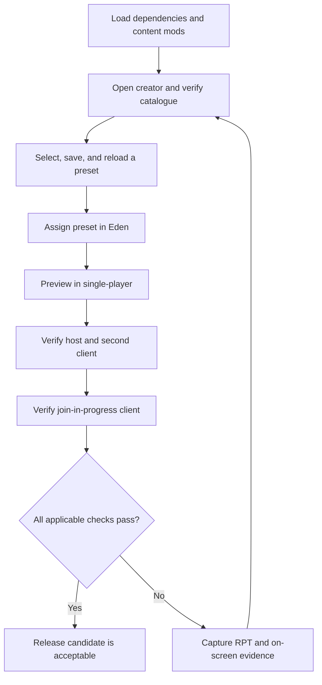

# In-game release checklist

Use a clean Arma profile where practical. Load only CBA_A3, ACE, RACA, and the content mods needed for the test. Record failures with the exact on-screen message and the newest Arma RPT excerpt containing `RACA`, `Error`, or `Warning`.

## Test flow

The flow separates authoring, Eden persistence, runtime behavior, and multiplayer synchronization so a passing creator screen is not mistaken for a complete release verification.

## 1. Startup and creator mission

- [ ] Launcher reports CBA_A3, ACE, and RACA as loaded without dependency errors.
- [ ] **Tutorials** contains **Restricted Arsenal Creator**.
- [ ] Opening it produces no **Cannot load mission** dialog.
- [ ] The VR scene loads, followed by the creator interface.
- [ ] With an empty RACA profile, Quick Start opens once and creates either a blank draft or a reviewable role-starter draft without saving automatically.
- [ ] Quick Start remains available manually after onboarding.
- [ ] A Quick Start role draft constrained to one source mod contains no catalogue classes attributed to another source.
- [ ] Capturing a custom role pack records the current included classes, adds it to both Role starter and Quick Start, and persists after restarting Arma.
- [ ] Merging a custom pack retains existing draft classes; replacing uses only available pack classes; unavailable mod classes are reported rather than inserted.
- [ ] Re-capturing and deleting a custom pack require confirmation, while the current draft and all saved arsenal presets remain unchanged.
- [ ] Closing the creator returns to the scene or menu without a script error.

## 2. Catalogue and presentation

- [ ] The catalogue finishes loading and reports a non-zero item count.
- [ ] The centered title reads **ARSENAL CREATION ASSISTANT** and no **PRESET LIBRARY** heading remains.
- [ ] **Preset Management** contains preset files and adoption tools; **Assignment** contains the table, search, filters, and bulk selection tools.
- [ ] Included, Item, Class Name, Mod, and Author headers align with their columns at the active UI scale.
- [ ] Weapons, Attachments, Magazines, Uniforms, Vests, Backpacks, Headgear, NVGs, Facewear, Equipment, and Included filters show plausible content.
- [ ] **Magazines** includes ammunition magazines, rockets, 40 mm rounds, grenades, mines, and placed explosives.
- [ ] **Equipment** includes magazine-backed ACE medical supplies such as `ACE_painkillers` when available.
- [ ] Searching `ACE_` does not return the vanilla `.338 LM 10Rnd Mag` / `10Rnd_338_Mag` solely because ACE patches it.
- [ ] Searching a display name, exact class, content mod name, author, and owning add-on each finds the expected item.
- [ ] Source filtering restricts visible rows to one loaded mod and composes correctly with category and text search.
- [ ] Mod, Add-on, and Author filters show plausible per-value counts, compose with each other/category/search, and restore **All** without changing the draft.
- [ ] **Saved Views** captures the complete search/category/mod/add-on/author/sort workspace, restores it after other filters change, persists after restarting Arma, and never changes the draft selection.
- [ ] Re-capturing a case-insensitive duplicate view requires confirmation; deleting a view requires confirmation and leaves every preset and the current draft intact.
- [ ] Favorites persist after closing and reopening Arma, and the Favorites category contains exactly the marked classes.
- [ ] Row tooltips identify class, category, source, author, favorite state, and exact/category limit.
- [ ] **Details** and Enter open the selected item inspector; its class/config/source/type/compatibility metadata matches the active row, its draft/favorite/limit state updates immediately, and Copy Details copies the visible report.
- [ ] Include/Exclude and Favorite actions from the item inspector update the creator row and preserve Undo behavior for draft inclusion.
- [ ] Clicking Included, Item, Class Name, Mod, and Author headers toggles a deterministic sort, preserves the selected class and filters, and restores the last sort after reopening Arma.

## 3. Selection-state regressions

- [ ] A single left-click toggles the row that was clicked immediately.
- [ ] Space toggles the currently selected row immediately.
- [ ] Ctrl-click selects separate rows and Shift-click selects a continuous range without immediately changing inclusion; **Space**, **Favorite**, and **Limit Item** each affect the complete selected set, while inclusion/limit changes reverse in one Undo step.
- [ ] Typing a space in the Search box does not toggle an item.
- [ ] Exclude one item, change category or search so it disappears, then return: it remains excluded.
- [ ] **Include Visible** and **Exclude Visible** affect only the filtered rows.
- [ ] **Clear All** removes every selection, including currently hidden rows.
- [ ] Undo/redo buttons and `Ctrl+Z` / `Ctrl+Y` correctly reverse row, bulk, starter, adoption, and limit changes without changing a saved preset.
- [ ] Closing a dirty draft asks before discarding it; closing immediately after save or load does not show a false warning.

## 4. Preset persistence

- [ ] Saving without a name is rejected with a useful status message.
- [ ] Saving an empty selection is rejected with a useful status message.
- [ ] A named non-empty preset appears immediately in Saved presets.
- [ ] Loading that preset restores the exact selection after filters and searches have changed.
- [ ] Saving the same name with different content overwrites it rather than creating a case-variant duplicate.
- [ ] Overwriting creates a revision-history snapshot; the comparison reports additions/removals and restoring creates a newer revision while archiving the outgoing one.
- [ ] Compare Draft copies complete added/removed class lists and both quantity policies.
- [ ] **Delete** requires confirmation, removes only the selected profile preset, and keeps the current item selection as an unsaved recovery copy.
- [ ] Delete and duplicate-import confirmations show real paragraph breaks, and duplicate Import Auto produces no `Suspending not allowed in this context` RPT error.
- [ ] Deleting a source preset does not corrupt adopted children or standalone copies already embedded in missions.
- [ ] Restarting Arma with the same profile preserves the preset.
- [ ] JSON export is valid UTF-8 JSON and round-trips without losing the name or any bucket.
- [ ] Required-mod manifest export groups every selected class by source mod and owning add-on.
- [ ] Support-bundle export contains environment metadata, compatibility analysis, manifest, and the portable preset; Import Auto rejects it as non-preset data.
- [ ] **View Details** shows color-coded Error/Warning/Information rows, severity filters preserve the full report, copy matches the underlying analysis, and double-clicking an available class selects it in Assignment.
- [ ] Preflight reports ACE3, CBA_A3, and RACA Eden health plus active catalogue class/mod/add-on/author/category counts; the support bundle contains the same environment evidence.
- [ ] A saved category quantity limit reloads with a canonical `category:<name>` rule and is shown as the effective row limit.

## 5. Preset adoption

- [ ] A child can select an adopted source, apply it, then save child-only additions and source-item removals.
- [ ] Every item in the adopted source snapshot is light blue, whether currently included or excluded.
- [ ] **Inherited** appears only while an adoption exists and shows the complete source snapshot; **Included** shows the current result.
- [ ] The summary reports total, source-included, added, and removed counts accurately.
- [ ] Loading a child after its source changes warns without changing the child's stored selection.
- [ ] **Adopt / Refresh** deliberately reapplies the changed source and the saved overrides.
- [ ] Selecting a descendant as a source is rejected as circular adoption.
- [ ] **Make Standalone** preserves the current item result and removes the source relationship.
- [ ] JSON export/import preserves safe adoption metadata.
- [ ] An otherwise-valid JSON document larger than 1 MB imports without RACA rejecting it for size.
- [ ] SQF, class-list, Eden, and runtime data contain the complete standalone item result and no required source reference.

## 6. Eden integration

- [ ] Any placed object's attributes contain a non-empty **Restricted Arsenals** category.
- [ ] No `Cfg3DEN/Attributes.RACA_PresetAttribute` error appears.
- [ ] Opening object attributes produces no control/array type error from `RACA_fnc_edenAttributeOnLoad`.
- [ ] **Configure slots** opens the RACA Eden configuration editor without an undefined-control or function error.
- [ ] A slot can be added, named, assigned a preset, enabled/disabled, reordered, and removed before applying.
- [ ] A single object can save and reload two differently named slots that reference the same or different presets.
- [ ] Each slot independently preserves its AND/OR mode, side/faction/group/rank/unit/UID/vehicle-role/item/permission conditions, denial message, icon, and hide-when-denied state.
- [ ] **Simulate access** lists every playable or AI soldier in the mission; the chosen unit shows correct PASS/FAIL rows for editor-verifiable conditions, labels UID/permission conditions UNKNOWN, computes AND/OR without treating unknown as pass, and copies the same report.
- [ ] **Cancel** discards the complete editor transaction; **Apply configuration** updates the parent Attributes control.
- [ ] **Refresh presets** updates matching embedded preset copies while preserving all slot-specific settings.
- [ ] A legacy single-preset mission value opens as one compatible slot and saves as a standalone object configuration.
- [ ] Every embedded slot contains a complete standalone preset with no required adoption/source reference.
- [ ] The mission dashboard lists every configured object with its slot count and names.
- [ ] Double-clicking a dashboard row selects only its corresponding Eden object.
- [ ] Bulk assign changes every selected object and no unselected object after confirmation.
- [ ] Bulk clear removes RACA configuration only from selected objects, and one Eden Undo reverses the full bulk operation.
- [ ] **Clear** persists and leaves the object without an RACA-applied arsenal.

## 7. Runtime and multiplayer

- [ ] In single-player preview, the configured object's ACE Arsenal interaction opens normally.
- [ ] Every enabled slot creates its own named ACE interaction and opens only its embedded preset's classes.
- [ ] A client joining after the object was configured receives the same slot actions, and deleting the object leaves no stale interactions or JIP registration errors in the RPT.
- [ ] Disabled slots create no usable interaction.
- [ ] Hidden denied slots are invisible to an unauthorized player; visible denied slots show the configured denial message without opening.
- [ ] A client cannot open a slot for another player unit, open from beyond the configured distance, or begin a second session while one is active.
- [ ] Adding a class outside the slot through any concurrent inventory route causes the complete pre-session loadout to be restored.
- [ ] Exact-class and category limits enforce quantities stored inside uniform, vest, and backpack cargo stacks.
- [ ] `-1` remains unlimited; interaction limits reset on each open; player/life/mission/arsenal limits persist and reset only at their documented boundary.
- [ ] Exhausted exact classes and exhausted categories are absent from the next ACE session and the remaining-quota message is correct.
- [ ] **Check remaining allowance** reports the same server-side exact/category values without opening ACE Arsenal and denies unauthorized or distant requests.
- [ ] Saving a personal loadout and reapplying it uses the same access and quota checks; an outside class or exhausted quantity is rejected and restored.
- [ ] Reconfiguring, clearing, or deleting an arsenal object while it is open closes the session and restores the pre-session loadout.
- [ ] A preset containing a now-missing mod class still initializes with the remaining valid classes and writes a warning to RPT.
- [ ] Repeated previews do not accumulate unrestricted ACE virtual cargo.
- [ ] The client has no public `RACA_objectConfig`, `RACA_quotaState`, or `RACA_openSessions` data containing the full server policy.
- [ ] A disconnect, respawn, or stale-session timeout leaves no locked session and does not preserve unauthorized equipment.
- [ ] Only a logged-in server admin or a UID in `RACA_adminUIDs` sees the **RACA Administration** ACE self-action.
- [ ] The admin dashboard reports every registered object, slot names/states, quota-record count, active-session count, and the newest audit records without exposing full embedded presets.
- [ ] Admin refresh, object quota reset, global quota reset, enable, disable, and confirmed clear execute on the server and refresh the displayed snapshot.
- [ ] Copy Audit produces a readable clipboard record and a non-admin client cannot request a snapshot or execute an admin command by remote call.
- [ ] On a hosted multiplayer server, the host sees the restricted contents.
- [ ] A connected client sees the same restricted contents.
- [ ] A client joining in progress sees the same restricted contents.
- [ ] On a dedicated server, Zeus Assign/Replace can resolve a preset already embedded in another registered mission object even when the server profile library is empty.

## Release gate

A release candidate is acceptable only when every applicable item above passes and the newest RPT contains no RACA config or SQF errors. Multiplayer/JIP items may be recorded separately, but must not be represented as verified until a second client has actually completed them.
