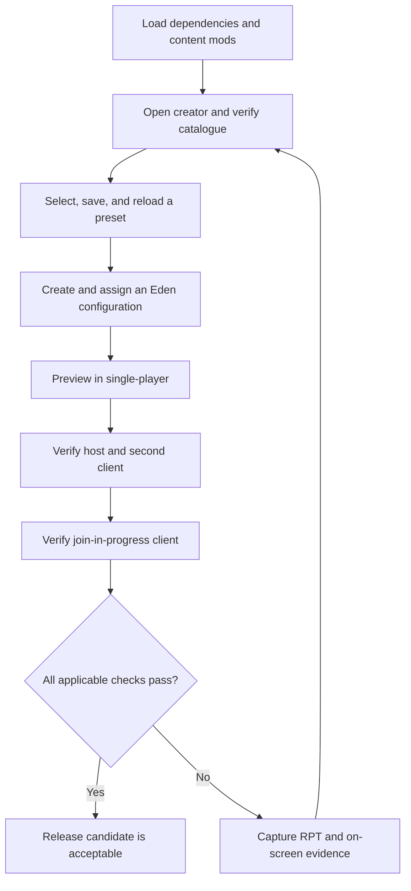

# In-game release checklist

Use a clean Arma profile where practical. Load only CBA_A3, ACE, RACA, and the content mods needed for the test. Record failures with the exact on-screen message and the newest Arma RPT excerpt containing `RACA`, `Error`, or `Warning`.

Before the manual flow, stage and run `tools\prepare-autotest.ps1`. Require
every `[RACA AUTOTEST]` assertion to pass, the summary to report zero failures,
and no `<AutoTest result="FAILED">` record. This unattended gate covers packaged
registration and core behavior; it complements, but does not replace, the
visual Creator, Eden, Zeus, and multiplayer checks below.

**Latest automated evidence:** the September 4 packaged build passed 97/97 assertions, exact Unicode clipboard/RPT reconstruction, and dedicated SERVER + initial CLIENT rehearsal probes. The boxes below remain unchecked because the complete visual/native-editor/Curator/distinct-JIP release matrix was not performed. See `TEST_LOG_2026-09-04.md`.

## Test flow

The flow separates authoring, Eden persistence, runtime behavior, and multiplayer synchronization so a passing creator screen is not mistaken for a complete release verification.

## 1. Startup and creator mission

- [ ] Launcher reports CBA_A3, ACE, and RACA as loaded without dependency errors.
- [ ] **Tutorials** contains **Restricted Arsenal Creator**.
- [ ] Opening it produces no **Cannot load mission** dialog.
- [ ] The VR scene loads, followed by the creator interface.
- [ ] With an empty RACA profile, Quick Start opens once and creates either a blank draft or a reviewable role-starter draft without saving automatically.
- [ ] Quick Start remains available manually after onboarding.
- [ ] Parameterized Quick Start combines a built-in role or custom pack with source, optic, suppressor, night-vision, and medical policies, and generates only an unsaved review draft.
- [ ] Add policies include only matching active-catalogue classes inside the selected source boundary; Exclude policies remove matching starter/pack classes; the last valid parameter choices restore after reopening Quick Start.
- [ ] A Quick Start role draft constrained to one source mod contains no catalogue classes attributed to another source.
- [ ] Capturing a custom role pack records the current included classes, adds it to both Role starter and Quick Start, and persists after restarting Arma.
- [ ] Merging a custom pack retains existing draft classes; replacing uses only available pack classes; unavailable mod classes are reported rather than inserted.
- [ ] Re-capturing and deleting a custom pack require confirmation, while the current draft and all saved arsenal presets remain unchanged.
- [ ] Closing the creator returns to the scene or menu without a script error.

## 2. Catalogue and presentation

- [ ] The catalogue finishes loading and reports a non-zero item count.
- [ ] The centered title reads **ARSENAL CREATION ASSISTANT** and no **PRESET LIBRARY** heading remains.
- [ ] **Preset Management** contains preset files and inheritance tools; **Arsenal Contents** contains the table, search, filters, and bulk selection tools.
- [ ] Included, Item, Class Name, Mod, and Author headers align with their columns at the active UI scale.
- [ ] Weapons, Attachments, Magazines, Uniforms, Vests, Backpacks, Headgear, NVGs, Facewear, Equipment, and Included filters show plausible content.
- [ ] **Magazines** includes ammunition magazines, rockets, 40 mm rounds, grenades, mines, and placed explosives.
- [ ] **Equipment** includes magazine-backed ACE medical supplies such as `ACE_painkillers` when available.
- [ ] Searching `ACE_` does not return the vanilla `.338 LM 10Rnd Mag` / `10Rnd_338_Mag` solely because ACE patches it.
- [ ] Searching a display name, exact class, content mod name, author, and owning add-on each finds the expected item.
- [ ] Source filtering restricts visible rows to one loaded mod and composes correctly with category and text search.
- [ ] Mod, Add-on, and Author filters show plausible per-value counts, compose with each other/category/search, and restore **All** without changing the draft.
- [ ] **Tags > Edit** creates a profile-wide tag for the current Ctrl/Shift multi-row selection; tagged classes appear in free-text search, the counted Tag filter, row tooltips, and item details after restarting Arma.
- [ ] Removing a tag from selected rows and confirmed tag deletion change only tag metadata; current draft inclusion, favorites, presets, and mission objects remain unchanged, and temporarily unavailable tagged classes return when their content mod is reloaded.
- [ ] Tag/member search and paging retain exact membership at 4,999, 5,000, 5,001, 20,001, and the full real catalogue; inserting a lexically earlier class displaces nothing and one committed edit performs one logical refresh.
- [ ] **Saved Views** captures the complete search/category/mod/add-on/author/tag/sort workspace, migrates older views with **All tags**, restores it after other filters change, persists after restarting Arma, and never changes the draft selection.
- [ ] A Saved Filter whose category/mod/add-on/author/tag value is now missing displays that missing value and yields no broadened results; **Clear Missing Filters** is the only action that deliberately returns those dimensions to All.
- [ ] Re-capturing a case-insensitive duplicate view requires confirmation; deleting a view requires confirmation and leaves every preset and the current draft intact.
- [ ] Cancelling duplicate saved-view or custom role-pack replacement leaves the prior record unchanged and does not show a false success message; reaching either collection limit behaves the same way.
- [ ] Favorites persist after closing and reopening Arma, and the Favorites category contains exactly the marked classes.
- [ ] Row tooltips identify class, category, source, author, favorite state, and exact/category limit.
- [ ] **Details** and Enter open the selected item inspector; its class/config/source/type/compatibility metadata matches the active row, its draft/favorite/limit state updates immediately, and Copy Details copies the visible report.
- [ ] For a direct-magazine rifle, magazine-well weapon, launcher/secondary-muzzle weapon, weapon with no loaded compatible magazines, and non-weapon item, Details lists every and only de-duplicated loaded class returned by Arma `compatibleMagazines`; **Show Magazines** is available only for a non-empty weapon result.
- [ ] **Show Magazines** changes presentation only. **Clear Magazine Filter** restores the exact prior search mode/text, category, source/add-on/author/tag filters, sort, page, and selected classes without changing inclusion, favorites, limits, tags, undo history, or Saved Filters.
- [ ] At a custom profile accent, capture the Details/Show Magazines state and record the complementary RGB calculation; inspect all changed Creator controls for ten seconds at 16:9, ultrawide, and 4:3 with no animation except pointer hover.
- [ ] Include/Exclude and Favorite actions from the item inspector update the creator row and preserve Undo behavior for draft inclusion.
- [ ] Clicking Included, Item, Class Name, Mod, and Author headers toggles a deterministic sort, preserves the selected class and filters, and restores the last sort after reopening Arma.
- [ ] On the real 40,000+ catalogue and reproducible 100,000-record fixture, paging exposes the complete exact result with no duplicates/hidden cap. Record p50/p95 first render, include/exclude, bulk action, typing/clearing filter, sort, and tag edit against the documented budgets.

## 3. Selection-state regressions

- [ ] A row-body left-click selects that class without changing inclusion; clicking its Included checkbox toggles it immediately.
- [ ] Space toggles the currently selected row immediately.
- [ ] Ctrl-click selects separate rows and Shift-click selects a continuous range without immediately changing inclusion; **Space**, **Favorite**, and **Limit Selection** each affect the complete selected set, while inclusion/limit changes reverse in one Undo step.
- [ ] Assignment shows a readable **Scope / Reset / Max** quantity-policy row; choosing Interaction forces **Every interaction** and disables only the reset selector, while every other scope re-enables it.
- [ ] Typing a space in the Search box does not toggle an item.
- [ ] Exclude one item, change category or search so it disappears, then return: it remains excluded.
- [ ] **Include Visible** and **Exclude Visible** affect only the filtered rows.
- [ ] **Clear All** removes every selection, including currently hidden rows.
- [ ] Undo/redo buttons and `Ctrl+Z` / `Ctrl+Y` correctly reverse row, bulk, starter, inheritance, and limit changes without changing a saved preset.
- [ ] Closing a dirty draft asks before discarding it; closing immediately after save or load does not show a false warning.
- [ ] Changing only the preset name marks the footer **UNSAVED DRAFT**; item, inheritance, and limit changes do the same.
- [ ] End the creator mission without choosing **Discard and close**, reopen it, and confirm the recovery prompt restores the exact name, available items, inheritance snapshot, and limits.
- [ ] Choosing **Discard draft**, or successfully saving/loading, removes the recovery prompt on the next creator launch.

## 4. Preset persistence

- [ ] Saving without a name is rejected with a useful status message.
- [ ] Saving an empty selection is rejected with a useful status message.
- [ ] A named non-empty preset appears immediately in Saved presets.
- [ ] Loading that preset restores the exact selection after filters and searches have changed.
- [ ] Saving the same name with different content overwrites it rather than creating a case-variant duplicate.
- [ ] Overwriting creates a revision-history snapshot; the comparison reports additions/removals and restoring creates a newer revision while archiving the outgoing one.
- [ ] Compare Draft copies complete added/removed class lists and both quantity policies.
- [ ] **Delete** requires confirmation, removes only the selected profile preset, and keeps the current item selection as an unsaved recovery copy.
- [ ] Delete and duplicate-import confirmations show real paragraph breaks, and duplicate Import Auto produces no `Suspending not allowed in this context` RPT error.
- [ ] Deleting a source preset does not corrupt inheriting children or standalone copies already embedded in missions.
- [ ] Restarting Arma with the same profile preserves the preset.
- [ ] JSON export is valid UTF-8 JSON and round-trips without losing the name or any bucket.
- [ ] Required-mod manifest export groups every selected class by source mod and owning add-on.
- [ ] Support-bundle export contains environment metadata, compatibility analysis, manifest, and the portable preset; Import Auto rejects it as non-preset data.
- [ ] JSON round-trip preserves unavailable syntactically valid cargo in its authored bucket plus runtime, inheritance, provenance, and safe extension metadata; returning the missing mod makes those classes available again.
- [ ] Import fixtures at 19,999, 20,000, 20,001, the full real catalogue, 50,001, and 100,000 input records complete without a hidden token/item/character rejection. Duplicate-heavy synthetic fixtures are labeled as records, not unique installed classes.
- [ ] Cancel during SQF scan, JSON validation, class validation, review, and immediately before commit leaves the profile library byte-for-byte unchanged. A concurrent/superseding import is rejected rather than overwriting newer profile state.
- [ ] A no-collision import offers **Import**; a collision offers **Overwrite**, **Import Copy**, and **Cancel** with unclipped text. Each success writes once and each cancellation/failure writes zero times.
- [ ] SQF migration ignores strings inside line/block comments, handles doubled quotes and common `+`/`append`/`arrayIntersect` layouts, never executes source, and generated SQF keeps all user-derived metadata in safe line comments.
- [ ] Exercise every clipboard action—JSON, SQF, class list, diagnostics, manifest, support bundle, preflight, item details, Dashboard report, and audit/rehearsal reports—with Unicode, CRLF, blank lines, quotes, backslashes, and a 4,096-character line. Reconstruct each RPT copy ID exactly and verify checksum.
- [ ] **View Details** always opens on Errors and shows real centered Severity/Code/Class/Source/Message headers. Severity changes preserve the full report and Copy Report stays full-report output.
- [ ] Compatibility navigation appears only for an available affected class, restores unrelated draft state, and an older report becomes visibly stale after the draft changes. Inspect clean, information-only, warning-only, and error reports at 16:9, ultrawide, and 4:3.
- [ ] Preflight reports ACE3, CBA_A3, and RACA Eden health plus active catalogue class/mod/add-on/author/category counts; the support bundle contains the same environment evidence.
- [ ] A saved category quantity limit reloads with a canonical `category:<name>` rule and is shown as the effective row limit.
- [ ] Item and category limits save and reload each reset choice (Never, Every interaction, Player respawn, Admin: new round, and Admin: new phase), and JSON round-trip preserves the same four-field policy records.
- [ ] The Max field accepts only whole numbers at or above `-1`; blank, decimal, alphabetic, and values below `-1` are rejected without changing the draft or Undo history.

## 5. Preset inheritance

- [ ] A child can select an inherited source, apply it, then save child-only additions and source-item removals.
- [ ] Every item in the inherited source snapshot is light blue, whether currently included or excluded.
- [ ] **Inherited** appears only while inheritance exists and shows the complete source snapshot; **Included** shows the current result.
- [ ] The summary reports total, source-included, added, and removed counts accurately.
- [ ] Loading a child after its source changes warns without changing the child's stored selection.
- [ ] **Inherit / Refresh** deliberately reapplies the changed source and the saved overrides.
- [ ] Selecting a descendant as a source is rejected as circular inheritance.
- [ ] **Make Standalone** preserves the current item result and removes the source relationship.
- [ ] JSON export/import preserves safe inheritance metadata while accepting legacy inheritance tags.
- [ ] An otherwise-valid JSON document larger than 1 MB but within the documented resource limits imports.
- [ ] SQF, class-list, Eden, and runtime data contain the complete standalone item result and no required source reference.

## 6. Eden integration

- [ ] Any placed object's attributes contain a non-empty **Restricted Arsenals** category.
- [ ] No `Cfg3DEN/Attributes.RACA_PresetAttribute` error appears.
- [ ] Opening object attributes produces no control/array type error from `RACA_fnc_edenAttributeOnLoad`.
- [ ] Eden's **Tools** menu contains **RACA Mission Arsenal Tool** and opens it without requiring an object-attributes dialog.
- [ ] The tool opens on **Mission Dashboard**, exposes a separate **Configure** tab, uses the active profile accent, uses readable Purista text, and has no all-uppercase action buttons or clipped/overlapping controls at the target resolutions.
- [ ] Dashboard rows use the columns **Arsenal Configuration**, **Item Name**, **Class Name**, and **Variable Name**; objects without a variable name leave that cell blank.
- [ ] **Variable name** defaults to **All** and correctly filters **No variable name** and **Only variable names**.
- [ ] **Object type** defaults to **Object** and correctly filters **All**, **Unit**, **Module**, and **Object**; choosing **All** inventories every object returned by the mission.
- [ ] Search matches readable item name, class name, and variable name without changing object assignments.
- [ ] **Configure > Add Configuration** creates a named mission-local Arsenal Configuration from an available saved preset.
- [ ] New configurations receive opaque stable IDs independent of their display names; alphanumeric names and names with spaces/punctuation remain valid, and renaming preserves every object link.
- [ ] A configuration preserves its name, chosen standalone preset snapshot, optional icon, AND/OR mode, side/faction/group/rank/unit/UID/vehicle-role/item/permission conditions, and denied message after saving, closing, and reopening the tool.
- [ ] A blank or duplicate configuration name, name over 128 characters, denied message over 512 characters, icon path over 512 characters, or oversized rule value shows an inline error and does not persist invalid data.
- [ ] **Save Configuration** refreshes the snapshots of every linked object while leaving unlinked objects unchanged; one Eden Undo restores the prior library and linked snapshots.
- [ ] **Delete Configuration** names the configuration, reports the linked-object count, does nothing on Cancel, and on Delete removes the library entry and clears every linked object in one undoable history step.
- [ ] **Test Access** lists every placed soldier; **Run Test** shows correct PASS/FAIL rows for editor-verifiable rules, labels UID/permission rules UNKNOWN, computes AND/OR without treating unknown as pass, and copies the same report.
- [ ] The compact object attribute contains only the mission configurations plus **<No Arsenal Configuration>** and displays: “Additional Arsenal Configurations can be created in the Eden RACA tool accessible in the toolbar.”
- [ ] Assigning through the compact object attribute produces the same self-contained object snapshot as assigning through Dashboard.
- [ ] A legacy single-preset or older multi-slot object value is offered as a preservation entry and remains byte-for-byte unchanged until a modern configuration is deliberately selected.
- [ ] Every modern object assignment contains a complete standalone preset with no required profile or inheritance/source reference and carries stable configuration ID/name metadata.
- [ ] Selecting a Dashboard row synchronizes the assignment dropdown; **Apply to Object** changes only that row's object and one Eden Undo reverses it.
- [ ] Choosing **<No Arsenal Configuration>** and cancelling leaves the object unchanged; confirming removes only that object's RACA configuration and Eden Undo restores it.
- [ ] Double-clicking a Dashboard row and **Select in Eden** each select only its corresponding Eden object.
- [ ] Unconfigured objects remain visible in neutral colour, valid configurations appear green, warnings amber, and malformed/blocking configurations red rather than disappearing.
- [ ] **Copy Report** records every currently visible Dashboard object plus complete preflight findings for configured rows.
- [ ] Hand-edited wrong-type slot/access/limit fields, unsafe IDs, unsupported access conditions, and invalid condition values produce specific blocking findings and cannot be saved or applied at runtime.
- [ ] **Save and Close** preflights every configuration, refuses blocking data while keeping the tool open for correction, and otherwise persists the mission library before closing.
- [ ] Seed a version 2 configuration envelope and confirm every Eden open/refresh/close/persistence entry point leaves its exact bytes unchanged and labels it FUTURE rather than erasing it.
- [ ] Seed malformed record type, duplicate ID, duplicate name, missing ID, unsafe legacy ID, empty name, invalid preset, and mixed valid/invalid libraries. Opening/refreshing/closing does not write; recovery lists the exact cause for every record.
- [ ] Repair assigns new IDs only to missing/unsafe repairable records, updates all linked objects atomically, reports record/object counts, and one Eden Undo restores the exact original library and object values. Duplicate/blocked records require explicit author resolution.
- [ ] Unsafe identifier, duplicate slot/ID, invalid access condition, unavailable required class, and valid candidate produce the same preflight result through Save Configuration, Save and Close, Dashboard Apply, compact attribute, and runtime apply. A blocked Apply leaves the tool and object unchanged.
- [ ] With 250, 1,000, and 2,500 placed objects covering neutral/valid/warning/blocked states, Dashboard search remains responsive, pages contain every exact match once, summaries stay correct, and Copy Report includes exactly the currently visible rows with full diagnostics.
- [ ] Force the native-attribute fallback and test normal success, Escape/cancel, native-dialog close, selection change, two rapid Apply actions, and configuration edit while open. One intended object changes once or not at all, pending state clears, filters/selection restore, and one Undo reverses success.
- [ ] Inspect **Mission Dashboard** and **Add Configuration** for ten seconds through tab changes, add/save/delete, fallback, close/reopen, hover, and keyboard focus at 16:9, ultrawide, and 4:3; no action text blinks, clips, or overlaps.

## 7. Runtime and multiplayer

- [ ] In single-player preview, the configured object's ACE Arsenal interaction opens normally.
- [ ] Every enabled slot creates its own named ACE interaction and opens only its embedded preset's classes.
- [ ] A client joining after the object was configured receives the same slot actions, and deleting the object leaves no stale interactions or JIP registration errors in the RPT.
- [ ] Disabled slots create no usable interaction.
- [ ] Hidden denied slots are invisible to an unauthorized player; visible denied slots show the configured denial message without opening.
- [ ] A client cannot open a slot for another player unit, open from beyond the configured distance, or begin a second session while one is active.
- [ ] Adding a class outside the slot through any concurrent inventory route causes the complete pre-session loadout to be restored.
- [ ] Exact-class and category limits enforce quantities stored inside uniform, vest, and backpack cargo stacks.
- [ ] When a class has both an exact limit and a category limit, one issued item consumes both counters; exhausting either policy blocks that class, and the category counter totals all issued classes in the category.
- [ ] `-1` remains unlimited; interaction-scope limits reset on each open; player/life/mission/arsenal limits persist and reset only at the selected Never/interaction/respawn/round/phase/manual boundary.
- [ ] A non-interaction limit set to **Every interaction** resets before both normal ACE Arsenal opening and saved-loadout application; player/life counters reset only for the triggering UID while mission/arsenal counters reset for the shared slot.
- [ ] Exhausted exact classes and exhausted categories are absent from the next ACE session and the remaining-quota message is correct.
- [ ] **Check remaining allowance** reports the same server-side exact/category values without opening ACE Arsenal and denies unauthorized or distant requests.
- [ ] Saving a personal loadout and reapplying it uses the same access and quota checks; an outside class or exhausted quantity is rejected and restored.
- [ ] Reconfiguring, clearing, or deleting an arsenal object while it is open closes the session and restores the pre-session loadout.
- [ ] Reconfiguring preserves usage for unchanged quota rules but removes counters for deleted slots, removed or unlimited rules, and changed scope/reset policies; clearing or deleting the object removes every associated quota record from the admin count.
- [ ] A preset containing a now-missing mod class still initializes with the remaining valid classes and writes a warning to RPT.
- [ ] Repeated previews do not accumulate unrestricted ACE virtual cargo.
- [ ] The client has no public `RACA_objectConfig`, `RACA_quotaState`, or `RACA_openSessions` data containing the full server policy.
- [ ] A disconnect, respawn, or stale-session timeout leaves no locked session and does not preserve unauthorized equipment.
- [ ] Respawning while an arsenal is open immediately removes the old unit's server session, permits the new unit to use arsenals, and leaves no delayed quota commit from the old display.
- [ ] Only a logged-in server admin or a UID in `RACA_adminUIDs` sees the **RACA Administration** ACE self-action.
- [ ] The admin dashboard reports every registered object, slot names/states, quota-record count, active-session count, and the newest audit records without exposing full embedded presets.
- [ ] Admin refresh, object quota reset, global quota reset, enable, disable, and confirmed clear execute on the server and refresh the displayed snapshot.
- [ ] Cancelling an administration Clear/global-reset prompt sends no server command and leaves configuration/quota counts unchanged.
- [ ] Copy Audit produces a readable clipboard record and a non-admin client cannot request a snapshot or execute an admin command by remote call.
- [ ] With an initial remote client connected, **MP Rehearsal > Start New** records the server and every current interface as SERVER, HOST (listen server), or CLIENT without exposing embedded presets.
- [ ] A client joining after Start New announces readiness, is classified as JIP, and reports the same configured-object/enabled-slot action-manifest counts.
- [ ] Disconnecting and reconnecting an initial-client Steam UID keeps that participant in its initial role and does not satisfy the distinct JIP-client gate; a missing UID produces explicit failed identity evidence.
- [ ] Missing dependencies, missing local manifests, and slot-count mismatches produce FAIL with specific issues; absent initial/JIP roles remain WAITING while active and become INCOMPLETE when finalized.
- [ ] Refresh Probes replaces each role/UID's latest evidence, Finalize freezes new JIP evidence, Copy Report matches the visible gates/participants, and a non-admin cannot start or inspect the rehearsal.
- [ ] Cancelling **Start New** when a rehearsal report already exists does not replace it or send a new rehearsal request.
- [ ] On a hosted multiplayer server, the host sees the restricted contents.
- [ ] A connected client sees the same restricted contents.
- [ ] A client joining in progress sees the same restricted contents.
- [ ] On a dedicated server, Zeus Assign/Replace can resolve a preset already embedded in another registered mission object even when the server profile library is empty.
- [ ] Place each Zeus module on a valid configured object, valid unconfigured object, multiple targets, no target, an object not editable by the curator, and a missing configuration. Verify visible accepted/rejected results, exact registry/ACE interaction effect, audit record, and `[RACA][ZEUS:<request-id>]` server-RPT event.
- [ ] Zeus requests accept only the current assigned curator and synchronized editable targets, reject module/operation mismatch and duplicate handling, respect `RACA_allowZeusModules`, and never interpret no-target Reset as a global reset.
- [ ] Repeat the full Zeus matrix on listen host, dedicated server with empty profile and embedded mission configuration, and a distinct joining curator/client. Match each visible request ID to the server RPT without recording player UIDs.

## Release gate

A release candidate is acceptable only when every applicable item above passes and the newest RPT contains no RACA config or SQF errors. Multiplayer/JIP items may be recorded separately, but must not be represented as verified until a second client has actually completed them.
