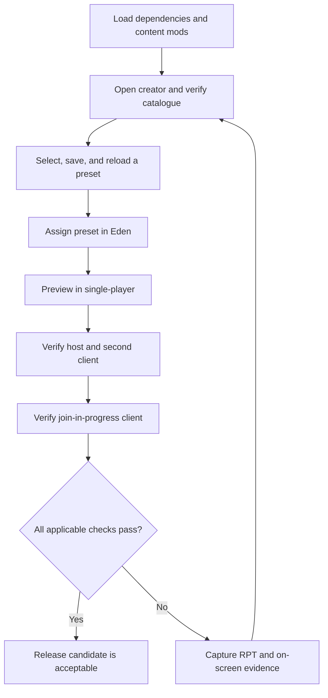

# In-game release checklist

Use a clean Arma profile where practical. Load only CBA_A3, ACE, RACA, and the content mods needed for the test. Record failures with the exact on-screen message and the newest Arma RPT excerpt containing `RACA`, `Error`, or `Warning`.

## Test flow

The flow separates authoring, Eden persistence, runtime behavior, and multiplayer synchronization so a passing creator screen is not mistaken for a complete release verification.

## 1. Startup and creator mission

- [ ] Launcher reports CBA_A3, ACE, and RACA as loaded without dependency errors.
- [ ] **Tutorials** contains **Restricted Arsenal Creator**.
- [ ] Opening it produces no **Cannot load mission** dialog.
- [ ] The VR scene loads, followed by the creator interface.
- [ ] Closing the creator returns to the scene or menu without a script error.

## 2. Catalogue and presentation

- [ ] The catalogue finishes loading and reports a non-zero item count.
- [ ] The centered title reads **ARSENAL CREATION ASSISTANT** and no **PRESET LIBRARY** heading remains.
- [ ] **Preset Management** contains preset files and adoption tools; **Assignment** contains the table, search, filters, and bulk selection tools.
- [ ] Included, Item, Class Name, Mod, and Author headers align with their columns at the active UI scale.
- [ ] Weapons, Attachments, Magazines, Uniforms, Vests, Backpacks, Headgear, NVGs, Facewear, Equipment, and Included filters show plausible content.
- [ ] **Magazines** includes ammunition magazines, rockets, 40 mm rounds, grenades, mines, and placed explosives.
- [ ] **Equipment** includes magazine-backed ACE medical supplies such as `ACE_painkillers` when available.
- [ ] Searching `ACE_` does not return the vanilla `.338 LM 10Rnd Mag` / `10Rnd_338_Mag` solely because ACE patches it.
- [ ] Searching a display name, exact class, content mod name, author, and owning add-on each finds the expected item.

## 3. Selection-state regressions

- [ ] A single left-click toggles the row that was clicked immediately.
- [ ] Space toggles the currently selected row immediately.
- [ ] Typing a space in the Search box does not toggle an item.
- [ ] Exclude one item, change category or search so it disappears, then return: it remains excluded.
- [ ] **Include Visible** and **Exclude Visible** affect only the filtered rows.
- [ ] **Clear All** removes every selection, including currently hidden rows.

## 4. Preset persistence

- [ ] Saving without a name is rejected with a useful status message.
- [ ] Saving an empty selection is rejected with a useful status message.
- [ ] A named non-empty preset appears immediately in Saved presets.
- [ ] Loading that preset restores the exact selection after filters and searches have changed.
- [ ] Saving the same name with different content overwrites it rather than creating a case-variant duplicate.
- [ ] **Delete** requires confirmation, removes only the selected profile preset, and keeps the current item selection as an unsaved recovery copy.
- [ ] Deleting a source preset does not corrupt adopted children or standalone copies already embedded in missions.
- [ ] Restarting Arma with the same profile preserves the preset.

## 5. Preset adoption

- [ ] A child can select an adopted source, apply it, then save child-only additions and source-item removals.
- [ ] Every item in the adopted source snapshot is light blue, whether currently included or excluded.
- [ ] **Inherited** appears only while an adoption exists and shows the complete source snapshot; **Included** shows the current result.
- [ ] The summary reports total, source-included, added, and removed counts accurately.
- [ ] Loading a child after its source changes warns without changing the child's stored selection.
- [ ] **Adopt / Refresh** deliberately reapplies the changed source and the saved overrides.
- [ ] Selecting a descendant as a source is rejected as circular adoption.
- [ ] **Make Standalone** preserves the current item result and removes the source relationship.
- [ ] JSON export/import preserves safe adoption metadata.
- [ ] An otherwise-valid JSON document larger than 1 MB imports without RACA rejecting it for size.
- [ ] SQF, class-list, Eden, and runtime data contain the complete standalone item result and no required source reference.

## 6. Eden integration

- [ ] Any placed object's attributes contain a non-empty **Restricted Arsenals** category.
- [ ] No `Cfg3DEN/Attributes.RACA_PresetAttribute` error appears.
- [ ] The selector starts with **&lt;None&gt;** and lists saved presets.
- [ ] **Refresh** discovers a preset saved after the attributes window or Eden session was opened.
- [ ] Selecting a preset, confirming attributes, reopening them, and saving/reloading the scenario preserves the selection.
- [ ] Selecting **&lt;None&gt;** persists and leaves the object without an RACA-applied arsenal.

## 7. Runtime and multiplayer

- [ ] In single-player preview, the configured object's ACE Arsenal interaction opens normally.
- [ ] Only the embedded preset's classes are available.
- [ ] A preset containing a now-missing mod class still initializes with the remaining valid classes and writes a warning to RPT.
- [ ] Repeated previews do not accumulate unrestricted ACE virtual cargo.
- [ ] On a hosted multiplayer server, the host sees the restricted contents.
- [ ] A connected client sees the same restricted contents.
- [ ] A client joining in progress sees the same restricted contents.

## Release gate

A release candidate is acceptable only when every applicable item above passes and the newest RPT contains no RACA config or SQF errors. Multiplayer/JIP items may be recorded separately, but must not be represented as verified until a second client has actually completed them.
